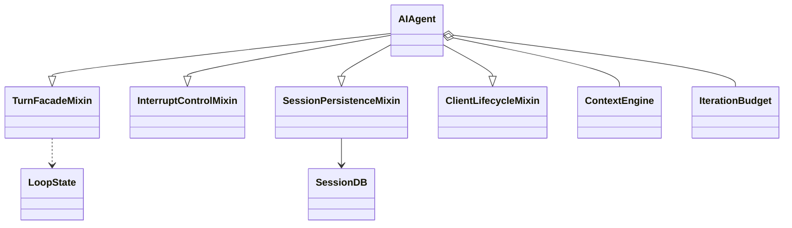
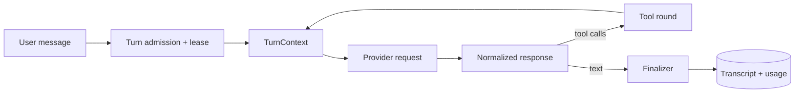
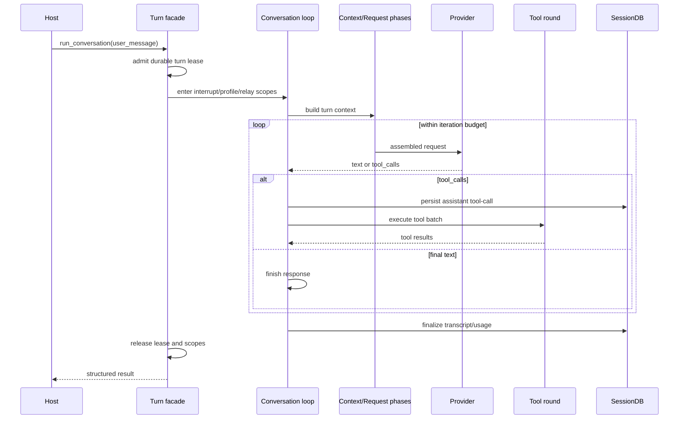
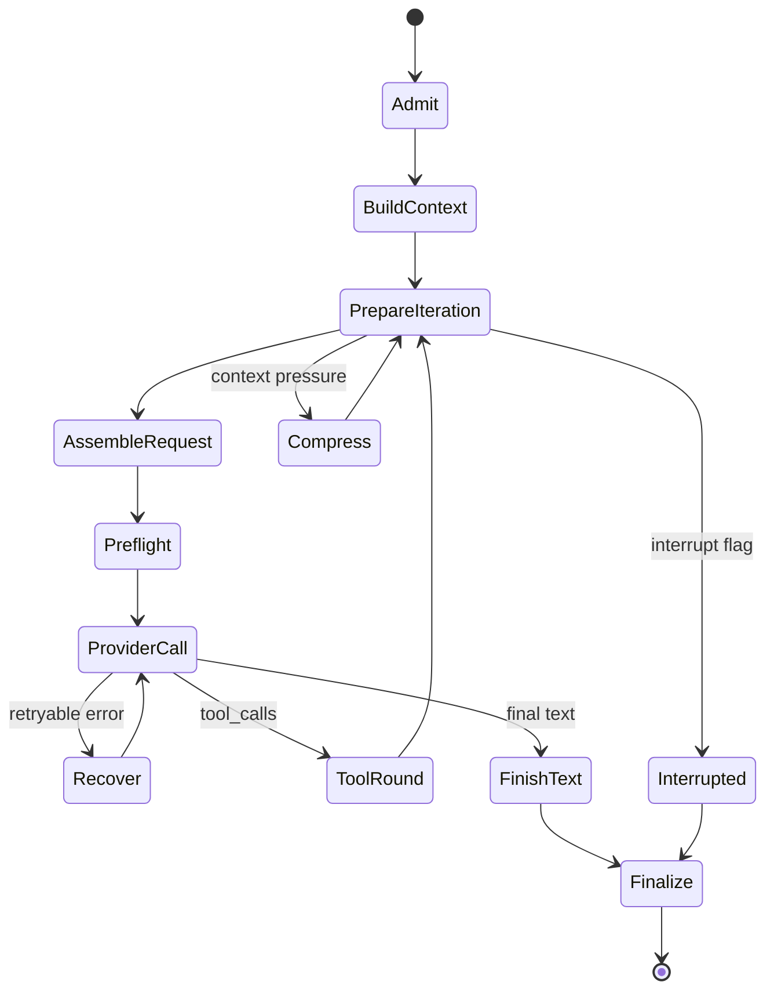
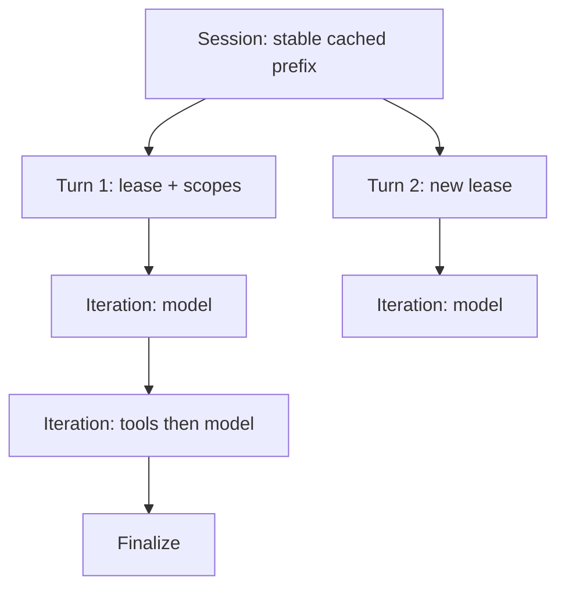

# 01 Runtime：Turn 驱动器与受约束的 Agent Loop

## 定位

**实现状态：核心。** Hermes 没有把运行时做成一个同名 `runtime/` 包；入口是 [AIAgent facade](../../run_agent.py)，真实循环被拆到 `agent/turn_*.py`。这里负责“一个用户 turn 怎样被准入、反复调用模型/工具、被中断并最终提交”。

它不是任意 DAG 工作流引擎，也不保存可恢复的 Python continuation。跨进程恢复依赖 transcript 和状态标记重建一个新 turn。

## 源码地图

| 责任 | 实现 |
| --- | --- |
| 公共 Agent 外观 | `run_agent.py::AIAgent` |
| 初始化与依赖装配 | `agent/agent_init.py::init_agent` |
| turn 外层准入/清理 | `agent/turn_facade.py`、`agent/turn_facade_lease.py` |
| 主循环 | `agent/conversation_loop.py::run_conversation` |
| 循环局部状态 | `agent/conversation_loop.py::_LoopState` |
| 上下文/请求/响应/工具/终结阶段 | `agent/turn_*.py` |
| 次数预算 | `agent/iteration_budget.py::IterationBudget` |
| 中断范围 | `agent/interrupt_control.py`、`agent/interrupt_scope.py` |
| 收尾与持久化 | `agent/turn_finalizer.py` |

## 组件关系

`AIAgent` 是 facade + mixin 聚合，不是把所有逻辑塞进一个 god object。mixins 保持旧公共入口，主题模块拥有实现。

## 正常时序

## 阶段机，而不是巨型 while

`conversation_loop.py` 的 while 只控制迭代；每一步返回 verdict，再由 `_run_phase` 把 verdict 中与 `_LoopState` 同名的字段合并回状态。这样做有三个收益：

- 阶段能独立测试，且不会靠几十个松散局部变量隐式耦合。
- “继续、完成、重试、压缩、恢复”能作为显式控制结果表达。
- facade 保持 API 稳定，阶段实现可以继续拆分。

主要阶段可理解为：

## 预算与“有界自治”

`IterationBudget` 是每个 agent 独立、带锁的消费计数器。正常循环同时受 `max_iterations` 和剩余预算约束；少数恢复路径可获得一次明确的 grace call。重点不是“防止模型多想”，而是让每个自动恢复分支仍然有确定上界。

不同上界分别控制不同风险：

- API/turn 迭代次数：避免无限模型—工具循环。
- Provider retry：只处理可重试故障。
- 压缩尝试：避免在坏上下文上反复压缩。
- 工具循环 guardrail：检测相同失败或无进展调用。

把它们合成一个全局 retry counter 会丢失失败语义，因此 Hermes 保留多维预算。

## 中断语义

| 控制 | 行为 |
| --- | --- |
| soft interrupt | 设置 agent 和执行线程的协作式中断位，传播到工具 worker/子 agent |
| hard interrupt | 额外取消待提交压缩、关闭活动请求；表示明确停止 |
| steer | 不杀工具；在合法消息边界追加真实 user row |
| redirect | 模型调用中止并在同一逻辑 turn 加入纠正；工具执行时退化为 steer |

线程级 interrupt 位很关键：同进程可能同时运行多个 agent，不能用一个进程全局布尔值。并发工具 worker 也要逐线程传播并在 turn 边界清理，避免线程 ID 复用留下脏信号。

## 设计模式

- **Facade + Mixins**：对外保持 `AIAgent`，内部按主题拆分。
- **Template Method / Pipeline**：循环骨架稳定，各阶段替换细节。
- **State Machine + Verdict**：控制转移显式化。
- **Lease / Fence**：跨进程 turn 所有权与压缩提交互斥。
- **Cooperative Cancellation**：让模型、工具和子 agent 在可控边界退出。
- **Bounded Retry**：按错误类别恢复，而不是笼统吞错。

## 必须守住的不变量

1. 同一会话根不能同时有两个写 turn。
2. tool-call assistant row 必须先落库，副作用后执行。
3. 任何插入的 steer 都必须维持合法角色交替。
4. 中断只影响本 agent/worker 范围。
5. finalizer 即使遇到部分失败，也要释放租约和上下文变量。
6. system prompt 只在明确的压缩边界重建。

## 失败语义

| 故障点 | 恢复策略 |
| --- | --- |
| Provider 短暂错误 | 分类后有限重试/切换凭据或 fallback |
| 上下文过长 | 先裁剪工具结果，再事务式压缩 |
| 工具超时 | 返回结构化失败，循环决定是否换策略 |
| 用户中断 | 协作式终止请求/工具/子 agent，保留已提交历史 |
| 进程崩溃 | 活跃 turn 标记变 `resume_pending`，新进程从 transcript 重建 |
| finalizer 附属任务失败 | 记录诊断，不能破坏主要回复或租约释放 |

## 进一步拆解：三个嵌套生命周期

只盯着 `while` 会漏掉 Hermes runtime 最重要的结构：**session、turn、iteration 是三个不同生命周期**。

| 生命周期 | 开始/结束 | 拥有的状态 | 失败后怎么办 |
| --- | --- | --- | --- |
| Session | 创建/恢复到归档 | transcript、系统提示缓存、usage、路由身份 | 下个进程可恢复 |
| Turn | 用户输入准入到 finalizer | lease、interrupt scope、有效 provider、pending compaction | 标记完成或 `resume_pending` |
| Iteration | 一次模型请求到文本/工具 verdict | 请求、attempt、工具批次、局部恢复预算 | 有界重试或返回外层 |

这解释了两个看似反直觉的选择：provider route 在 turn 内冻结，但可以在新 turn 重新解析；system prompt 比 turn 活得更久，不能因某次 slash command 随意重建。把三层都塞进一个 `RunContext`，很容易让短生命周期字段泄漏到下一轮。

### Verdict 应携带什么

阶段 verdict 最适合携带“控制决定 + 明确的状态增量”，不应携带任意 callback 或隐藏副作用：

- 数据结果：normalized response、tool results、usage delta；
- 控制结果：continue、finish、retry、compress、interrupt；
- 所有权变化：pending compaction、活动 request、finalization reason；
- 不应出现：重新读取全局配置、悄悄写 system prompt、无上界递归。

## 业界横向比较（2026-09）

| 方案 | 执行模型 | 更强的地方 | 代价/限制 | 更适合 |
| --- | --- | --- | --- | --- |
| Hermes | 线性 turn phase machine + transcript | 多入口、真实工具、缓存约束和用户会话一体化 | 不是任意 DAG；恢复不到 Python continuation | 长期个人/工作代理 |
| OpenAI Agents SDK | `Agent + Runner + Tool/Handoff` 的轻量 loop | 小型原语、类型化工具、handoff/HITL/tracing 开箱清晰 | 产品壳、跨日 durable lifecycle 需应用或第三方承接 | 在业务服务内嵌 agent |
| LangGraph | state graph + super-step + checkpoint | 分支、time travel、interrupt、节点级 fault tolerance | 要先显式建模 graph/state；多渠道产品能力不在核心 | 可解释工作流与 HITL |
| PydanticAI | 类型化 agent loop + capabilities | Python 类型体验好，可把模型、工具、MCP 映射到 durable backend | 产品级 session/UI 仍由应用组装 | Python 服务和结构化输出 |
| Temporal / DBOS | event history / workflow + activities/steps | 进程崩溃、计时器、外部 signal、跨天恢复更强 | 确定性、序列化、版本迁移和运维成本更高；不理解 prompt | 高价值长任务和业务流程 |

LangGraph 在每个步骤保存 checkpoint，并以 thread 组织状态；Temporal 把“崩溃后继续”作为 durable execution 的核心承诺。Hermes 的优势不应描述成“恢复更强”，而是**以较低运行设施成本，让完整对话产品恢复到语义上可继续**。

## Hermes 什么时候更好，什么时候不是

Hermes 更好：

- 同一 agent 必须在 CLI、聊天平台、Desktop/TUI 间保持一致行为；
- 任务围绕对话和工具轨迹展开，恢复到新的模型 iteration 可以接受；
- prompt cache 成本、用户 profile 和本地执行环境是一级约束。

优先选图/工作流引擎：

- 需要从任意业务节点 time travel、分叉并重放；
- 一个流程跨数天、含计时器/补偿事务/外部 signal；
- 法规或资金副作用要求可证明的步骤级幂等与事件历史。

常见组合是 Hermes 管交互 session，Temporal/DBOS 管少量高价值异步流程。边界处只交换序列化命令、状态和 artifact，不把活的 `AIAgent` 对象塞进 workflow history。

## 源码阅读题

1. turn lease 在 provider request 之前哪一层获得？所有异常出口是否都经过释放？
2. 若 assistant tool-call 已持久化、工具完成但 tool result 尚未落库时进程崩溃，恢复逻辑能知道什么、不能知道什么？
3. 哪些 verdict 会消费普通 iteration，哪些恢复路径允许 grace？为什么不能共用一个无限 retry？
4. redirect 在模型调用期和工具执行期为何采用不同语义？这与角色交替有什么关系？

## 学习实验

1. 从 `run_agent.py::AIAgent.run_conversation` 进入，给每个 `_run_phase` 画输入/输出字段。
2. 写一个仅返回 tool-call 的假 Provider，观察 assistant tool-call 在 handler 开始前已入库。
3. 在模型调用、工具调用、压缩提交三个位置分别触发 interrupt，比较 transcript。
4. 把预算设为 1，验证“普通调用、恢复 grace、最终结果”之间的边界。

## 延伸阅读

- [Agent loop](../../website/docs/developer-guide/agent-loop.md)
- [Context compression and caching](../../website/docs/developer-guide/context-compression-and-caching.md)
- [Session lifecycle](../session-lifecycle.md)
- [OpenAI API quickstart：Agents SDK 与 handoff 示例](https://platform.openai.com/docs/quickstart/make-your-first-api-request)
- [LangGraph persistence](https://docs.langchain.com/oss/python/langgraph/persistence)
- [LangGraph fault tolerance](https://docs.langchain.com/oss/python/langgraph/fault-tolerance)
- [Temporal durable execution](https://docs.temporal.io/)
- [PydanticAI durable execution](https://pydantic.dev/docs/ai/capabilities/durable_execution/overview/)
