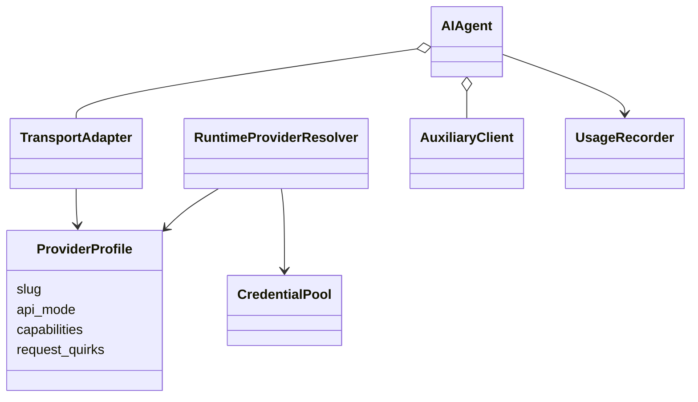
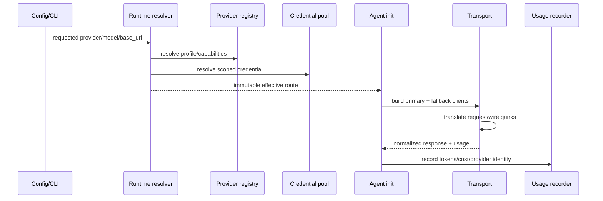
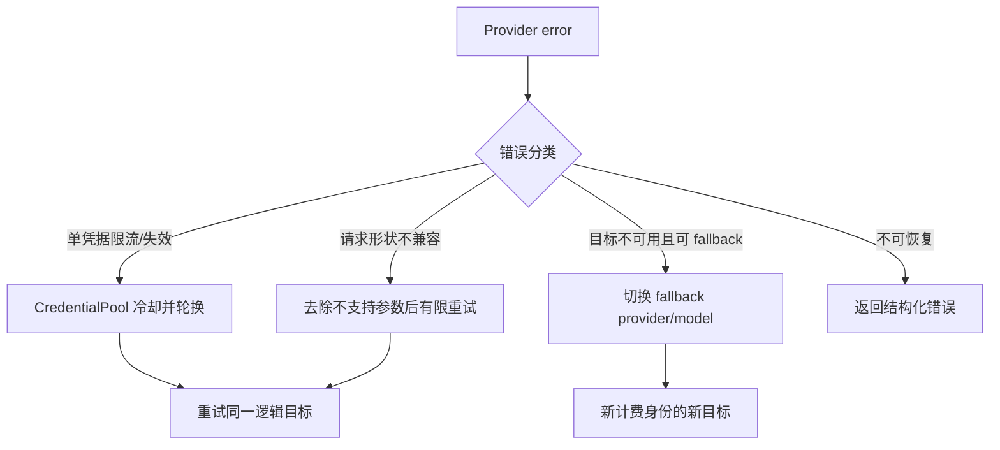
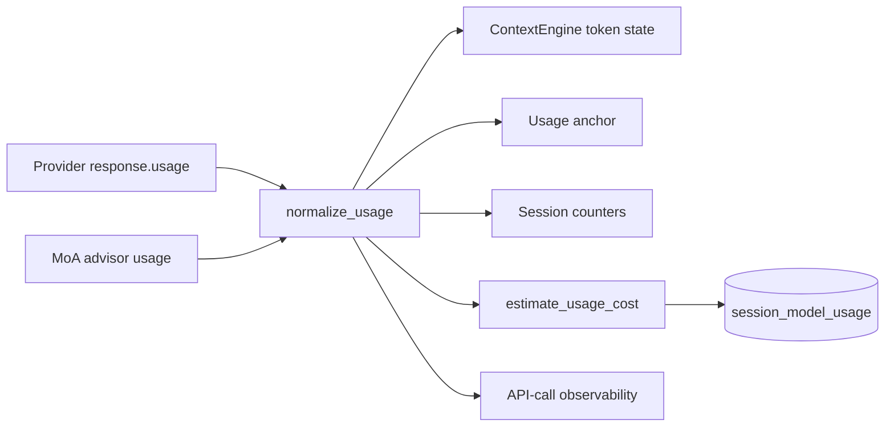
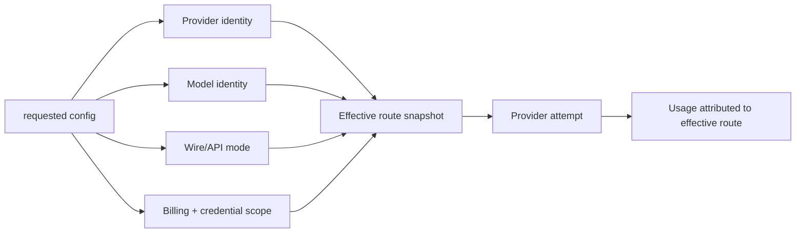

# 02 Models：Provider 解析、传输适配与用量核算

## 定位

**实现状态：核心。** 模型层不只是“封装 OpenAI SDK”，而是把配置、凭据、Provider 能力、传输协议、fallback 和计费身份解析成一个稳定的调用目标。

它不是一个基于用户意图自动选择最优模型的通用 router。主路由是确定性的配置/凭据解析；MoA、smart routing 或插件中间件是额外策略。

## 源码地图

| 责任 | 实现 |
| --- | --- |
| Provider 描述 | `providers/base.py::ProviderProfile` |
| Provider 注册/懒加载 | `providers/__init__.py` |
| 运行时解析阶梯 | `hermes_cli/runtime_provider.py::resolve_runtime_provider` |
| 客户端组装 | `agent/agent_init.py` |
| 传输适配 | `agent/transports/` |
| fallback 配置 | `hermes_cli/fallback_config.py` |
| 凭据池/冷却 | `agent/credential_pool.py` |
| 辅助模型 | `agent/auxiliary_client.py` |
| 模型元数据/上下文窗 | `agent/model_metadata.py` |
| 用量与价格 | `agent/turn_usage.py`、`agent/usage_pricing.py` |

## 对象关系

`ProviderProfile` 把“这个 Provider 是谁、说哪种 wire protocol、有哪些能力和怪癖”数据化；transport 只负责把 Hermes 请求翻译成对应协议。

## 解析与调用时序

## 确定性的解析阶梯

`resolve_runtime_provider()` 按优先级处理禁用项、特殊 Provider shortcut、自定义/本地端点、认证解析、凭据池、OAuth/云 Provider，最后才进入 OpenRouter 或自定义兜底。这个阶梯有两个重要性质：

- **可解释**：同样的配置和凭据得到相同结果。
- **身份完整**：provider、model、base URL、billing mode 一起确定，避免把 fallback 的费用算到主模型。

解析结果应在一个 turn 内视为快照。中途重新读取所有环境变量会让一次调用的认证与计费身份漂移，也会破坏 profile 隔离。

## Fallback 与凭据轮换不是一回事

- 凭据轮换保持 provider/model 语义，改变的是认证材料。
- fallback 改变有效 provider/model，必须独立记录 usage 和错误。
- 不是所有 `api_mode` 都支持同一 fallback 机制；特殊托管循环可能拥有自己的恢复协议。

## 主模型与辅助模型

`AuxiliaryClient` 为压缩、视觉描述、标题、会话搜索、Goal judge、审批判断等侧任务提供单独路由。这样做避免把主模型状态和工具循环带进小型判定任务，也允许选择成本更低或能力更匹配的模型。

但辅助调用也必须：

- 有独立 timeout 和预算；
- 记录真实 provider/model；
- 在失败时定义 fail-open 或 fail-closed；
- 不偷偷改写主会话 system prompt。

## 用量数据流

`record_response_usage()` 对每个成功 Provider attempt 计数，即使上游没有 usage 字段；只有真实 token 数据才能进入精确 token/cost 累加。MoA 会把 advisor fan-out 用量与 aggregator 用量合并展示，同时按各自真实身份计价。

## 设计模式

- **Strategy / Profile Object**：Provider 行为由 profile 描述。
- **Adapter**：不同 wire protocol 归一为 Hermes 响应。
- **Chain of Responsibility**：确定性的解析与 fallback 阶梯。
- **Circuit Breaker / Cooldown**：确认耗尽的凭据不会被持续探测。
- **Snapshot**：turn 内冻结有效路由和计费身份。
- **Sidecar service**：辅助模型不污染主循环。

## 关键不变量

1. profile scoped secret 优先于进程环境，multiplex 下 scoped miss 不能回落到默认 profile。
2. fallback 后的 usage 必须记到真实 provider/model/base URL。
3. Provider 不支持的字段只能在明确兼容分支剥离，不能吞掉任意 4xx。
4. 限流冷却只在已经证明 bucket 耗尽时使用，不能在冷却期持续 re-probe。
5. 模型元数据用于上下文预算，但实际 response usage 是更高优先级证据。

## 进一步拆解：路由其实有四个维度

把 `model="x"` 当成完整路由是常见设计错误。Hermes 的有效目标至少包含：

| 维度 | 例子 | 搞错后的症状 |
| --- | --- | --- |
| provider | direct、OpenRouter、Bedrock、自定义端点 | 能力和错误分类不对 |
| model | provider 内的具体 deployment/model | 上下文窗与价格不对 |
| wire mode | Messages、Responses、Chat Completions 等 | 参数或 tool-call 形状不兼容 |
| credential/billing scope | profile secret、OAuth、API key pool | 串 profile、费用归因错误 |

因此 fallback 不是字符串数组，而是一串新的完整 route candidate。只有 credential rotation 可以在不改变逻辑目标的情况下换认证材料。

### 能力协商比名称判断可靠

Provider 差异应尽可能落到 `ProviderProfile.capabilities` 与明确 request quirks，而不是散落的 `if "claude" in model`。模型名称会变，代理网关会重命名，私有 deployment 甚至不含厂商名。一个健壮的 transport 应回答：是否支持并行工具、图像、reasoning 字段、usage streaming、某种 system prompt 形态，而不是猜品牌。

### 重试预算的乘法陷阱

若 SDK transport 重试 3 次、Hermes provider recovery 重试 3 次、外层 durable step 再重试 3 次，最坏可能是 27 次真实调用。接入 Temporal/DBOS 等执行器时，要明确哪一层拥有重试，并让其他层对已归类错误减少或关闭重试。

## 业界横向比较（2026-09）

| 方案 | 抽象重点 | 更强的地方 | Hermes 的相对位置 |
| --- | --- | --- | --- |
| LiteLLM Router/Proxy | 大量 provider 的统一 API、负载均衡、冷却、fallback、分布式状态 | 独立网关、Redis 协调、权重/延迟/成本/限流策略丰富 | Hermes 与会话、profile、agent recovery 结合更深；路由策略广度较小 |
| Vercel AI SDK / AI Gateway | TypeScript 统一 provider、流式 UI、registry/middleware | Web/TS 开发体验和 provider interchange 很强 | Hermes 更偏 Python 长期 agent 与多宿主，不是前端生成式 UI SDK |
| OpenAI Agents SDK ModelProvider | Agents SDK 内的模型适配 | 与 runner、tracing、tool/handoff 原语天然一致 | 适合较小应用；Hermes provider 解析更关注本地配置、OAuth 与 profile |
| PydanticAI models/providers | Python 类型化、provider-neutral agent | 输出/依赖类型和 durable capability 集成好 | Hermes 的产品集成更完整，类型化业务输出不是唯一中心 |
| 自建单 Provider adapter | 最小依赖 | 行为可控、调试简单 | Provider 单一且无 fallback 时可能比 Hermes 全栈更合适 |

“哪一个更好”取决于路由发生在哪一层：

- 多个业务都需要共享限流与配额时，独立 LiteLLM/AI Gateway 更合适；
- 只有一个 Hermes 实例需要 profile-aware 凭据、特殊 provider 恢复和准确会话 usage 时，内置解析链更直接；
- 动态按质量/成本选择模型必须有 eval 数据和可观测性，否则所谓 smart routing 只是不可解释随机性。

## 设计检查清单

1. 每次 attempt 是否记录 requested route 与 effective route？
2. 429、401、timeout、schema 4xx 分别触发 credential rotation、fallback、参数降级还是立即失败？
3. fallback 会不会意外跨越数据驻留区、价格上限或能力要求？
4. auxiliary model 的失败是 fail-open 还是 fail-closed？例如标题失败可以忽略，安全判定失败通常不能。
5. streaming usage 缺失时，系统是标记 unknown 还是伪造估算值？
6. model metadata 变化是否会成为“冻结当前枚举值”的 change-detector 测试？

## 学习实验

1. 用相同 model 分别配置直接 Provider、OpenRouter、自定义 base URL，记录 resolver 输出差异。
2. 构造两枚凭据：第一枚返回 rate limit，第二枚成功，观察 cooldown 与 usage 身份。
3. 配一个 fallback chain，验证重复 provider/model 被去重。
4. 让 Provider 省略 usage，观察 API call 次数仍增加，但 token 成本不会被伪造。

## 延伸阅读

- [Provider runtime](../../website/docs/developer-guide/provider-runtime.md)
- [Model provider plugins](../../website/docs/developer-guide/model-provider-plugin.md)
- `providers/base.py`
- [LiteLLM routing、fallback 与 cooldown](https://docs.litellm.ai/docs/routing)
- [Vercel AI SDK provider management](https://ai-sdk.dev/docs/ai-sdk-core/provider-management)
- [Vercel AI SDK model middleware](https://ai-sdk.dev/docs/ai-sdk-core/middleware)
- [OpenAI Responses API：模型、工具、usage 与缓存字段](https://developers.openai.com/api/reference/cli/resources/responses/methods/create)
