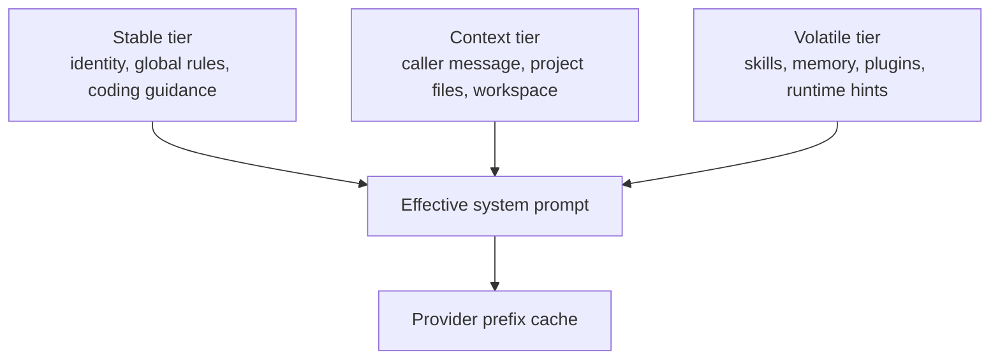
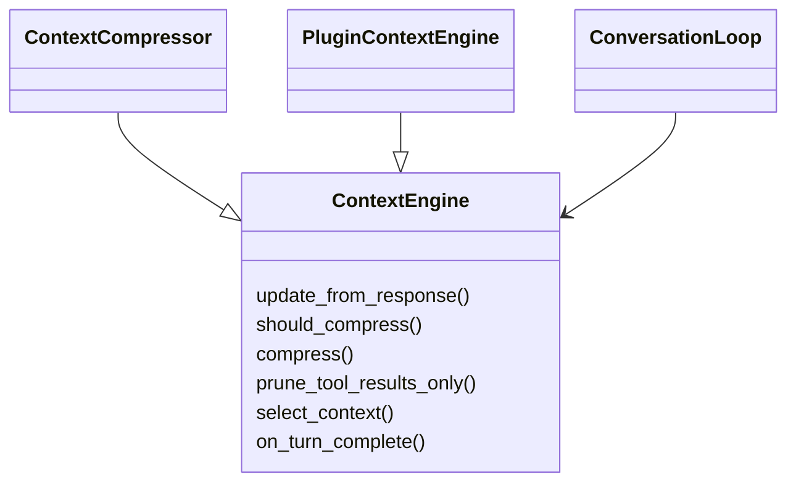
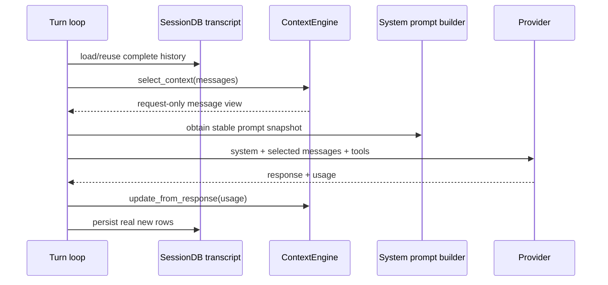
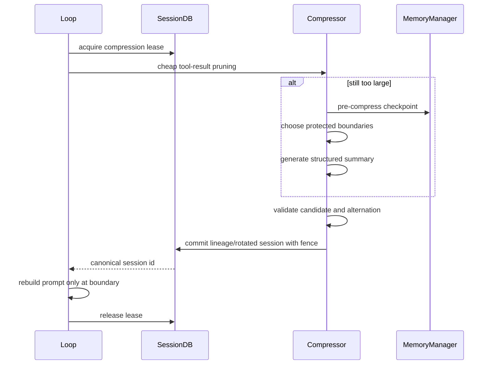
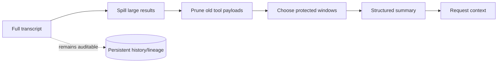
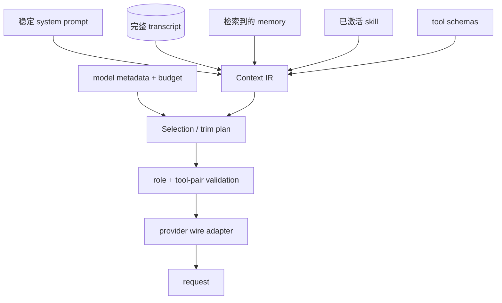

# 03 Context：稳定前缀、请求选择与事务式压缩

## 定位

**实现状态：核心 + 可插拔。** Context 层决定本次 API 请求看见什么；它不等于数据库里的完整会话，也不等于长期 Memory。

最核心的设计是三分法：

- **持久 transcript**：发生过什么，作为审计和恢复事实。
- **system prompt tiers**：长期稳定前缀与少量上下文/易变部分。
- **request context**：这一次真正发给模型的选择或压缩结果。

## 源码地图

| 责任 | 实现 |
| --- | --- |
| system prompt 分层 | `agent/system_prompt.py` |
| prompt 内容组装 | `agent/prompt_builder.py` |
| Context Engine 端口 | `agent/context_engine.py::ContextEngine` |
| 默认压缩器 | `agent/context_compressor.py` |
| 压缩事务 | `agent/conversation_compression.py` |
| turn 起点/预检压缩 | `agent/turn_context_compaction.py` |
| Provider 原生压缩 | `agent/native_compaction.py` |
| token/context metadata | `agent/model_metadata.py` |
| 大工具结果外溢 | `tools/tool_result_storage.py` |
| 第三方 Context Engine | `plugins/context_engine/` |

## System prompt 三层

排序的目的不是美观，而是让最长、最常复用的内容留在前面。会话运行中不能因为技能列表或记忆文件改变就重建过去的 system prompt；变更通常下一会话生效，压缩是唯一明确允许的重建边界。

## ContextEngine 端口

`select_context()` 只替换 request view，不能改写原始 transcript；`compress()` 才能在租约和提交栅栏保护下产生新的会话 lineage。

## 一次请求的上下文流

## 压缩是一笔事务

事务式意味着：候选摘要生成失败、验证失败、租约丢失或提交被 hard-cancel 时，原会话仍然是完整事实。不能先原地删除旧消息再调用总结模型。

## 渐进式降载

Hermes 的次序体现了“最小语义损失优先”：

1. 大工具结果写入外部文件，只给模型留引用/预览。
2. 重复或陈旧工具结果做 micro-compaction。
3. 保护最近 turn、未闭合 tool pair 和系统边界。
4. 对中间区间生成结构化摘要。
5. Provider 支持时可使用原生 compaction/checkpoint。

## Context 与 Memory 的边界

| 问题 | Context | Memory |
| --- | --- | --- |
| 时间尺度 | 当前请求/会话 | 跨 turn/跨会话 |
| 目标 | 适配模型上下文窗 | 保留未来有价值的信息 |
| 数据形态 | message view、摘要、工具引用 | 用户事实、偏好、召回片段 |
| 允许改原 transcript? | 选择不改；压缩通过受控 lineage 提交 | 不应改写 transcript |
| 失败策略 | 保留旧上下文或缩小请求 | provider fail-soft，不应毁掉 turn |

## 设计模式

- **Ports and Adapters**：`ContextEngine` 允许替换策略。
- **Unit of Work / Transaction**：压缩 lease、候选、验证、一次提交。
- **Copy-on-write View**：请求上下文与 transcript 分离。
- **Progressive Degradation**：先便宜裁剪，再付费总结。
- **Stable Prefix / Cache-aware Architecture**：缓存从优化变成设计不变量。

## 关键不变量

1. 不能拆散 assistant tool-call 与对应 tool result。
2. 压缩候选必须保持角色合法和必要系统信息。
3. `select_context` 不得永久删除原消息。
4. 压缩发布必须验证 lease/fence 所有权。
5. 记忆召回、技能正文等易变内容不能让历史 system prompt 漂移。
6. token 估算用于预检，真实 usage 用于校准。

## 取舍与非目标

- 摘要不可避免有信息损失，因此 Hermes 保存 lineage 并保护近端窗口。
- Context 插件可以改变选择策略，但不能绕开消息协议和缓存边界。
- 大结果外溢优化上下文，不代表文件具有永久归档保证。
- “能塞进上下文窗”不等于“应该塞”；相关性和工具对完整性同样重要。

## 进一步拆解：Context 是一个编译过程

更准确的心智模型不是“拼字符串”，而是把多个来源编译成满足 provider 约束的请求：

把中间结果看成 IR 有三个好处：选择逻辑与 wire protocol 分离；能对 token 预算和消息关系做验证；压缩发布前可比较旧、新上下文语义，而不立即破坏 transcript。

### 四类 token 不能混算

| 区域 | 生命周期 | 优化手段 | 主要风险 |
| --- | --- | --- | --- |
| 稳定前缀 | session | 字节稳定、按复用率设计顺序 | 任意动态字段导致 cache miss |
| 当前工作集 | turn/iteration | 保留目标、约束、最近因果链 | 裁剪过度丢失当前状态 |
| 大型 tool result | 短期 artifact | excerpt、file reference、渐进披露 | 把不可信内容当指令 |
| 长期记忆候选 | 跨 session | 检索、打分、过期/provenance | 旧事实与当前任务冲突 |

一个常见反模式是为了“让模型知道最新状态”把时间戳、工具清单或整份 memory 每 turn 重写进 system prompt。它同时扩大输入、打破缓存，还混淆指令和数据。Hermes 更偏向稳定前缀 + 后缀追加 + 明确压缩边界。

### 压缩质量如何验收

压缩不能只比较 token 数。至少应保留以下语义单元：当前目标、已完成动作、不可重复副作用、稳定 ID、未解决阻塞、用户明确约束、下一步。可以构造一组“问答探针”，分别在压缩前后查询这些事实；若省了 40% token 却丢了 tool call ID，恢复质量反而更差。

## 业界横向比较（2026-09）

| 方案 | Context 模型 | 优点 | 与 Hermes 的关键差异 |
| --- | --- | --- | --- |
| Hermes | 稳定 system prefix + transcript selection + transactional compression | cache-aware；与角色交替、tool pair、session 恢复一起设计 | 需要自己维护压缩与 provider 差异 |
| OpenAI Responses | `conversation`/`previous_response_id` + context management/compaction | 服务端状态与 compaction API 降低应用搬运成本 | 更依赖特定 API；Hermes 必须跨 provider |
| LangGraph | graph state + messages reducers + checkpoint + summarization | state 不必全等于 message list，节点可显式管理 | 图状态更强；Hermes 的跨入口产品语义更完整 |
| Anthropic context editing/tool search | 删除陈旧 tool results、按需暴露 tool schema、prompt caching | 长工具会话的 token 管理直接 | provider 专属；Hermes 需抽象共同最低语义 |
| Letta | memory blocks 编译进 context，agent 可自管记忆 | 长期状态与 context 组织是一等概念 | 更 memory-centric；Hermes 把 memory/provider 与完整 harness 解耦 |

OpenAI 官方 Responses 接口同时提供 conversation、`previous_response_id`、context management 和 compaction；这对单一平台应用很便利。Hermes 更好的场景是 provider 可替换且需要本地 transcript 真相源；若应用已完全绑定 Responses API，重复实现服务端 conversation state 未必划算。

## Context 设计审查题

1. 这段信息是指令、会话事实、外部证据还是工具输出？它应该在哪个 role/区域？
2. 删除某条消息会不会留下孤立的 tool result 或破坏 alternation？
3. 所谓 token budget 是模型元数据估算，还是上一响应的实测 usage 校正？
4. compression 失败时旧视图是否仍可用？新 summary 是否原子发布？
5. 外部 context engine 能否修改持久 transcript？若能，审计和回滚由谁负责？
6. cache hit rate、压缩后任务成功率和摘要事实保真率是否一起测量？

## 学习实验

1. 构造 20 个大工具结果，比较 spill、micro-compaction、LLM summary 三阶段。
2. 实现一个只保留首尾消息的最小 `ContextEngine`，验证 DB transcript 未改变。
3. 在压缩摘要生成后、commit 前触发 hard interrupt，验证旧会话仍完整。
4. 比较同一会话连续两个 turn 的 system prompt 字节和缓存断点。

## 延伸阅读

- [Prompt assembly](../../website/docs/developer-guide/prompt-assembly.md)
- [Context compression and caching](../../website/docs/developer-guide/context-compression-and-caching.md)
- [Context engine plugin](../../website/docs/developer-guide/context-engine-plugin.md)
- [Micro compaction](../micro-compaction.md)
- [OpenAI Responses：compaction API](https://developers.openai.com/api/reference/java/resources/responses/methods/compact)
- [LangGraph memory/context concepts](https://docs.langchain.com/oss/python/concepts/memory)
- [Anthropic：managing tool context](https://platform.claude.com/docs/en/agents-and-tools/tool-use/manage-tool-context)
- [Letta stateful agent documentation](https://docs.letta.com/)
