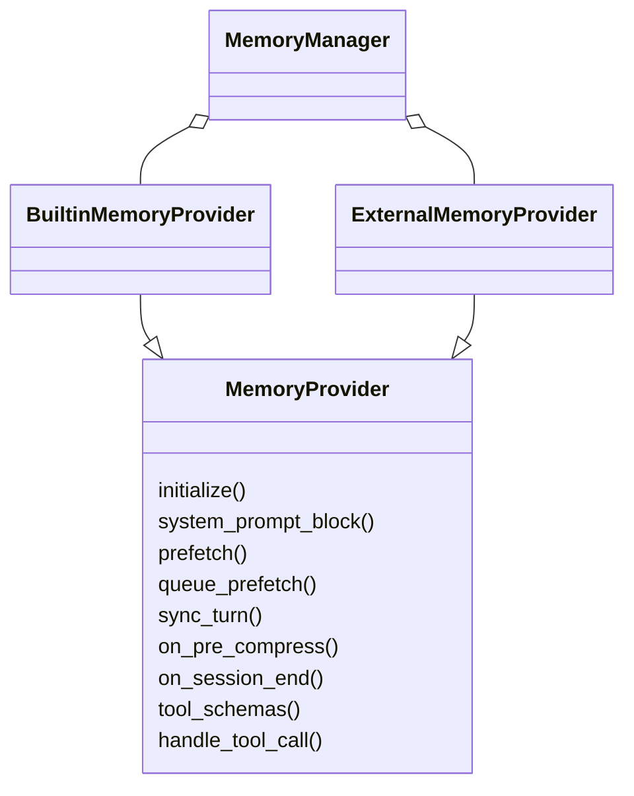
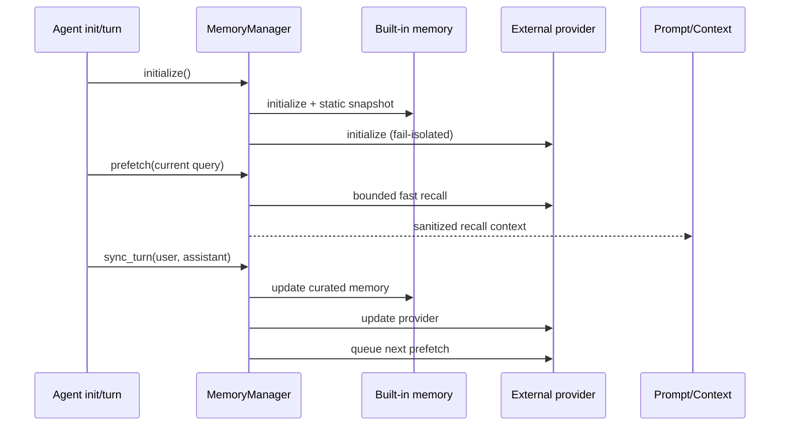
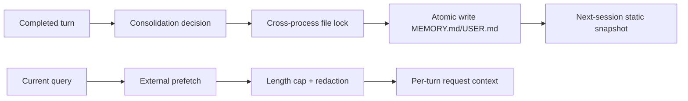
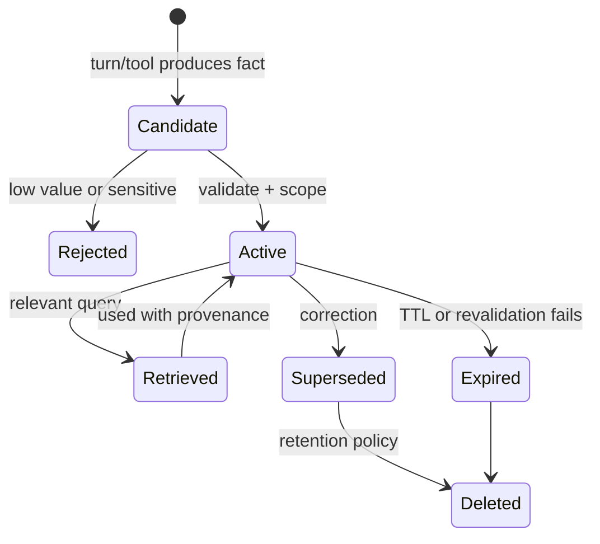

# 04 Memory：内置策展记忆与外部 Provider 编排

## 定位

**实现状态：核心端口 + 插件实现。** Hermes 内置一套小而可控的文本记忆，同时允许挂载一个外部 memory provider。核心关注生命周期、超时、隔离和 prompt-cache 安全，不强制所有用户采用同一种向量库或认知记忆模型。

因此它不是一个统一实现“情景记忆、语义记忆、反思、知识图谱”的大而全系统；这些能力取决于选中的 provider。

## 源码地图

| 责任 | 实现 |
| --- | --- |
| Provider ABC | `agent/memory_provider.py::MemoryProvider` |
| 多 Provider 编排 | `agent/memory_manager.py::MemoryManager` |
| 内置工具 | `tools/memory_tool.py` |
| 内置文件存储 | `tools/memory_tool_store.py::MemoryStore` |
| 外部实现 | `plugins/memory/` |
| 预压缩 checkpoint | `MemoryProvider.on_pre_compress` 等生命周期 |
| prompt 召回消毒 | `agent/context_engine.py::sanitize_memory_context` |

## Provider 协议

管理器固定让 built-in 在前，并最多编排一个外部 provider。这是刻意控制组合爆炸：多个第三方记忆同时写入、召回和注册同名工具，会让一致性和归因迅速失控。

## Turn 生命周期

外部 prefetch 用独立 daemon worker 和 timeout。若 worker 卡死，管理器不会为下一 turn 再堆一个线程，而是跳过该 provider，避免“每 turn 泄漏一条阻塞线程”。turn 结束时的 sync 与下一次 prefetch 串行化，防止读取早于刚完成的写入。

## 内置记忆的形态

`MemoryStore` 维护有界的 `MEMORY.md` 与 `USER.md`，以可读文本和分隔条目保存经过策展的信息。写入具备文件锁、原子替换、漂移保护和提示注入警告。

注意两条路径：内置静态 snapshot 在会话开始冻结；外部实时 recall 作为每 turn 上下文进入请求。后者不能回写历史 system prompt，否则记忆文件一变就会破坏缓存。

## 故障隔离

`MemoryManager` 的 fan-out 大多是 fail-soft：一个外部 provider 初始化、召回或同步失败，不应让主要对话失败。管理器还负责：

- 核心 memory 工具名保留，外部 provider 不能静默覆盖。
- 过大的 recall 结果外溢或截断。
- shutdown 有界等待，不因外部线程永久卡住。
- 兼容旧 provider 方法签名，但新代码仍应实现当前协议。
- pre-compress checkpoint 带 API 版本，避免插件误解摘要边界。

## 设计模式

- **Composite / Orchestrator**：一个 manager 对 built-in + external fan-out。
- **Strategy / Plugin**：不同后端实现同一生命周期端口。
- **Serialized Writer**：turn sync 与 prefetch 的因果顺序明确。
- **Bulkhead**：外部 recall 在独立有界线程中，故障不拖死主循环。
- **CQRS-like Split**：冻结的 prompt snapshot 与实时 recall 分路。

## 安全与信任

Memory 是不可信输入面：它可能含旧的恶意网页、错误总结或外部服务返回。Hermes 对进入上下文的内容做长度限制和脱敏，内置写入做注入模式告警；但这些都是启发式，不是安全边界。

插件运行在 agent 进程内，拥有该进程权限。第三方 memory provider 的真正信任门槛是安装前审查，以及必要时把整个 Hermes 进程放进 OS 级沙箱。

## 关键不变量

1. 记忆失败不能破坏主回复。
2. 外部 provider 不能覆盖保留工具名。
3. 当前会话的 system prompt snapshot 不随文件写入漂移。
4. end-of-turn 写入必须先于依赖它的下一次预取。
5. 压缩前给 provider 的 checkpoint 必须清晰区分将被折叠的范围。
6. `skip_memory=True` 的 cron/子 agent 不应偷偷继承父会话私有记忆。

## 取舍

- 文本记忆可审计、易备份，但语义召回能力有限。
- 外部 provider 提供更强召回，却增加网络、隐私和一致性风险。
- fail-soft 保住可用性，但意味着记忆不是强一致事务的一部分。
- 有界 snapshot 防止 prompt 膨胀，但需要策展和生命周期管理。

## 进一步拆解：记忆必须有生命周期

“把对话向量化”只解决了相似度检索，不等于记忆系统。一个可维护的 memory item 至少需要：

| 字段/能力 | 作用 | 缺失后的问题 |
| --- | --- | --- |
| scope | user、profile、project、agent、session | 串用户或串项目 |
| provenance | 来源 turn、tool、人工编辑、生成模型 | 无法判断可信度 |
| kind | semantic、episodic、procedural | 事实、经历、规则混在一起 |
| validity | created、verified、expires、supersedes | 旧事实长期污染回答 |
| retrieval metadata | embedding、关键词、实体、时间 | 单一路径召回不稳 |
| mutation semantics | add、merge、correct、delete | 只能累积，不能纠错/遗忘 |

Hermes 的 Provider 端口和 pre/post turn hook 提供了插入点，但“冲突合并、时间衰减、事实 provenance、法规删除”并没有因为有端口就自动完成。阅读内置 provider 时，要把**已实现的存取协议**与**记忆质量策略**分开评价。

### Hot path 与 background consolidation

- Hot path：回复前读/写，优点是立即一致；缺点是增加延迟，提取失败会阻塞主 turn。
- Background：turn 后异步提炼，优点是可用更慢模型和批处理；缺点是下一个 turn 可能先到，且需要幂等、重试和可观测队列。
- Hermes 的原则是 memory provider 失败不破坏主回复，这是一种可用性选择；对合规型“必须记账”场景，则应把写入升级为显式业务步骤而非 best-effort hook。

## 业界横向比较（2026-09）

| 方案 | 核心形态 | 更强的地方 | 代价/风险 |
| --- | --- | --- | --- |
| Hermes memory providers | 核心协议 + 插件 provider + turn hooks | 与 profile/session、本地文件和 agent 生命周期低耦合集成 | 高级冲突/图谱/评测取决于 provider |
| LangGraph Store / LangMem | namespace JSON store；semantic/episodic/procedural 分类 | 与 graph state、后台更新、few-shot 数据集衔接好 | 需要应用定义 schema、更新时机和检索策略 |
| Letta memory blocks | agent 可读写的持久 block + archival/context 管理 | stateful agent 身份和自管理记忆是核心产品模型 | 更强的 agent 自修改能力也扩大治理需求 |
| Mem0 | 事实提取 + vector，选配 graph relationships | 快速获得 user/agent/run scope 与混合召回 | 多一次提取/合并模型成本；错误事实也可能被固化 |

若核心需求是“一个长期人格持续自我管理状态”，Letta 往往比 Hermes 的通用 provider 端口更直接；若要为已有多入口代理增加可替换、可本地化的记忆，Hermes 更自然；若需要即插即用的向量/图抽取，Mem0 更省开发时间，但必须给错误更正、删除和租户隔离做验收。

## 记忆评测，而不是只测召回

建议建立四组数据：

1. **应记住**：稳定偏好、项目事实、明确承诺；
2. **不应记住**：一次性验证码、临时情绪、工具输出中的注入文本；
3. **应更新**：地址、版本、负责人发生变化；
4. **应隔离**：另一用户、profile 或项目中的同名实体。

同时量化 precision、recall、staleness、cross-scope leak 和 response impact。召回率高但把过期事实插入 prompt，业务效果可能更差。

## 源码阅读题

1. pre-turn memory 是在 system prompt 还是普通 context 区域注入？这对信任层级有何影响？
2. post-turn hook 失败由谁记录，是否会重复执行？
3. 同一事实被用户纠正两次时，内置实现是 append、overwrite 还是 merge？
4. provider 如何获得 profile/session scope，是否存在进程全局 fallback？

## 学习实验

1. 写一个最小 `MemoryProvider`，让 `prefetch` sleep 超时，观察主 turn 继续且后续不堆 worker。
2. 在一个 turn 写入内置 memory，确认同会话 system prompt 不变、下一会话才看到新 snapshot。
3. 返回超大 recall 文本，观察 sanitize/外溢路径。
4. 让外部 provider 的 `sync_turn` 抛异常，验证 built-in 仍可更新。

## 延伸阅读

- [Memory provider plugin](../../website/docs/developer-guide/memory-provider-plugin.md)
- `agent/memory_provider.py`
- `agent/memory_manager.py`
- [LangGraph memory concepts](https://docs.langchain.com/oss/python/concepts/memory)
- [Letta documentation](https://docs.letta.com/)
- [Mem0 graph memory](https://docs.mem0.ai/open-source/features/graph-memory)
