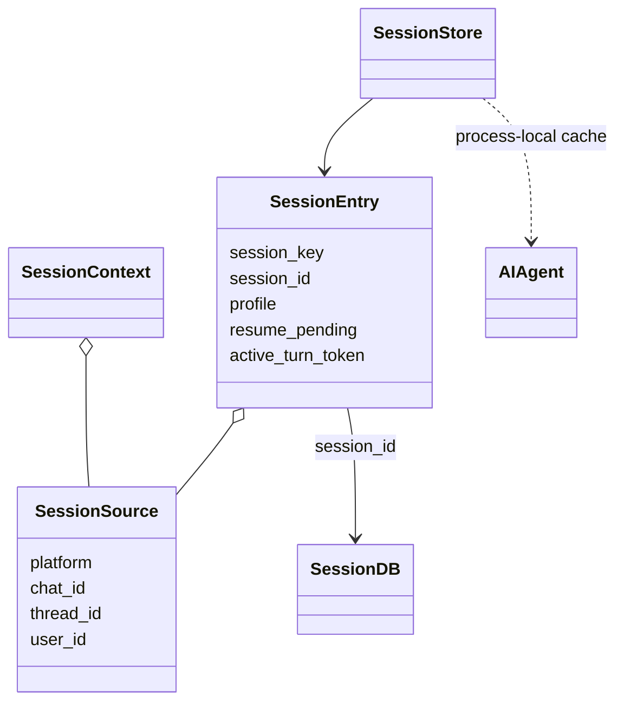
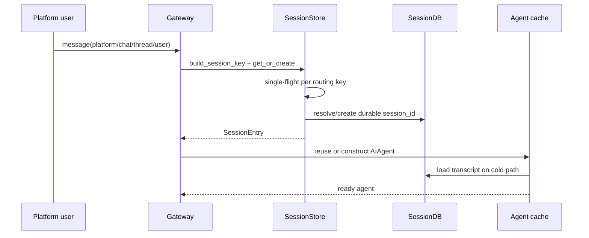
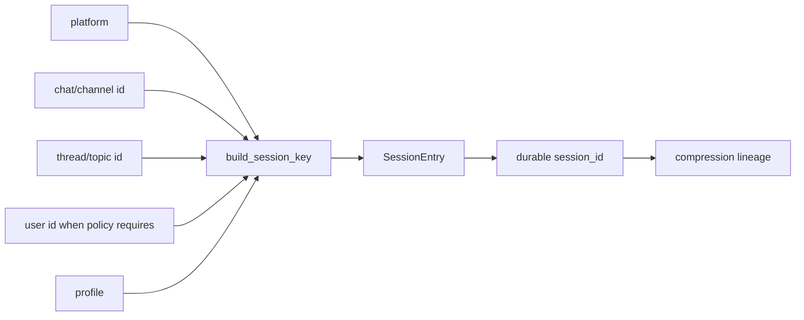
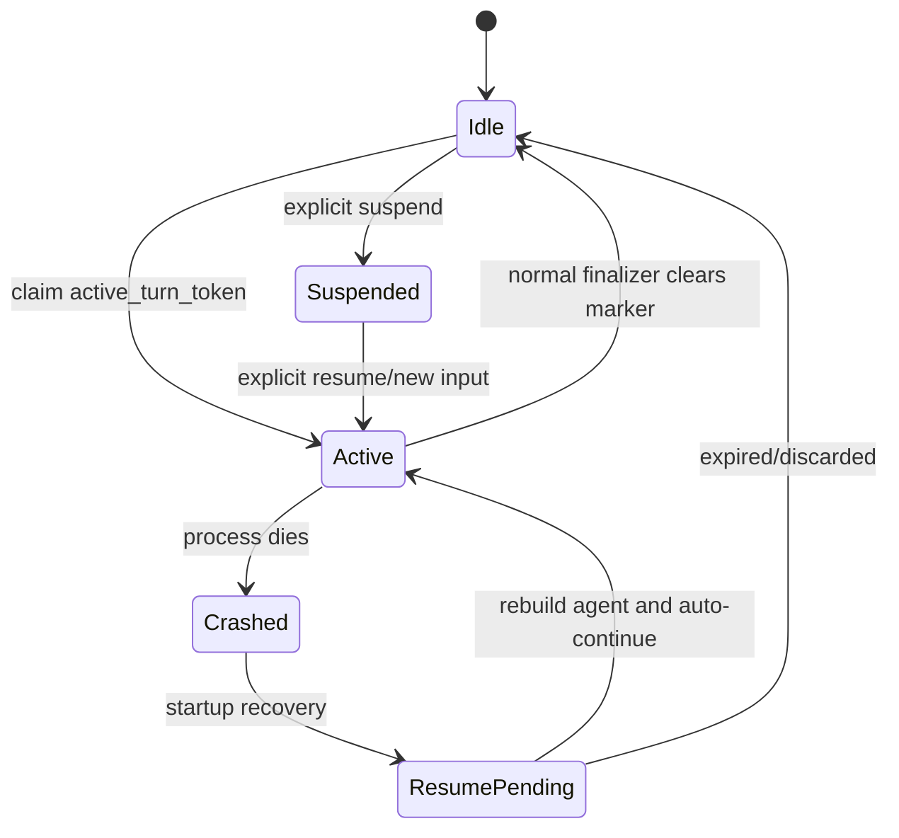
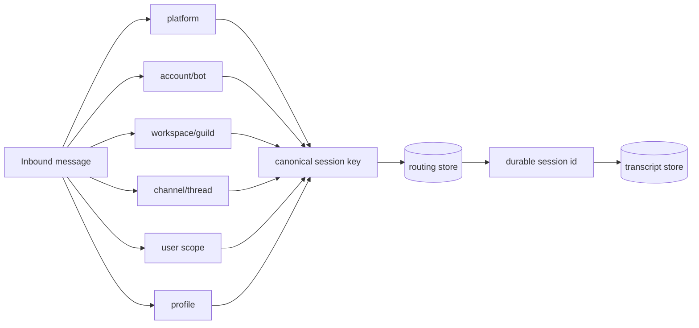

# 05 Session：持久会话、路由身份与活跃 Agent 缓存

## 定位

**实现状态：核心 + 分散。** Hermes 中“session”至少包含三种不同对象，学习时必须拆开：

1. `session_id`：SQLite transcript 的持久身份；压缩后可能形成 lineage。
2. `session_key`：Gateway 根据平台、聊天、线程、用户、profile 生成的稳定路由键。
3. 活跃 `AIAgent`：进程内缓存对象，可随内存压力或重启消失。

把三者当成一个对象，会误解恢复、缓存和授权。

## 源码地图

| 责任 | 实现 |
| --- | --- |
| transcript facade | `hermes_state.py::SessionDB` |
| schema/messages/search/usage/lineage | `hermes_state_*.py` mixins |
| 单 DB writer 注册 | `hermes_state_registry.py` |
| Gateway 身份对象 | `gateway/session.py::SessionSource/SessionContext/SessionEntry` |
| 路由存储 | `gateway/session.py::SessionStore` |
| 生命周期/CAS marker | `gateway/session_lifecycle.py` |
| profile scoped DB | `gateway/session_persistence.py` |
| Agent 对象缓存 | `gateway/run_agent_cache.py` |
| TUI 会话重建 | `tui_gateway/session_*.py` |

## 对象关系

## 创建/恢复时序

`SessionStore` 以 SQLite routing index 为主，兼容旧 `sessions.json` 镜像和 JSONL fallback。相同 key 的并发 cold start 被 single-flight 合并，避免创建两个不同 session。

## 路由身份

不同平台的 DM、群聊、线程语义不同，因此 key 不是简单字符串拼接。适配器还必须用 profile scoped allowlist 再做授权；session ID 只是路由句柄，不是访问令牌。

## 活跃 turn 标记与崩溃恢复

turn 开始时，生命周期管理器用 CAS 语义写入 `active_turn_token` 和时间；正常 finally 清掉。若进程不干净退出，下一次启动把遗留标记提升为 `resume_pending`。

这里恢复的是“未完成 turn 的业务意图”：重新加载 transcript、附加恢复提示、开启新执行线程。原来的 socket、线程和 Python 栈都不会复活。

## SessionDB 的并发模型

- SQLite WAL 提供读写并发。
- 每个解析后的 DB 路径在进程内只有一个 writer handle，引用计数由 registry 管理。
- 只读连接有有界池，避免高并发搜索耗尽文件描述符。
- busy/locked 用短时、抖动重试；结构损坏进入粘性 quarantine，不能当成“再打开就好”。
- system prompt 内容寻址存储，message 行引用 hash，减少重复。

## 设计模式

- **Repository**：`SessionDB` 隐藏 schema 与 SQLite 细节。
- **Facade + Topic Mixins**：公共类稳定，能力分拆在 sibling 模块。
- **Identity Map / Routing Index**：`session_key → session_id`。
- **Singleflight**：合并同 key 并发创建。
- **CAS / Lease Marker**：判定是否有一轮执行被进程死亡打断。
- **Lineage**：压缩不是覆盖过去，而是父子会话演化。

## 关键不变量

1. profile 对应的 routing store 与 transcript store 不能错配。
2. `model_override` 持久化前必须去掉 secret，只保留允许字段。
3. session key 的构造必须包含平台真实隔离维度。
4. 正常结束必须清理 active marker；只有异常退出才留下恢复证据。
5. agent cache 可丢，transcript 才是恢复事实。
6. session ID 不能代替适配器授权。

## 进一步拆解：Session identity 是一个向量

数据库里的随机 ID 只是持久主键。真正决定“这条消息属于哪个对话”的，是平台、账户/机器人、workspace、channel/thread、用户、profile 等维度的组合。

漏掉一个隔离维度可能造成两种相反故障：collision 会把不同用户映射到同一 transcript；over-segmentation 会让同一 thread 无法续聊。设计 adapter 时应先写 canonical identity tuple，再写字符串编码；字符串只是表示，tuple 才是契约。

### 三个“状态”不要混为一谈

| 状态 | 真相源 | 可否丢弃 | 典型内容 |
| --- | --- | --- | --- |
| Durable session | SQLite/state store | 否 | transcript、usage、model override、active marker |
| Process agent cache | 内存 | 是 | 已构造 `AIAgent`、client、快速索引 |
| Surface connection | gateway/TUI/Desktop 连接 | 是 | websocket、typing indicator、stream subscriber |

断开 WebSocket 不应结束 durable session；丢掉 agent cache 不应丢历史；恢复 active turn 也不表示原 surface 连接仍存在。Hermes 把这三个生命周期拆开，是多入口系统可恢复的基础。

## 业界横向比较（2026-09）

| 方案 | Session 单位 | 持久能力 | 更适合 |
| --- | --- | --- | --- |
| Hermes | 平台路由 key → durable session ID | 完整 transcript、usage、override、active turn 与多入口映射 | 聊天平台/CLI/Desktop 共用长期身份 |
| OpenAI Managed Agents sessions | 托管 agent session，含环境、status、required actions、usage 和事件流 | 服务端管理 session/turn/environment/artifact | 使用托管 agent runtime 的应用 |
| OpenAI Responses conversations | 服务端 conversation / previous response chain | API 自动追加 input/output；应用少搬运消息 | 单一 API 平台、服务端状态可接受 |
| LangGraph threads | `thread_id` 下的一串 checkpoints | 分支、time travel、pending writes、store | graph run 的状态与恢复 |
| Temporal workflow ID/run ID | workflow execution identity | 事件历史、signal/update、继续执行 | 跨日业务流程，不等同聊天 transcript |

Hermes 的强项是“路由身份 + 对话事实 + 产品入口”；LangGraph/Temporal 的强项是“执行状态”。实际系统常同时需要两个 ID：`conversation_id` 面向用户，`workflow_id` 面向后台任务。强行共用会让归档对话误杀后台任务，或 workflow retry 生成重复聊天消息。

## 并发与恢复推演

按四个时间点推演一个 turn：

1. 已写 user row，尚未写 active marker；
2. active marker 已写，模型请求尚完成；
3. assistant tool-call 已写，工具正在运行；
4. final text 已写，marker 尚未清理。

每一点都问：另一个进程能否取得 lease？用户会看到什么？能否安全重试？哪些字段足以去重？这比只测“创建 session 成功”更能验证 SessionDB 设计。

## 源码阅读题

1. gateway routing store 与 `SessionDB` 分别回答什么问题？为什么不能只保留一个？
2. `model_override` 的 allowlist 在写入前还是读取后应用？secret 会不会进入 DB？
3. 正常 finalizer 与进程异常留下的 active marker 如何区分？
4. adapter 授权使用哪些外部身份字段，为什么不能仅凭客户端提交的 session ID？

## 学习实验

1. 对同一 session key 并发执行两次 get/create，确认只有一个 durable ID。
2. 删除进程内 agent cache，再发送消息，确认从 DB 重建。
3. 模拟 active marker 未清理后重启，观察 `resume_pending`。
4. 为相同 chat ID 使用两个 profile，验证路径、secret 和 transcript 隔离。

## 延伸阅读

- [Session storage](../../website/docs/developer-guide/session-storage.md)
- [Session lifecycle](../session-lifecycle.md)
- [State DB recovery](../state-db-recovery.md)
- [OpenAI Managed Agents：create session](https://developers.openai.com/api/reference/python/resources/beta/subresources/agents/subresources/sessions/methods/create)
- [LangGraph persistence and threads](https://docs.langchain.com/oss/python/langgraph/persistence)
- [Temporal documentation](https://docs.temporal.io/)
