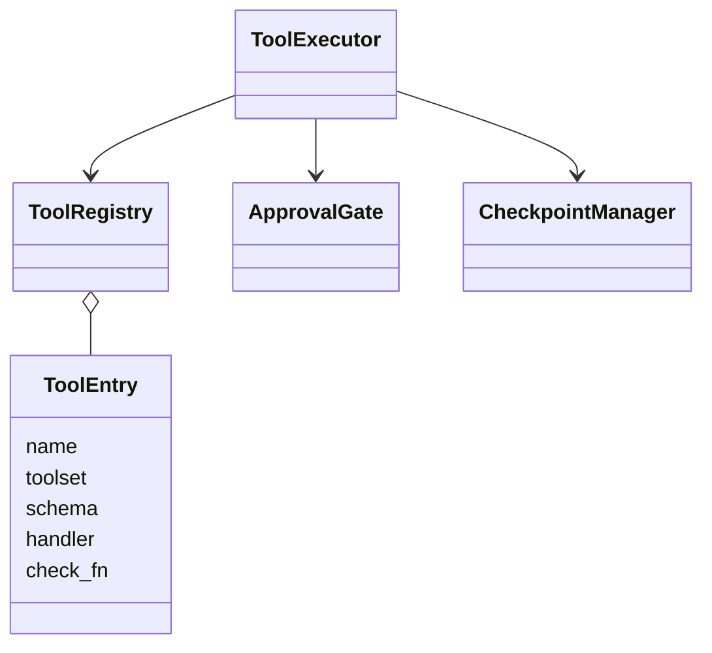
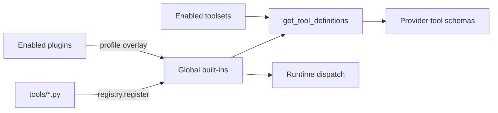
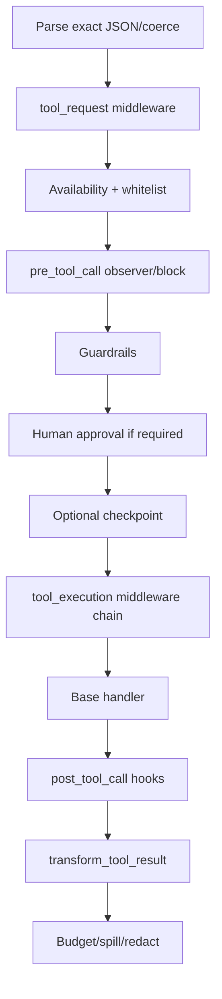
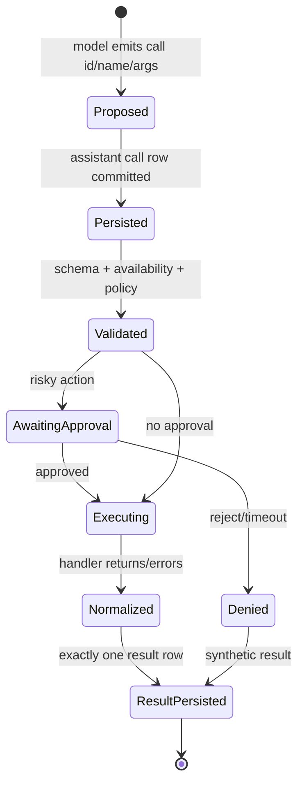

# 06 Tools：注册表、策略管线与副作用提交协议

## 定位

**实现状态：核心。** 工具层从 schema 暴露到最终 result 入队，经过注册、可用性、参数解析、中间件、插件 hook、guardrail、审批、并发调度、持久化和输出预算。

Hermes 的关键不是“能调函数”，而是所有工具共享同一条治理管线。

## 源码地图

| 责任 | 实现 |
| --- | --- |
| 工具注册表 | `tools/registry.py::ToolRegistry/ToolEntry` |
| 核心发现与 schema | `model_tools.py` |
| 工具集图 | `toolsets.py` |
| 一轮 tool-call 编排 | `agent/turn_tool_round.py` |
| 执行管线/并发 | `agent/tool_executor.py` |
| 插件 hook/中间件 | `hermes_cli/plugins.py`、`hermes_cli/middleware.py` |
| 审批 | `tools/approval*.py` |
| checkpoint | `tools/checkpoint_manager.py` |
| 大结果外溢 | `tools/tool_result_storage.py` |

## 核心对象



## 注册与发现

工具模块在 import 时向全局 registry 自注册。`discover_builtin_tools()` 用 AST 先判断模块是否含顶层注册语句，再选择性 import，避免为了枚举工具把整个目录的重依赖全部加载。



注册表发布 coherent snapshot 并维护 generation。工具定义缓存以 generation、profile、toolsets 等为 key；插件增加/移除工具后缓存会自然失效，而不是读取半更新状态。

## 从模型到结果的时序

```mermaid
sequenceDiagram
    participant M as Model
    participant R as Tool round
    participant D as SessionDB
    participant E as Tool executor
    participant P as Policy pipeline
    participant H as Handler
    M-->>R: assistant(tool_calls)
    R->>R: cap, validate, dedupe
    R->>D: persist assistant tool-call row
    alt persist failed
        R-->>M: stop; never execute side effect
    else persisted
        R->>E: plan semantic batches
        E->>P: middleware/hooks/guards/approval
        P->>H: invoke JSON handler
        H-->>P: JSON string result
        P-->>E: transformed result
        E->>D: persist each tool result
        E-->>R: ordered result messages
    end
```

“persist-before-execute”缩小了 crash ambiguity：至少能知道是哪一个已承诺的 tool-call 触发了副作用。它仍不提供任意外部系统的 exactly-once；handler 执行完成但 result 落库前崩溃，副作用状态仍可能未知。

## 策略管线



顺序具有安全意义：request middleware 改写后的参数才是 guardrail 和审批真正审查的参数。observer hook 可以观察或显式阻止；middleware 才能改变行为。

## 语义并发

`_plan_tool_batch_segments` 不会简单把所有 tool-call 扔进线程池。它按工具安全元数据、读写属性和路径重叠构造顺序段：

- 明确只读且互不冲突的调用可并行。
- 未知或有副作用工具形成顺序屏障。
- 两个会访问重叠文件路径的调用串行。
- 返回给模型的 tool result 始终恢复原 tool-call 顺序。

这是一种保守的 deterministic concurrency：宁可少并行，也不让并发改变语义。

## Toolsets 是 session 能力边界

`toolsets.py` 用命名集合和 include 关系组织能力。Gateway 根据 session 的 platform 选择 GUI/project 等 surface toolset；`check_fn` 只判断依赖是否可达或用户是否 opt-in，不能用进程环境推断“是否有桌面 UI”。

这是一个重要可迁移原则：**能力属于会话，不属于进程。** 同一 backend 可能同时服务桌面、终端和远端客户端。

## 设计模式

- **Registry**：schema 与 handler 统一登记。
- **Command Bus**：模型产生命令，执行器统一分发。
- **Chain of Responsibility**：middleware、hook、guard、approval 逐层决策。
- **Policy Object**：toolset、whitelist、并发元数据与审批规则。
- **Bulkhead / Semantic Scheduler**：只并发已证明安全的调用。
- **Decorator**：execution middleware 包裹 `next_call`。

## 关键不变量

1. handler 返回 JSON 字符串；错误也使用稳定 envelope。
2. assistant tool-call 成功持久化前不得执行副作用。
3. 每个 tool-call ID 恰好配一个 result 消息。
4. 插件覆盖核心工具必须显式授权并记录所有权。
5. 输出超限要 spill/truncate，不能撑爆下一次模型请求。
6. 并行执行不能打乱模型看到的结果顺序。

## 失败语义

| 故障 | 行为 |
| --- | --- |
| JSON 参数无效 | 合成错误 result，不调用 handler |
| `check_fn` 不可用 | schema 隐藏或运行时拒绝 |
| pre-hook block | 返回受控 block result |
| 审批超时/无人可答 | fail closed |
| handler 异常 | 结构化错误，供模型决定下一步 |
| result 过大 | 外溢文件 + 有界摘要 |
| result 持久化失败 | 停止继续工具链，保留诊断 |

## 进一步拆解：工具调用是一次小型事务

工具 handler 只是中间一环。完整调用的可观察状态是：



它不是数据库意义上的原子事务：外部副作用无法和 SQLite row 一起 commit。但“先记录提议，再执行，再记录观察”把不可避免的 crash window 缩成可审计状态。高风险 tool 仍需业务幂等键、远端 operation ID 或查询后恢复。

### Schema 的三种职责

1. **给模型的 affordance**：名字、描述、参数让模型知道何时调用；
2. **运行时验证**：拒绝缺字段、类型错误和额外危险参数；
3. **安全最小化**：窄 schema 比在 handler 里接受任意 shell/API payload 更容易治理。

因此“兼容更多输入”不总是好事。模糊 coercion 会让审批看到的参数与实际执行含义不一致。middleware 改写后应再次验证，并让审批展示最终参数。

### 并行不是布尔开关

Hermes 的语义并发关注资源冲突。两个 read-only call 可以并行；写同一工作树、共享 browser tab 或使用同一串行 session 的调用应被放进同一 conflict segment。更成熟的扩展可以让工具声明 effect set：`read(path)`、`write(path)`、`network(domain)`、`ui(tab)`，调度器按交集决策，而不是维护工具名黑名单。

## 业界横向比较（2026-09）

| 方案 | 工具抽象 | 更强的地方 | Hermes 的相对优势/短板 |
| --- | --- | --- | --- |
| Hermes | 全局 registry + session toolset + policy pipeline + real backends | persist-before-execute、profile overlay、审批、输出外溢和终端/浏览器集成 | 类型化 Python DX 不如 PydanticAI；远端 exactly-once 仍需工具自身 |
| OpenAI Agents SDK | function tool、hosted tool、agent-as-tool、guardrails | 用 Python 类型/signature 快速产出 schema，与 run context/tracing 紧密 | 产品级 registry/多后端策略较少 |
| PydanticAI | 类型化 tools/toolsets + dependency injection | 参数/返回类型、重试提示和测试体验强 | Hermes 更重视长期 session 和跨 surface 能力边界 |
| LangChain/LangGraph | tools + ToolNode + middleware | 与 graph state、HITL、retry/fallback middleware 组合灵活 | 要自行定义产品级授权与工具所有权 |
| Vercel AI SDK | TS tool schema + stream/tool loop | 与 Web 流式 UI、structured output 组合自然 | 主要面向 TS 应用，系统终端后端不是核心 |
| MCP | 远端标准化 `tools/list` / `tools/call` | 跨语言、跨进程发现与调用 | 只解决协议；Hermes 仍必须做 host policy、审批、落库和调度 |

如果你在写普通业务 API agent，PydanticAI/OpenAI Agents SDK 的函数装饰器更轻；如果工具是长期运行系统里的真实 shell、浏览器、消息动作，Hermes 的 lifecycle 和 policy 值得学习；如果工具要被多个 host 复用，优先做 MCP server，再由 Hermes 的策略层托管。

## 工具设计审查题

1. 这是查询、可重试幂等写、不可重试写，还是长任务启动？
2. 请求成功但客户端超时时，如何查询远端 operation status？
3. 输出是否包含 secret、二进制、大文本或不可信指令？
4. `check_fn` 表达“服务可达/用户启用”还是误用了进程环境来猜 session surface？
5. 新能力能否先做 CLI + skill、服务门控工具或 MCP，而非永久增加 core schema？
6. 并发时结果如何恢复到模型原始 call 顺序？

## 学习实验

1. 注册一个 profile overlay 工具，观察 registry generation 与 definition cache。
2. 同一批次发起两个只读不同路径、两个写同一路径的调用，记录调度段。
3. 在 tool-call 入库后、handler 返回前强制退出，分析恢复时能知道什么、不能知道什么。
4. 用 middleware 改写 terminal 命令，确认审批展示的是改写后参数。

## 延伸阅读

- [Tools runtime](../../website/docs/developer-guide/tools-runtime.md)
- `tools/AGENTS.md`
- [Tool-call guardrail controller](../hermes-interview/zh-tool-call-guardrail-controller.md)
- [OpenAI Responses API tools/function calling](https://developers.openai.com/api/reference/cli/resources/responses/methods/create)
- [LangChain agent middleware and tool interception](https://docs.langchain.com/oss/python/langchain/agents)
- [Model Context Protocol 2026-07-28 architecture](https://modelcontextprotocol.io/specification/2026-07-28/architecture)
