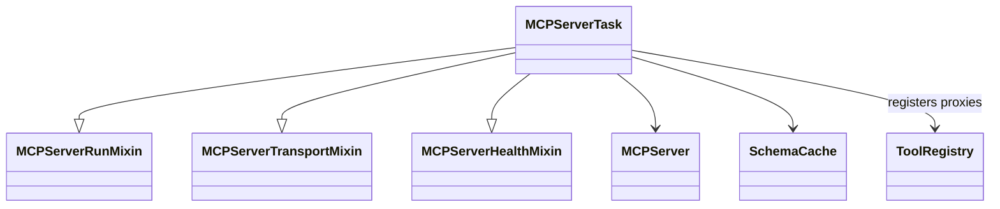
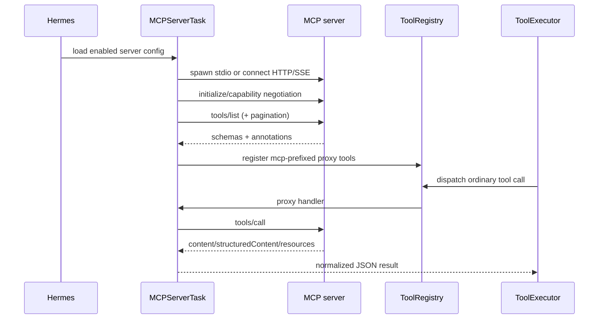
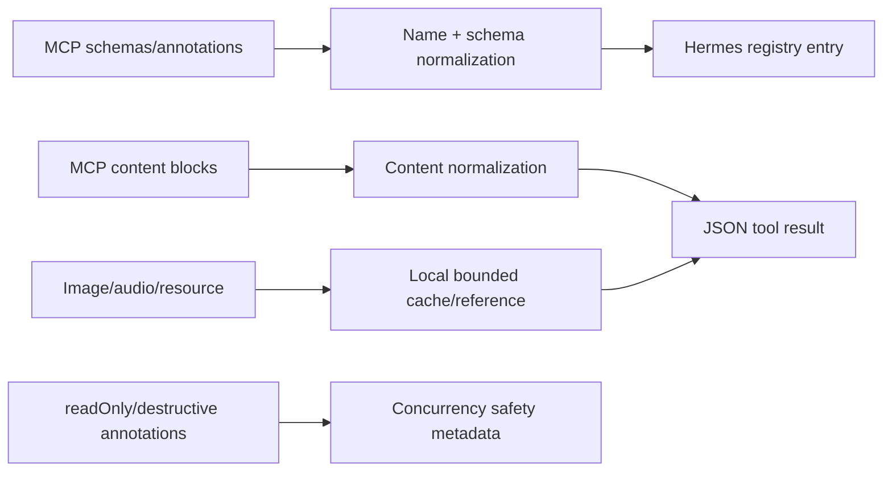
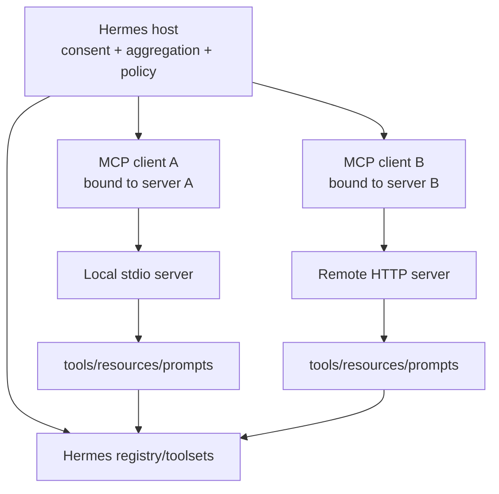

# 07 MCP：外部协议的反腐层与懒注册代理

## 定位

**实现状态：成熟的 MCP 客户端适配。** Hermes 把 MCP server 的 tools/resources/prompts 转换为普通 ToolRegistry 条目，从而复用同一套 tool policy、审批、并发和结果预算。

不要把 `mcp_tool.py` 中的 “server task” 名称误读为 Hermes 向外提供完整 MCP server；这里的主职责是管理一个远端/子进程 MCP server 的客户端会话。

## 源码地图

`tools/mcp_tool.py` 是 facade，主题逻辑位于：

| 主题 | sibling |
| --- | --- |
| 配置/作用域 | `mcp_tool_config.py`、`mcp_tool_scope.py` |
| schema 与命名 | `mcp_tool_schema.py` |
| discovery/注册 | `mcp_tool_discovery.py`、`mcp_tool_registration.py` |
| stdio/HTTP/SSE | `mcp_tool_transport.py` |
| 请求/内容归一 | `mcp_tool_handlers.py`、`mcp_tool_content.py` |
| 生命周期/健康 | `mcp_tool_lifecycle.py`、`mcp_tool_health.py` |
| 连接任务 | `mcp_tool_server_run.py` |
| sampling | `mcp_tool_sampling.py` |

## 对象关系

## 连接、发现与调用

命名通过 server namespace 前缀避免不同 MCP server 的同名工具冲突。注册进命名 toolset 后，MCP 工具和内置工具对模型看起来是一种协议。

## 传输与协商

支持 stdio、Streamable HTTP/SSE 等连接形态。连接端处理：

- 子进程命令解析、安全环境、进程账本和死亡监控。
- HTTP content-type 预检、身份 header、client cert/OAuth。
- 旧 initialize 协议与现代 discovery 的有条件协商。
- connect cooldown、健康状态、断线重连和一次受控重试。

协商不是“任何错误都换协议”：只有明确的 modern-only 信号才 fallback；timeout 不被当作协议版本证据，否则慢服务会触发重复连接。

## 反腐层

反腐层负责消化外部协议差异：JSON Schema 形状、分页、text/structured content、多媒体、嵌入 resource 和错误 envelope。上层 ToolExecutor 不需要为 MCP 再实现一套循环。

## 懒注册与缓存

已知 schema 可以先从缓存注册代理，真正调用时再连接 server。这减少每次启动的冷延迟，也保持 prompt tool schema 稳定。代价是 schema 可能短暂陈旧，因此 reload 和健康检查必须明确处理 registry generation 与 prompt-cache 边界。

## 信任与安全

- MCP server 返回内容属于不可信输入。
- server annotations 只能作为调度提示，不能替代 Hermes 自己的审批/guardrail。
- stdio 子进程在 agent 进程环境中启动；terminal backend 沙箱不会自动包住 MCP。
- profile multiplex 下，配置、OAuth/session 和工具注册必须带 scope。
- 第三方 server 的依赖/命令在连接前可做预检，但扫描不是 OS 隔离。

## 设计模式

- **Protocol Adapter / Anti-corruption Layer**：MCP 转换为 Hermes Tool 协议。
- **Facade + Mixins**：一个公共 MCP 模块，多主题实现。
- **Proxy**：registry handler 代理远端 `tools/call`。
- **Circuit Breaker**：失败冷却、健康状态与有限重连。
- **Lazy Initialization**：缓存 schema，首次需要时连接。
- **Namespace**：server-qualified tool name 消除冲突。

## 关键不变量

1. `tools/list` 必须读取所有分页，不能只看第一页。
2. schema cache 更新必须推动 registry generation。
3. 重试只能发生在可判断为未完成/可安全重放的连接错误上。
4. 外部 content 必须经过尺寸和媒体落盘约束。
5. server 作用域不能跨 profile 泄漏。
6. reload 若改变当前 tool schema，必须尊重会话 prompt-cache 策略。

## 进一步拆解：协议层与 Host 策略层

MCP 的 host–client–server 架构刻意把控制权留给 host。Hermes 同时扮演 host 和多个一对一 MCP client 的管理者：

| MCP 负责 | Hermes host 仍负责 |
| --- | --- |
| negotiated-era `initialize`/`server/discover` 与 capabilities | 哪个 profile/session 可连接 |
| `tools/list`、`tools/call` wire schema | 名称冲突、toolset 暴露和审批 |
| resources/prompts/sampling 等协议原语 | 哪些内容进入模型、信任级别与 token 预算 |
| stdio/HTTP 等 transport | 生命周期、重连、缓存失效和日志脱敏 |
| OAuth/授权协议基础 | 用户 consent、token scope 和 server 信任 |

2026-07-28 规范把 MCP 定义为 stateless：每个请求携带协议版本与 client capabilities，并以 `server/discover` 获得 server capabilities；旧规范则通过 `initialize` 建立会话语义。Hermes 的 transport 明确协商两个时代，不能把长连接实现细节误当成新协议状态。

这也是为什么“支持 MCP”不等于“工具系统完成了”。一个 host 若把所有 server schema 无条件加入每次请求，会破坏 Hermes 的窄工具面和 prompt cache；若把 server 返回当可信系统指令，会跨越数据/指令边界。

### 重试要看提交不确定性

连接在发送前断开，通常可安全重试；server 已收到请求、执行副作用后连接断开，client 无法仅凭 transport error 判断是否重放。对于写工具，需要 server 侧 idempotency key、operation status resource，或让用户决定恢复策略。把所有 EOF 都视为“没执行”会制造重复动作。

## 业界横向比较（2026-09）

| 路径 | 优点 | 限制 | 适用场景 |
| --- | --- | --- | --- |
| Hermes MCP client | 与 registry、toolsets、profile、媒体落盘、缓存 generation 结合 | 重点是 client/host，不是通用 MCP server framework | 给长期 Hermes session 接外部能力 |
| 官方 MCP SDK/自建 host | 协议覆盖和控制最直接 | host policy、session、UI、审批全部自建 | 做专用 MCP 产品或 server |
| OpenAI Agents SDK MCP | 与 Agent/Runner/tracing/HITL 组合简单 | 受 SDK run 模型约束 | 应用内 agent 快速消费 MCP |
| LangChain MCP adapters | MCP tools 与 LangChain/LangGraph 生态互通 | graph/session policy 由应用决定 | 已使用 LangGraph 的工作流 |
| Provider 托管 remote MCP | 少写 client/transport 代码 | 数据路径、能力集和审批语义更依赖 provider | 单 provider 托管应用 |
| 直接 REST/SDK 集成 | 类型与业务语义最可控 | 每个 host 重复适配，不具 MCP 互操作性 | 少量稳定的内部 API |

Hermes 更好在“很多外部 server 进入一个长期、多 profile agent”时；专门发布一个可复用 server 时，官方 MCP SDK 才是主角。MCP 也不应取代普通 SDK：若一个高价值支付动作需要强业务事务、细粒度 IAM 和专门审计，直接服务 API 往往更清晰。

## 安全审查清单

1. server 是谁发布、代码运行在哪里、升级是否可被替换？
2. access token 是否绑定正确 audience？是否发生 token passthrough？
3. tools/resources/prompts 中的文本是否标记为外部不可信数据？
4. `tools/list` 改变时是立刻破坏当前缓存，还是延后到新 session/显式 `--now`？
5. 本地 stdio server 继承了哪些文件、环境变量和网络权限？
6. remote server 的 tool call 是否有超时、取消和输出大小限制？

## 源码阅读题

1. 分页 `tools/list` 结果如何汇总，最后在哪一步推动 registry generation？
2. schema 名冲突怎样命名和归属，插件/核心覆盖是否显式？
3. image/resource content 在进入模型前落到哪里，生命周期由谁清理？
4. 当前 server reload 如何与 prompt-cache 不变量协调？

## 学习实验

1. 实现一个只提供 `echo` 的 stdio MCP server，观察它如何出现在 `mcp-<server>` toolset。
2. 让 `tools/list` 返回两页，验证第二页也注册。
3. server 在 `tools/call` 前后分别断开，比较是否重试及副作用风险。
4. 返回 text + image + embedded resource，检查 normalized result。

## 延伸阅读

- `tools/mcp_tool.py`
- `tools/mcp_tool_transport.py`
- `tools/mcp_tool_registration.py`
- [Tools runtime](../../website/docs/developer-guide/tools-runtime.md)
- [MCP 2026-07-28 architecture](https://modelcontextprotocol.io/specification/2026-07-28/architecture)
- [MCP 2026-07-28 authorization](https://modelcontextprotocol.io/specification/2026-07-28/basic/authorization)
- [MCP security considerations](https://github.com/modelcontextprotocol/modelcontextprotocol/blob/main/docs/specification/2026-07-28/basic/authorization/security-considerations.mdx)
