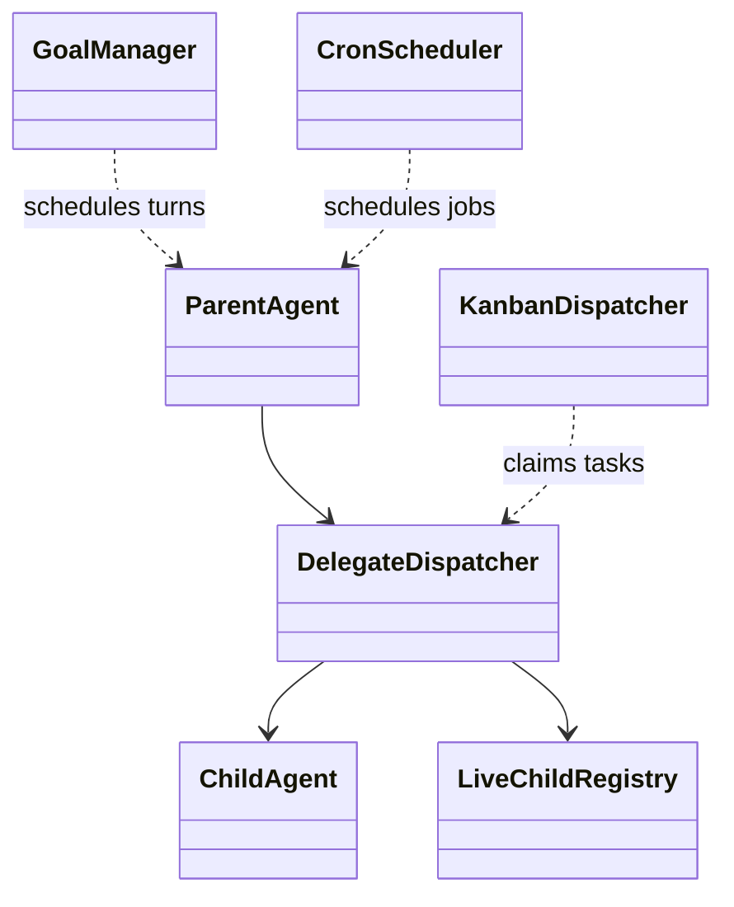
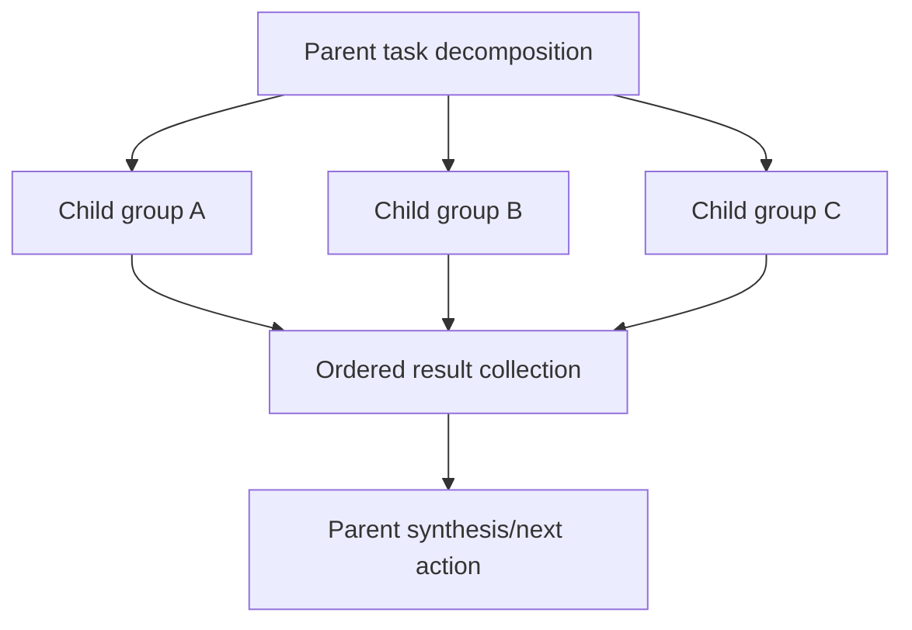
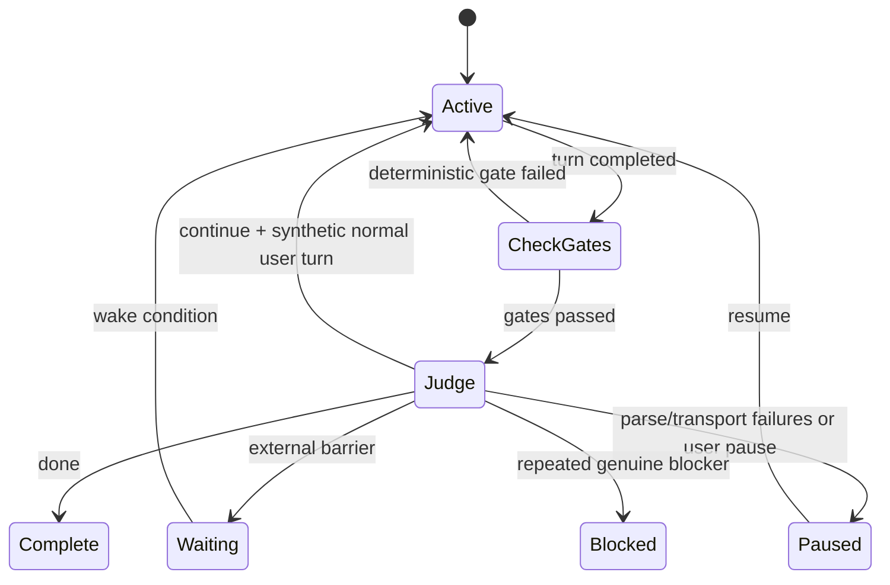
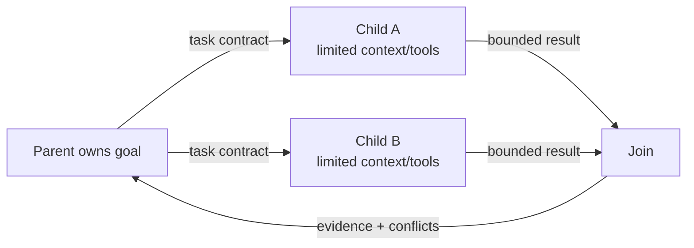

# 08 Orchestration：层级委派、并行汇聚与持久目标循环

## 定位

**实现状态：分散。** Hermes 没有一个通吃所有场景的 `Orchestrator`。它用几种专用编排器解决不同问题：

| 机制 | 适用问题 |
| --- | --- |
| `delegate_task` | 把独立子任务交给有工具的 child agent |
| MoA | 多个无工具 advisor 并行给意见，再由主 agent 聚合 |
| Goal/Ralph loop | 跨多个 turn 持续追求一个完成条件 |
| Cron/Heartbeat | 时间驱动的重复或唤醒任务 |
| Kanban | 持久任务图、领取、执行与审核 |

这种“多个小状态机”比一个超级 DSL 更贴合失败语义。

## 源码地图

| 责任 | 实现 |
| --- | --- |
| 委派 facade | `tools/delegate_tool.py` |
| 批量/后台调度 | `tools/delegate_tool_dispatch.py` |
| child 生命周期/结果 | `tools/delegate_tool_*.py` |
| 活跃 child 注册/控制 | `tools/delegate_tool_registry.py` |
| 后台委派 ledger | `tools/async_delegation.py` |
| Agent 生命周期事件 | `agent/subagent_lifecycle.py` |
| MoA | `agent/moa_loop.py` |
| Goal 状态机 | `hermes_cli/goals.py`、`gateway/run_goals.py` |
| Cron | `cron/` |
| Kanban | `hermes_cli/kanban*.py`、`plugins/kanban/` |

## 核心对象



## 层级委派

```mermaid
sequenceDiagram
    participant P as Parent Agent
    participant D as delegate_task
    participant R as Child registry
    participant C as Child AIAgent
    participant DB as SessionDB
    P->>D: task + role/toolset/worktree options
    D->>D: intersect allowed toolsets; derive depth role
    D->>DB: create fresh child session
    D->>C: build focused prompt, fresh budget
    D->>R: register live child
    C->>C: run independent tool loop
    C-->>D: structured summary/artifacts/status
    D->>R: unregister + cleanup
    D-->>P: bounded child result
```

child 默认不复制父 transcript、memory 和全部 context files，只收到任务、聚焦 prompt 和允许工具集。父 agent 看到的是结构化摘要，而不是整段 child 对话。这是上下文隔离，也降低父 prompt 膨胀。

工具权限采用交集而非并集：child 不能因为指定了一个更宽 role 就获得父会话没有的能力。depth 决定 leaf/orchestrator 行为，防止无界递归委派。

## 并行 fan-out/fan-in



并行单位有各自 timeout、heartbeat 和诊断；父中断会传播到活跃 child。后台模式把 dispatch/completion/delivery 写入 SQLite ledger，但执行 worker 本身仍是进程内任务：崩溃后会识别 abandoned 并报告，不能把任意 child Python 栈续跑。

## MoA 与 subagent 的区别

MoA advisor 并行读取问题并输出观点，通常不能使用工具；aggregator 仍是正常主 agent，可继续工具循环。它适合“多模型视角”，不适合把外部副作用分片执行。

| 维度 | delegate child | MoA advisor |
| --- | --- | --- |
| 工具 | 受限工具集 | 无工具 |
| 会话 | 独立 child session | 一次 advisor 请求 |
| 输出 | 任务结果/工件/状态 | 建议文本 |
| 取消 | 注册表传播 | fan-out task 取消 |
| 用量 | child 独立核算 | advisor 用量折入 MoA trace |

## Goal 持久状态机



Goal manager 把 objective、预算、质量 gate、judge verdict 和等待状态持久化。继续工作通过普通 user message 进入循环，保持角色交替和 prompt cache，而不是在 loop 中间塞一条假的 system 指令。

确定性 shell quality gate 先于 LLM judge。judge 只判断业务完成语义，并且有失败预算；模型判定服务不可用不能让一个目标无限自旋。

## 设计模式

- **Supervisor / Hierarchical Agents**：父管理 child 生命周期和权限。
- **Fork-Join**：并行执行、按原计划汇聚。
- **Actor Registry**：活跃 child 可 list/steer/interrupt。
- **Persistent State Machine**：Goal、Cron、Kanban 不依赖内存栈。
- **Work Queue**：Kanban 通过领取/租约/审核推进任务图。
- **Saga-like Cleanup**：超时/取消后清理 worktree、注册表和交付声明。

## 关键不变量

1. child 工具集只能是父能力与角色允许集的交集。
2. 子任务必须有独立预算、session 和取消范围。
3. 聚合只接收受限结果，不能偷偷把所有 child transcript 注入父上下文。
4. 后台“已完成”与“已交付给父会话”是两个状态。
5. Goal continuation 必须作为合法 user turn。
6. 等待外部条件时不应消耗执行 turn 预算。

## 取舍与非目标

- 没有统一 DAG DSL，换来每种编排机制更清晰的失败与恢复语义。
- 进程崩溃后可恢复 ledger/状态机，但不会 exactly-once 恢复任意 tool side effect。
- child 隔离提高可控性，却需要父任务写清接口和期望输出。
- MoA 增加成本，应只用于观点多样性真正有价值的任务。

## 进一步拆解：先定义所有权，再选模式

多 agent 的关键不是数量，而是控制权、上下文和结果如何流动。

| 模式 | 当前对话所有者 | 子方看到的上下文 | 返回形态 | Hermes 对应 |
| --- | --- | --- | --- | --- |
| Delegation | 父 agent | 最小任务包 + 允许工具 | 有界结果/artifact | `delegate_task` / subagent |
| Handoff | 接收方 agent | 通常接管对话或过滤后的 history | 新 agent 直接继续 | Hermes 非主要模式 |
| Agent-as-tool | 调用方 | 像函数参数一样的输入 | 工具结果 | 可由工具/插件表达 |
| Shared-context swarm | 当前 speaker | 共享团队消息 | 下一 speaker 的消息 | 非 Hermes 默认；context 成本高 |
| Fan-out/fan-in | 协调者 | 每个 worker 的独立任务片段 | 聚合后的结构化集合 | 并行 delegation / MoA |



Hermes 偏 delegation：父 agent 保留用户关系和最终承诺，child 是隔离的执行单元。这比共享整个 transcript 更省 context，也更容易限制工具；代价是任务接口必须写清，子方不会自动知道父对话里的隐含要求。

### 结果聚合必须保留分歧

fan-in 不应只是把多份文本拼起来。一个可复用结果 envelope 应包含：结论、证据/文件、置信度、未解决问题、失败原因和消耗。多个 agent 对同一事实冲突时，聚合器应暴露冲突并验证，而不是以多数票伪装成事实。

### Goal 与 worker 的区别

Goal 是持久控制状态，worker 是一次执行。等待外部事件时 Goal 可保持 active，但不应让 worker 占用 turn/模型预算。continuation 由调度器重新构造成合法 user turn，避免在模型—工具 loop 中注入同 role 的合成消息。

## 业界横向比较（2026-09）

| 方案 | 编排风格 | 更强的地方 | 主要取舍 |
| --- | --- | --- | --- |
| Hermes | hierarchical delegation + MoA + Goal/Cron/Kanban | 与长期用户会话、工具能力交集、取消和后台交付结合 | 无统一 DAG DSL；机制较分散 |
| OpenAI Agents SDK | handoff、agent-as-tool、manager pattern | 原语少而清晰，handoff 可过滤输入 | durable/产品 session 由应用或集成补充 |
| LangGraph | subgraph、command、state graph | 条件路由、共享/私有 state、time travel 和持久图 | 需要显式图建模，简单任务可能过重 |
| AutoGen / Microsoft Agent Framework | group chat、selector、swarm、workflow handoff | 多种团队对话模式和研究/原型生态 | 共享上下文成本、终止条件和涌现行为更难治理 |
| CrewAI | crews/flows/role-based agents | 高层业务流程和角色表达直观 | 抽象更 opinionated，底层状态语义需核验 |
| Temporal/Dapr Agents | durable workflow/actors/events | 跨服务、长运行、事件驱动、恢复与运维 | 基础设施和确定性约束更高 |

Hermes 更适合“一个长期主代理按需派工”；LangGraph 更适合“流程图本身就是产品逻辑”；handoff 更适合客服分诊等明确移交；Temporal/Dapr 更适合跨服务 SLA。不要因为任务里有三个角色就上 swarm——如果三个步骤是确定性的，普通函数或 workflow 通常更可靠、更便宜。

## 编排失败预算

父任务的最坏开销近似：`父迭代 + Σ 子任务迭代 + 聚合调用 + 重试`。还要单独限制：

- 最大深度，避免递归委派；
- fan-out 宽度，避免瞬时 provider/工具风暴；
- 每 child 的 toolset 与 token/时间预算；
- 失败 child 的 quorum/partial-success 规则；
- 取消传播与孤儿后台任务清理。

## 源码阅读题

1. child toolset 如何由父能力与角色 allowlist 求交集？
2. child completion 写 ledger 和把结果交付父 session 分别在哪一步？
3. foreground/background delegation 的 cancel 与 timeout 有何差异？
4. MoA advisor 的 transcript 是否进入主 session？usage 如何按真实模型归因？
5. Goal judge 与 deterministic gate 冲突时，谁拥有最终否决权？

## 学习实验

1. 委派两个只读子任务并行运行，观察 child session、toolset 交集和结果顺序。
2. child 运行时调用 steer 与 interrupt，确认通过 registry 到达正确对象。
3. 后台 child 执行中杀进程，重启后检查 abandoned/completion ledger，而不是期待续栈。
4. 建一个 Goal，配置一个必失败的确定性 gate，观察 judge 不会绕过 gate。

## 延伸阅读

- [Subagent lifecycle API](../../website/docs/developer-guide/subagent-lifecycle-api.md)
- [Cron internals](../../website/docs/developer-guide/cron-internals.md)
- `tools/delegate_tool.py`
- `hermes_cli/goals.py`
- [OpenAI API quickstart：Agents SDK handoff 示例](https://platform.openai.com/docs/quickstart/make-your-first-api-request)
- [LangGraph subgraphs](https://docs.langchain.com/oss/python/langgraph/use-subgraphs)
- [AutoGen Swarm](https://microsoft.github.io/autogen/stable/user-guide/agentchat-user-guide/swarm.html)
- [Dapr Agents](https://docs.dapr.io/developing-ai/dapr-agents/)
- [Temporal documentation](https://docs.temporal.io/)
