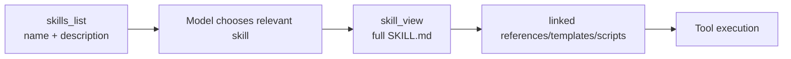
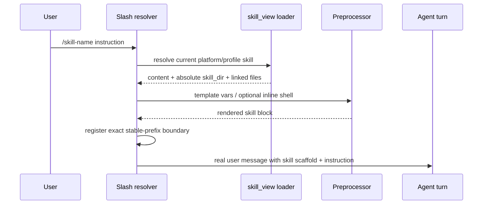
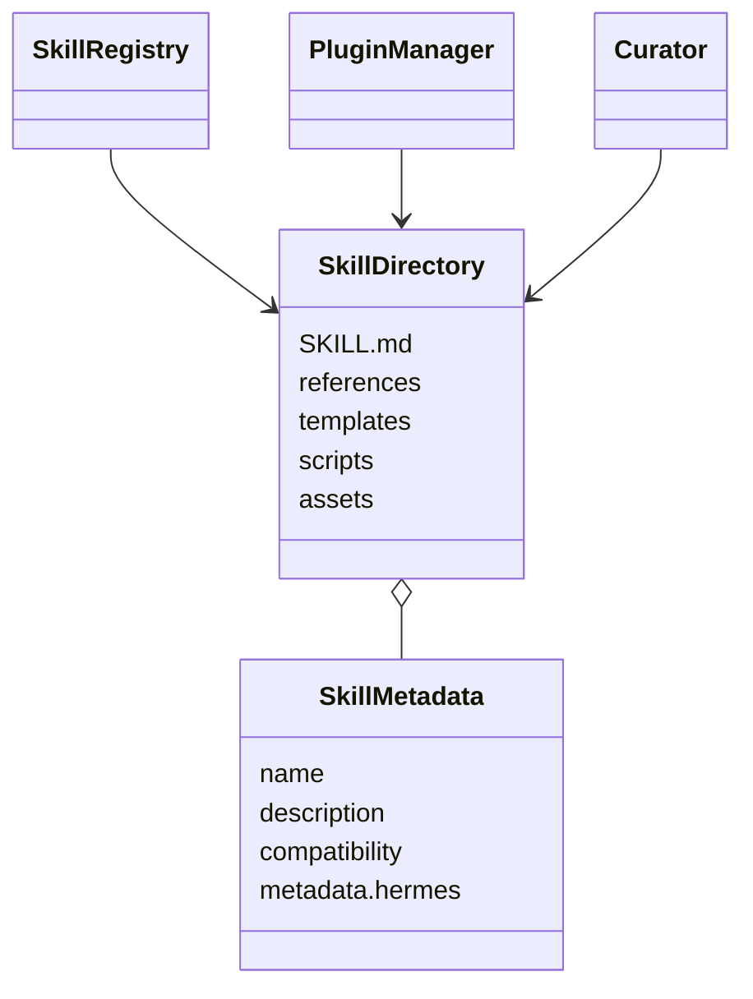
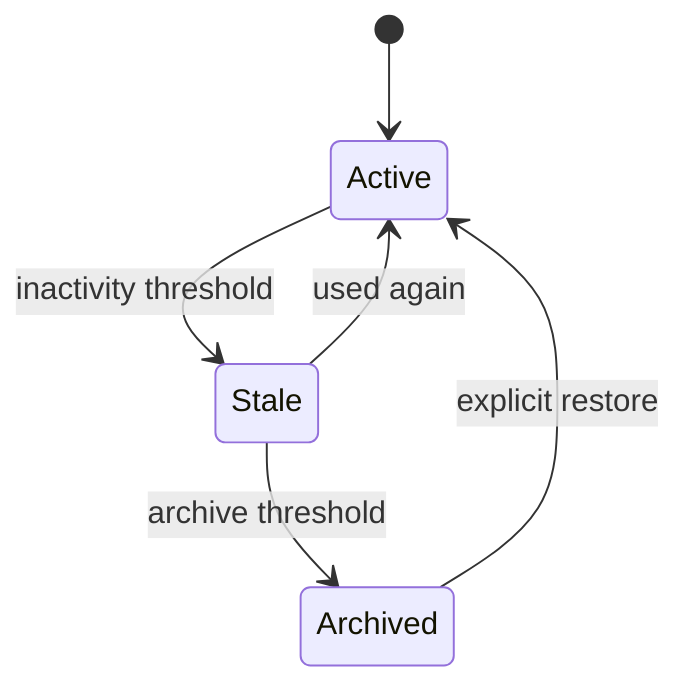
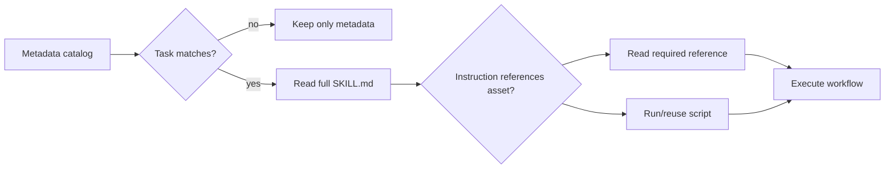

# 09 Skills：渐进披露、可执行说明与缓存友好的激活

## 定位

**实现状态：核心 + 插件。** Skill 是带 YAML frontmatter 的 `SKILL.md` 目录，可附带 `references/`、`templates/`、`assets/`、`scripts/`。它把“怎样完成某类任务”放在边缘，而不是为每种业务向核心增加工具。

Skill 不是安全沙箱，也不是纯知识文档：正文可能指导执行脚本，预处理甚至可启用 inline shell，因此安装前审查是信任边界。

## 源码地图

| 责任 | 实现 |
| --- | --- |
| 列表/查看工具 | `tools/skills_tool.py` 及 siblings |
| 搜索路径/平台过滤 | `agent/skill_utils.py` |
| slash skill 激活 | `agent/skill_commands.py` |
| 模板/inline shell | `agent/skill_preprocessing.py` |
| 使用计数/生命周期 | `tools/skill_usage.py` |
| 创建/修改工具 | `tools/skill_manage.py` |
| 自动策展 | `agent/curator.py`、`agent/curator_backup.py` |
| Hub 安装与扫描 | `hermes_cli/skills_hub*.py` |
| 插件提供的 skills | `hermes_cli/plugins.py` |

## 渐进披露

第一层只暴露名称和简短描述，避免把所有技能正文塞进 prompt。确定需要后才用 `skill_view` 读完整正文；支持文件再按引用加载。重复查看相同且未变化的 skill 会返回短引用 stub，压缩后清理该去重状态。

搜索优先级是 project-local → 当前 profile 的本地技能 → external dirs，按名称 first-wins。项目技能必须经过隔离/检疫入口；平台、环境和 disabled 配置决定是否在列表中出现。

## Slash 激活与缓存边界

Skill 正文与用户指令拼成一条真实 user message。固定 scaffold 作为 stable prefix 注册，易变的用户指令留在尾部；memory 提取器还能从 scaffold 中恢复用户原始指令，避免把整段技能正文误记成用户偏好。

`/reload-skills` 重新扫描命令表，但不重建会话 system prompt，因为 skill 是按名激活的。涉及 system-prompt/tool schema 的安装变更默认下一会话生效；需要即时失效时必须显式选择 cache-breaking 路径。

## 技能目录模型

## Readiness 与配置注入

frontmatter 可以声明所需环境变量、平台、兼容性和 Hermes 配置。`skill_view` 返回 readiness/setup note；slash scaffold 注入解析后的非秘密配置和 skill 绝对目录，使模型可以正确解析相对脚本路径。

秘密不会直接写进正文。需要的环境变量通过 secret capture/setup 流程配置，再由执行环境的显式 allowlist 传递。

## Curator

Curator 使用 `.usage.json` sidecar 记录 view/use/patch，而不修改用户的 `SKILL.md`。它按 active → stale → archived 转换，archive 可恢复；pinned、Hub 技能和被 Cron 引用的技能受保护。

默认只做确定性的时间转换；LLM consolidation 默认关闭。启用后，独立辅助 agent 可把重复技能合并为 umbrella，并先创建备份、记录报告、改写 Cron 引用，仍然只归档不永久删除。

## 设计模式

- **Progressive Disclosure**：索引 → 正文 → 支持文件。
- **Convention over Configuration**：固定 `SKILL.md` 目录协议。
- **Overlay / Precedence Chain**：project、本地、external、plugin。
- **Stable-prefix Scaffolding**：激活消息兼顾 prompt cache。
- **Sidecar Metadata**：使用统计不污染源文件。
- **Lifecycle State Machine**：可恢复的策展而非直接删除。

## 关键不变量

1. instructional skill 必须完整读取，不提供诱导模型只读第一页的分页接口。
2. 相对路径必须相对 skill directory 解析。
3. skill name/path 要阻止绝对路径、drive path 和 `..` 逃逸。
4. disabled/platform-filtered 技能不能被 preload 绕过。
5. skill 变更不能无声破坏活跃会话的 prompt cache。
6. Curator 只操作明确可管理对象，归档可恢复。

## 进一步拆解：Skill 是可执行知识包，不是长 prompt

一个成熟 skill 通常同时包含四种资产：

| 资产 | 角色 | 何时加载 |
| --- | --- | --- |
| name + description | 路由元数据 | discovery 时，尽量短 |
| `SKILL.md` | 决策与工作流指令 | task 命中后完整加载 |
| `references/` | 领域知识、格式规范、协议细节 | 主文明确指向且当前步骤需要时 |
| `scripts/` / assets | 确定性执行、验证、模板 | 执行阶段按需调用 |

这就是 progressive disclosure 的本质：减少常驻 context，却不能把“必须完整阅读的说明”做成分页工具。若模型只读第一页，后面的安全约束会永久缺失。Hermes 还多一层缓存约束：discovery metadata 属于稳定 session prompt 的一部分时，安装/禁用 skill 默认应延后到下个 session，显式 `--now` 才接受 cache invalidation。

### Skill 与 Tool、Plugin、Memory 的边界

- Skill 告诉模型**如何做**，可以引用 CLI/tool，但不提供新的进程权限。
- Tool 提供结构化动作，schema 每次进入模型请求，常驻成本高。
- Plugin 安装代码，可注册 tool/provider/hook，信任级别远高于纯说明。
- Memory 记录这个用户/项目**发生过什么**，不应冒充通用工作流程。

同一能力若用 skill + 现有 terminal 就能完成，不需要新增 core tool；需要稳定结构化参数时再做 service-gated tool；第三方复杂能力优先插件或 MCP。这正是 Hermes “窄腰、边缘扩展”的 Footprint Ladder。

## 业界横向比较（2026-09）

| 方案 | 包格式/激活 | 优点 | 关键差异 |
| --- | --- | --- | --- |
| Hermes skills | `SKILL.md` + references/scripts/assets；目录优先级、slash/cache-aware 激活 | 与 CLI、profile、Curator、工具生态和 prompt cache 深度结合 | 需要严格 authoring 与信任审查 |
| Agent Skills 规范 | metadata → activation → execution 的三级渐进披露 | 跨产品复用、格式简单、上下文开销小 | 规范不定义 host 权限、缓存和安装治理全部细节 |
| Anthropic/Claude skills 生态 | task-specific instructions + resources/scripts | 与 coding/knowledge workflows 结合成熟 | 宿主特性和分发行为可能 provider/product-specific |
| OpenAI/Codex skills | `SKILL.md` 路由、按需读取支持资源 | 与编码 agent、工具和模板工作流组合 | 宿主执行权限与技能发现规则需按产品文档核验 |
| LangChain prompt/tool bundles | 代码组合 prompt、tool、middleware | 应用内类型与版本控制自由 | 缺少一个统一、跨 agent 的技能包约定 |

Hermes 的优势不是自创格式，而是把 skills 放进长期 agent 的缓存、profile、slash 与策展生命周期。若只开发一个固定后端服务，普通函数模块和版本化 prompt 可能更简单；若希望同一流程被多个兼容 agent 复用，遵循 Agent Skills 规范更有迁移价值。

## Skill 质量模型

一份好 skill 应通过五类测试：

1. **触发精度**：该触发时能命中，不相关任务不抢路由；
2. **流程完备**：前置条件、失败分支、验证和交付物明确；
3. **确定性下沉**：格式转换/校验尽量由脚本做，不让模型重复手写；
4. **最小读取**：主文给出路由，references 按需但被引用时必须完整读；
5. **权限诚实**：说明需要的工具/网络/secret，不把 plugin 级能力伪装成文档。

## 源码阅读题

1. 同名 skill 在 project/local/built-in 目录冲突时，first-wins 次序在哪里确定？
2. 文件内容 dedup stub 如何判断“已读”，文件修改后怎样失效？
3. `/skills install --now` 与默认延迟生效分别改变哪些缓存/会话状态？
4. Curator 的 archive 为什么要可恢复，而不是直接删除？

## 学习实验

1. 新建一个含 `references/` 与 `scripts/` 的最小 skill，依次调用 list/view/file view。
2. 用同名 project/local skill 验证 first-wins；切换 profile 验证扫描缓存失效。
3. 连续两次 view 同一文件，观察 dedup stub；修改文件后再看完整内容。
4. 调用 slash skill，检查 memory 记录的是用户指令而非整段 scaffold。

## 延伸阅读

- [Creating skills](../../website/docs/developer-guide/creating-skills.md)
- `skills/AGENTS.md`
- `tools/skills_tool.py`
- `agent/curator.py`
- [Agent Skills specification](https://agentskills.io/specification)
- [Anthropic：manage tool context](https://platform.claude.com/docs/en/agents-and-tools/tool-use/manage-tool-context)
