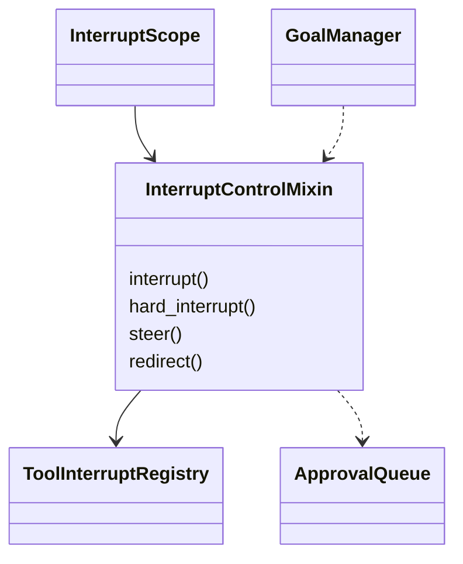
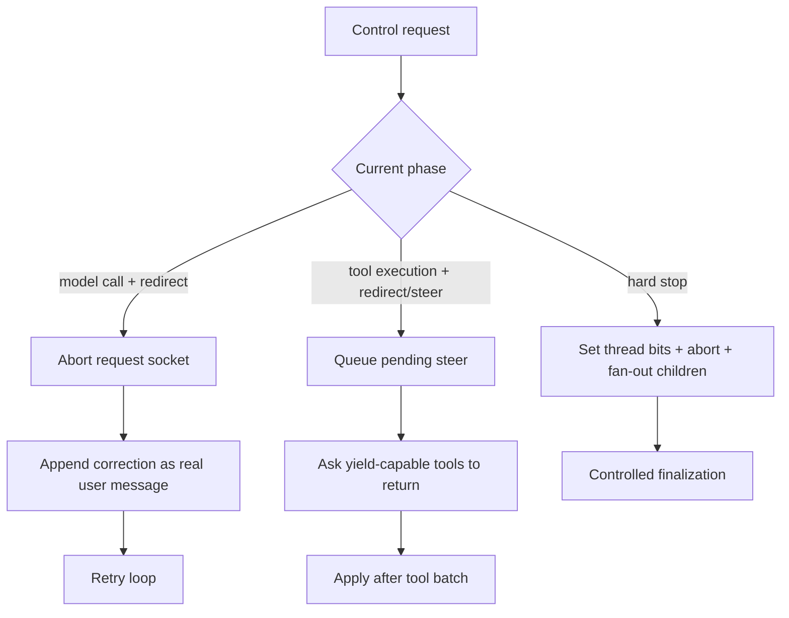
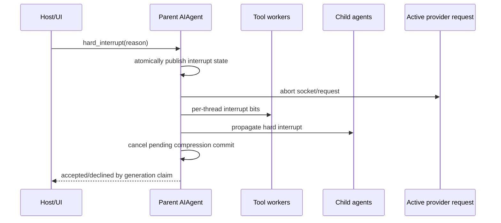
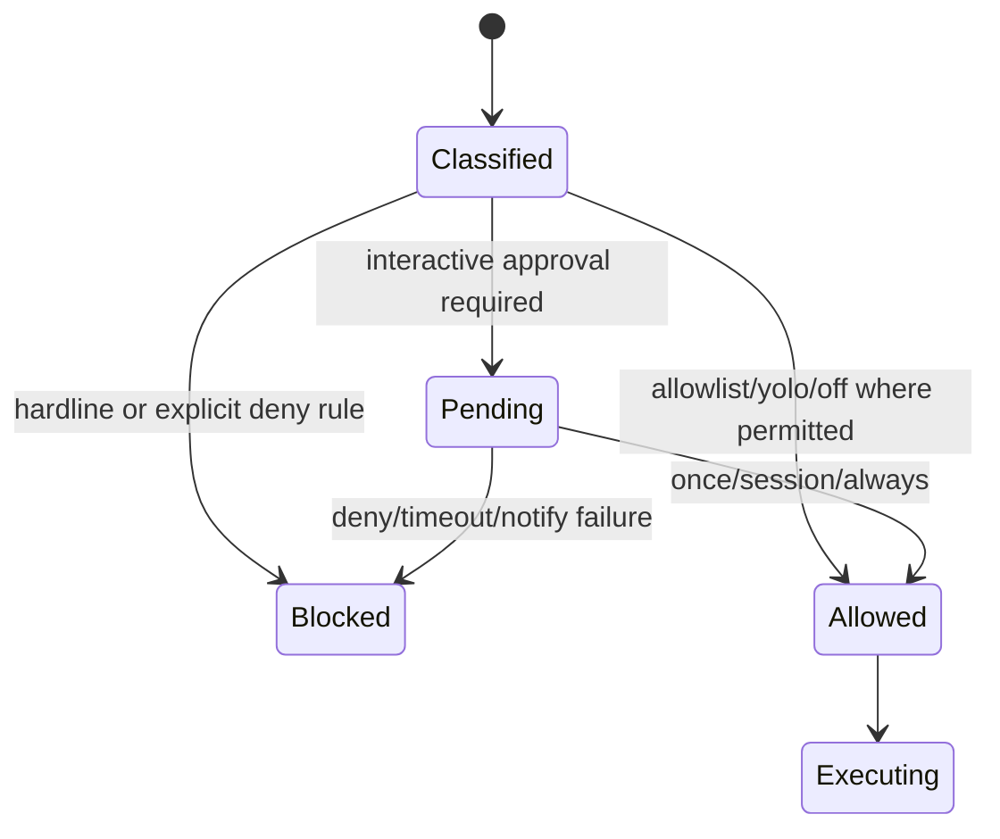
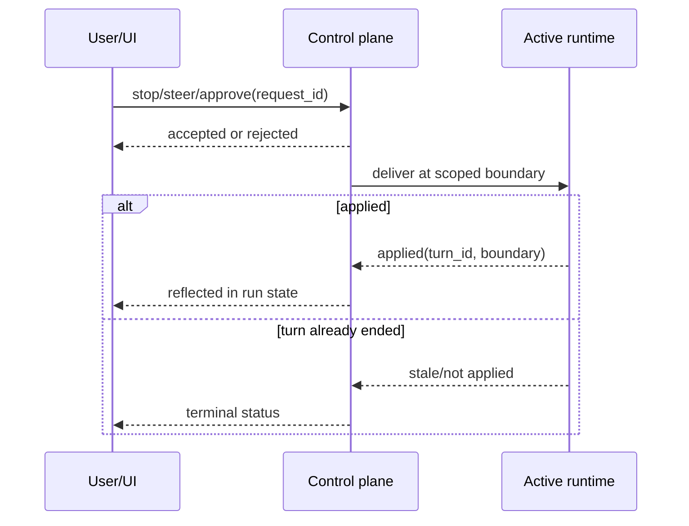

# 10 Control：Interrupt、Steer、Redirect、审批与长任务控制

## 定位

**实现状态：分散。** Hermes 没有单一控制平面类；控制按时间尺度分层：

- 毫秒到秒：中断模型请求、工具进程、child agent。
- turn 内：steer/redirect 在合法消息边界改变方向。
- 人机协同：审批队列暂停危险动作。
- 分钟到长期：Goal、loop、heartbeat、Cron 的 pause/resume。

“暂停”不是冻结 Python 栈；绝大多数恢复都从持久状态和 transcript 开新执行。

## 源码地图

| 控制 | 实现 |
| --- | --- |
| Agent interrupt/steer/redirect | `agent/interrupt_control.py` |
| 宿主取消范围 | `agent/interrupt_scope.py` |
| 工具线程 interrupt/yield | `tools/interrupt.py` |
| turn 中 drain/apply | `agent/turn_iteration_prep.py`、`agent/turn_finalizer.py` |
| 子 agent 控制 | `tools/delegate_tool_registry.py` |
| 审批决策/等待 | `tools/approval*.py` |
| Gateway 控制命令 | `gateway/run*.py`、slash handlers |
| TUI RPC 控制 | `tui_gateway/methods_session_control.py`、`methods_prompt.py` |
| Goal/loop/heartbeat | `hermes_cli/goals.py`、相应 manager |

## 控制对象

## 四种 turn 控制语义

| 操作 | 是否停止当前模型请求 | 是否停止工具 | 消息语义 | 适用场景 |
| --- | --- | --- | --- | --- |
| soft interrupt | 是 | 协作停止 | 结束当前 turn | 新消息抢占 |
| hard interrupt | 是并关闭活动请求 | 是，传播 child | 明确终止 | Stop/cancel |
| steer | 否 | 否；长终端可 yield 到后台 | 下一合法 user row | 工具完成后纠偏 |
| redirect | 是，仅模型阶段 | 工具阶段退化为 steer | 同一逻辑 turn 的纠正 | 改写尚未完成的推理方向 |

## 中断传播

`require_generation` 用活动 generation 做最后写边缘的 CAS：如果 watchdog 读到“似乎卡住”后 agent 已产生新活动，旧 abort 请求会被拒绝，避免误杀已恢复的 turn。

`InterruptScope` 解决宿主不知道深层同步代码创建了哪个 `AIAgent` 的问题。scope 先 latch cancel reason；之后才注册进来的 agent 也会立即收到 hard interrupt，不丢竞态。

## Steer 的消息协议

Steer 文本不会直接修改正在发送的 provider payload。它被锁保护地累积，在工具批次结束或下一轮准备阶段 drain，作为真实 user row 插入。若 turn 已在最终回复后结束，未消费的 steer 作为 `pending_steer` 返回给宿主，由宿主决定作为下一 turn 重放。

这是为了守住：

- 角色交替合法；
- 已持久化消息不被事后篡改；
- UI 收到“已排队”不等于“模型已消费”的准确信号。

## 审批是一种人类阻塞状态

Gateway 审批把请求放进 session-scoped 队列并阻塞工具线程，`/approve` 或 `/deny` 解析后唤醒。相同并发请求可合并等待。没有可答复的人机界面时必须立即 fail closed，不能挂满 timeout。

人类等待时间单独计入 tool batch deadline 的有限豁免，否则正常审批会被当成工具超时；该豁免自身又有上限，防止坏插件把 deadline 无限延长。

## 长任务 pause/resume

Goal、loop、heartbeat、Cron 的 manager 保存 paused 状态和下一次推进条件。UI 的 `methods_session_control.py` 只是统一命令 envelope；每个 manager 保持自己的状态机。

Resume 的含义是“允许 scheduler/下一输入重新推进”，不是恢复一条被冻结线程。正在运行的 turn 若要停止，仍需 interrupt。

## 设计模式

- **Cooperative Cancellation Token**：线程/agent 范围中断位。
- **Cancellation Scope**：宿主控制深层创建的 agent。
- **CAS / Generation Fence**：拒绝过期 watchdog 决策。
- **Mailbox**：pending steer/redirect 队列。
- **Human-in-the-loop State Machine**：审批请求、决策、超时。
- **Command Adapter**：不同 UI 映射到相同控制语义。

## 关键不变量

1. `/approve`、`/deny`、`/stop` 等命令必须绕过 Gateway 的两个 busy-message guard。
2. 硬中断必须传播到并发工具 worker 和 child agent。
3. redirect 不能杀死已有副作用的工具；工具阶段只排 steer。
4. UI 的 accepted 只表示控制请求已接纳，不夸大为已消费/已完成。
5. 审批无人可答时 fail closed。
6. 每个 turn 清理线程 interrupt 位，避免线程 ID 复用污染。

## 进一步拆解：Control plane 需要双向确认

控制请求不是普通聊天消息。一个严谨协议至少区分三种状态：

`accepted` 只表示控制面接纳并尝试交付，不表示模型已经看到 steer，也不表示进程已经停止。Hermes 的 generation/fence 思想避免一条迟到 stop 命中新 turn；UI 若把 accepted 渲染成 completed，会制造危险的控制错觉。

### 四种控制的边界

| 控制 | 是否终止当前计算 | 是否产生新 user 内容 | 是否可跨进程等待 | 典型用途 |
| --- | --- | --- | --- | --- |
| soft interrupt | 协作式 | 否 | 通常否 | 尽快停模型/工具但保留清理 |
| hard interrupt | 强制取消更多资源 | 否 | 否 | 用户明确 stop、放弃 pending commit |
| steer/redirect | 在安全边界结束或续接 | 是 | 依实现 | 改需求而不丢全部进展 |
| approval | 暂停风险动作 | 人类决策成为结果 | 需要可持久状态才可靠 | approve/edit/reject |

真正 durable 的 approval 不能只是内存里的 `Event.wait()`：进程重启后必须从数据库恢复 pending action、原参数、策略、过期时间和决策 ID，并确保一次决策只能消费一次。Hermes 当前审批更适合在线交互控制；跨天人工审批应交给 Goal/外部 durable workflow 或扩展持久状态。

## 业界横向比较（2026-09）

| 方案 | 中断/HITL 模型 | 更强的地方 | Hermes 的相对位置 |
| --- | --- | --- | --- |
| Hermes | interrupt scopes + steer/redirect + approval broker + gateway bypass | 模型、工具、child、消息入口统一控制，语义贴近真实产品 | 通用 durable approval/history 仍有限 |
| LangGraph | `interrupt()` + checkpoint + `Command(resume=...)` | 暂停点和图状态持久，approve/edit/reject 可恢复 | 要求 checkpointer/thread/UI 正确装配 |
| OpenAI Agents SDK | serializable `RunState` + interruptions/approvals | 轻量 SDK 中保存/恢复 run state 清晰 | 外部存储、队列与产品路由由应用负责 |
| Temporal | Signals/Updates/Queries 驱动 workflow state | 跨进程、跨天、强事件历史和并发 handler 规则 | 不理解 LLM role/tool protocol，需要 agent adapter |
| Responses WebSocket steering | 对 active response 排队输入并产生 successor | provider 级低延迟 steering 与事件确认 | 特定执行模式限制；Hermes 必须跨 provider/surface |

若要即时控制一个本地/聊天 Hermes turn，内置 control plane 更完整；若审批可能等待几小时并必须跨部署，LangGraph checkpoint 或 Temporal signal 更强；如果使用单一支持 steering 的 provider，可减少应用层取消/续接，但仍需把 UI/session 身份映射正确。

## 竞态推演

1. stop 到达时 provider 已返回、finalizer 尚未提交；
2. approve 到达时审批刚超时；
3. steer accepted 后工具产生不可逆副作用；
4. redirect 命中旧 generation，但 session 已开始下一 turn；
5. 两个 UI 同时 approve 与 deny。

对每个竞态写线性化点：哪一个数据库写/锁操作决定结果，迟到事件返回什么，用户界面显示什么。没有线性化点的控制协议只能“通常工作”。

## 源码阅读题

1. busy-message guard 为什么必须为控制命令留旁路？旁路是否也通过授权？
2. interrupt 如何传播到 ThreadPool worker 和 child agent，在哪里清理？
3. approval key 如何合并相同请求，超时后晚到响应怎样处理？
4. background terminal handoff 后，steer 由谁保存并何时进入 transcript？

## 学习实验

1. 在 provider sleep、terminal sleep、child agent 三种状态下分别 stop。
2. terminal 长任务期间 steer，观察 yield/background handoff 和合法 user row。
3. 发起两个相同危险命令，验证审批合并；超时后检查两者都得到确定结果。
4. 让 liveness generation 在 abort 前变化，验证过期中断被拒绝。

## 延伸阅读

- `agent/interrupt_control.py`
- `agent/interrupt_scope.py`
- `tools/approval.py`
- [Programmatic integration](../../website/docs/developer-guide/programmatic-integration.md)
- [LangChain/LangGraph human-in-the-loop](https://docs.langchain.com/oss/python/langchain/human-in-the-loop)
- [Temporal workflow message passing](https://github.com/temporalio/documentation/blob/main/docs/develop/go/workflows/message-passing.mdx)
- [OpenAI Responses WebSocket steering events](https://developers.openai.com/api/reference/cli/resources/beta/subresources/responses)
