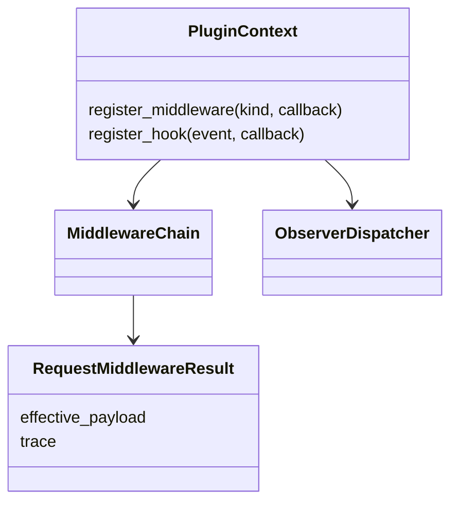
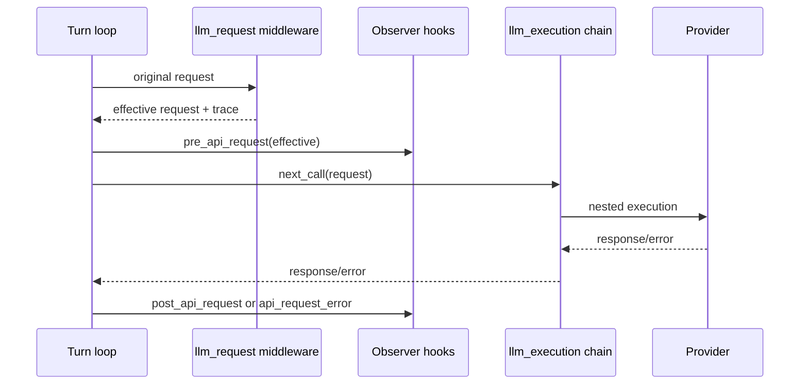
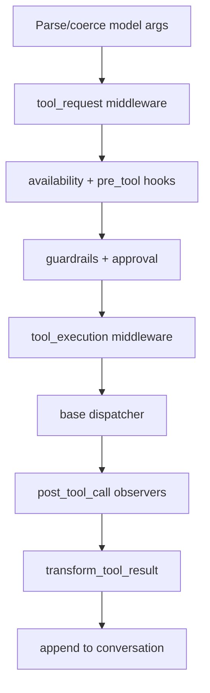
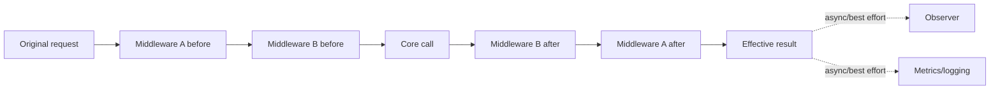

# 11 Middleware：行为改写链与只读 Observer Hooks

## 定位

**实现状态：核心端口 + 插件消费。** Hermes 明确区分两种扩展：

- **Observer hook**：观察事件、记录 telemetry；少数 pre-hook 可返回 block 指令。
- **Middleware**：改写请求或用 `next_call` 包裹实际执行。

这一区分让可观测性插件不必获得行为修改语义，也让真正的路由/策略扩展有明确顺序。

## 源码地图

| 责任 | 实现 |
| --- | --- |
| middleware runner | `hermes_cli/middleware.py` |
| 注册与 hooks | `hermes_cli/plugins.py` |
| LLM request 接入 | `agent/turn_api_request.py` |
| LLM execution 接入 | `agent/turn_api_call.py` |
| tool 接入 | `model_tools.py`、`agent/tool_executor.py` |
| shell/webhook observers | `agent/shell_hooks.py`、`agent/outbound_webhooks.py` |
| 流式 observer 队列 | `agent/plugin_stream_hooks.py` |
| 契约说明 | `docs/middleware/README.md` |

## 契约对象

## 四类 Middleware

| kind | 可见输入 | 典型返回 | 作用 |
| --- | --- | --- | --- |
| `llm_request` | provider request + original | 新 request + trace | 参数改写/路由标签 |
| `llm_execution` | request + `next_call` | provider response | 包裹或替代调用 |
| `tool_request` | args + original args | 新 args + trace | 路径/策略重写 |
| `tool_execution` | args + `next_call` | tool result | 包裹或替代 handler |

所有 payload 带 session/task/turn/request/tool-call 等相关 ID，以及 observer/middleware schema version。

## LLM 顺序

## Tool 顺序

参数改写发生在安全检查之前，所以 guardrail、审批、observer 和 handler 看到的是同一个 effective args；同时保留 original args 供审计。

## `next_call` 链的异常语义

多个 execution middleware 按注册顺序嵌套。失败策略有意细化：

- 在调用 `next_call` 前抛错：记录警告，跳到后续链/基础执行，fail-open。
- `next_call` 已成功后，middleware 后处理抛错：保留下游结果，**不重复执行**。
- 下游本身抛错：正常传播，middleware 可显式转换，不能无声变成 `None` 成功。
- 有意不调用 `next_call`：视为短路替代，插件必须返回兼容结果。

这防止“观测插件失败导致工具再执行一次”的严重副作用错误。

## Observer Hooks

典型生命周期包括 session start/end、turn、pre/post API、API error、pre/post tool、审批前后、流式文本/推理等。stream observers 用每 consumer 队列异步分发，避免插件回调阻塞模型流。

Shell hooks 支持外部进程 observer；只有声明的阻断事件能改变执行，其他 observer 失败通常 fail-open。

## 设计模式

- **Chain of Responsibility**：request middleware 顺序改写。
- **Decorator / Onion Model**：execution middleware 嵌套 `next_call`。
- **Observer**：只读生命周期事件。
- **Versioned Envelope**：插件契约可演进。
- **Fail-open Extension, Fail-closed Policy**：插件异常不拖垮核心；安全 gate 自己决定拒绝。

## 边界与风险

- Middleware 插件运行在 agent 进程内，拥有完整权限，不是隔离层。
- request middleware 可改变命令/URL/路径，因此顺序和 trace 是安全证据。
- observer payload 必须脱敏；“只读”不代表可以外传全部 prompt。
- 同一插件同时做行为改写和 telemetry 会增加审计难度，最好拆分回调责任。
- 插件启停可能改变 tool schema/system prompt，活跃会话必须遵守缓存失效策略。

## 关键不变量

1. effective request/args 是后续 hook、策略与执行的唯一事实。
2. original 值保留用于审计，不可被原地修改。
3. downstream 已成功后不得因 wrapper 错误重放。
4. observer 不能阻塞 streaming 热路径。
5. middleware trace 要进入后续 observer payload。
6. 插件回调错误必须记录插件身份和阶段。

## 进一步拆解：Interceptor 与 Observer 不同

Middleware 在因果路径上，能改写或阻断；Observer 在观察路径上，不应改变结果。把遥测放在 blocking middleware 里会放大 tail latency；把安全授权放在 observer 里则太晚，因为副作用已经发生。

### 两套值必须同时存在

| 值 | 用途 |
| --- | --- |
| original request/args | 审计“模型原本提出什么” |
| effective request/args | 后续验证、审批与执行的唯一事实 |

middleware 若把 terminal command 或 provider request 改写，后续策略必须看 effective 值，不能一边审批原命令、一边执行改写命令。original 必须 immutable，否则审计记录也会随引用被修改。

### “下游成功后抛错”不可自动重放

洋葱式 wrapper 最危险的窗口是 `next_call()` 已执行副作用，外层 after logic 抛异常。通用 retry middleware 无法知道下游是否已提交，不能重新进入整条链。可行处理是记录 post-processing failure、返回已有结果或按操作幂等性做专门恢复。

## 业界横向比较（2026-09）

| 方案 | Hook 粒度 | 优点 | 主要取舍 |
| --- | --- | --- | --- |
| Hermes middleware/hooks | LLM request/execution、tool request/execution、observer | 与 plugin identity、审批、effective args 和多 surface 运行时结合 | API 面较小，需坚持异常/顺序契约 |
| LangChain agent middleware | before/after/wrap model/tool；现成 HITL、PII、fallback、limits | 拦截点丰富，组合式内置策略多 | 顺序、state mutation 和 checkpointer 装配复杂度更高 |
| Vercel AI SDK model middleware | wrap language model；transform params/result/stream | provider-level 变换、缓存、RAG 和 guardrails 适合 TS | 主要覆盖模型层，不等于完整 tool/runtime middleware |
| OpenAI Agents SDK lifecycle hooks | agent/run/tool 生命周期与 tracing | 轻量、与 SDK 原语一致 | 深度改写请求时需更专门 wrapper/guardrail |
| OpenTelemetry instrumentation | spans/metrics/logs | 跨框架可观测标准 | 观察而非授权，不该阻断业务 |

Hermes 的 middleware 更适合为一个完整个人 agent 增加策略；LangChain 的现成 agent middleware 目录更广；AI SDK 适合前端/TS provider 变换。若只想记录 trace，优先 observer/OTel，不要为了“统一”把遥测变成可阻断执行的插件。

## 组合与版本治理

多个 middleware 的顺序本身就是 API：`sanitize → validate → authorize → execute → redact/observe` 与反序会改变安全语义。建议给每次调用产出 middleware trace：插件 ID、阶段、输入摘要、decision、耗时和错误，但默认不记录 secret/完整 prompt。

插件升级若改变 wrapper 顺序或 effective args 形态，需要契约测试；不要写仅断言“列表有 N 个插件”的 change-detector，应断言重要关系，例如授权一定发生在执行之前。

## 源码阅读题

1. middleware 注册顺序由配置、安装顺序还是 priority 决定？是否稳定？
2. pre-hook block 如何合成与普通 tool result 相同的协议形态？
3. wrapper after 阶段抛错时，框架如何防止重放已成功 handler？
4. observer 队列满或关闭时，是 drop、backpressure 还是阻塞主 turn？

## 学习实验

1. 写一个 `tool_request` middleware 默认 terminal workdir，观察审批内容。
2. 写两个 execution middleware，记录进入/退出顺序，验证洋葱模型。
3. 让外层 middleware 在 `next_call` 成功后抛错，确认 handler 只执行一次。
4. 注册慢 streaming observer，检查模型流不被同步阻塞。

## 延伸阅读

- [Middleware contract](../middleware/README.md)
- `hermes_cli/middleware.py`
- `hermes_cli/plugins.py`
- [LangChain agents and middleware](https://docs.langchain.com/oss/python/langchain/agents)
- [LangChain human-in-the-loop middleware](https://docs.langchain.com/oss/python/langchain/human-in-the-loop)
- [Vercel AI SDK middleware](https://ai-sdk.dev/docs/ai-sdk-core/middleware)
- [OpenTelemetry semantic conventions](https://opentelemetry.io/docs/specs/semconv/)
