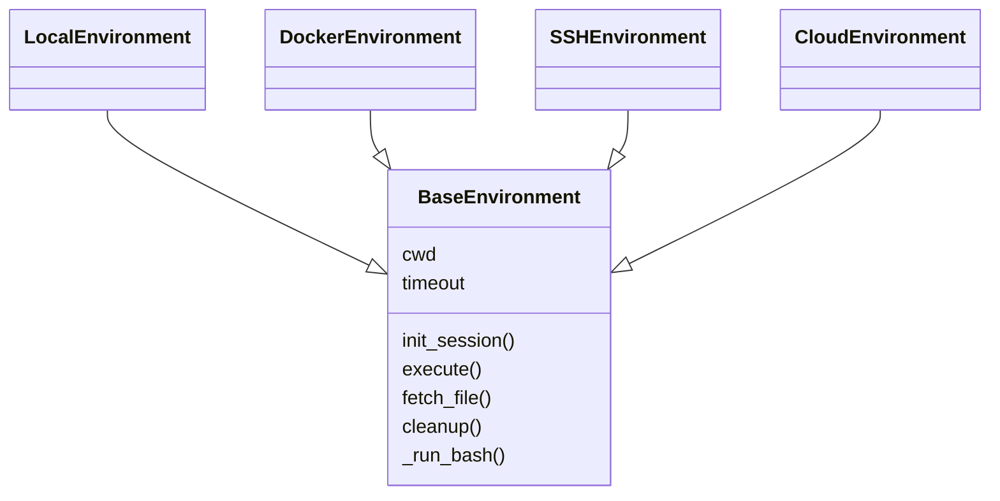
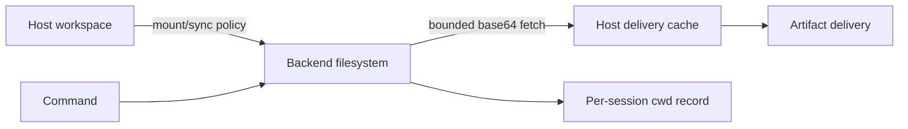
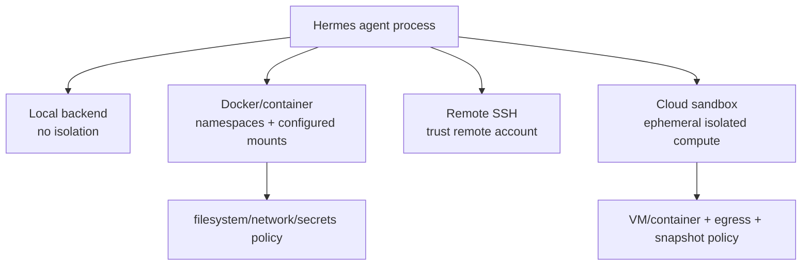

# 12 Sandbox：可插拔执行环境，而非默认安全承诺

## 定位

**实现状态：可选。** 默认 `local` backend 直接以当前 OS 用户身份执行命令，不是沙箱。更强隔离通过 Docker、Singularity、Modal、Daytona、Vercel Sandbox、SSH 等 backend，或把整个 Hermes 进程放入容器/OpenShell 获得。

必须区分：

- **terminal-backend isolation**：只隔离经 terminal/file contract 执行的动作。
- **whole-process isolation**：连 MCP、插件、code execution、skill loading 都在 OS 边界内。

## 源码地图

| 责任 | 实现 |
| --- | --- |
| backend ABC | `tools/environments/base.py::BaseEnvironment` |
| backend 选择/生命周期 | `tools/terminal_tool*.py` |
| 本地/Docker/SSH/云 | `tools/environments/{local,docker,ssh,modal,daytona,vercel_sandbox,...}.py` |
| 远端文件同步 | `tools/environments/file_sync.py` |
| 路径映射 | `tools/environments/path_utils.py` |
| 命令审批/guard | `tools/approval*.py`、`tools/terminal_tool_guards.py` |
| 子 agent worktree | `tools/delegate_tool*.py` |
| 安全模型 | `SECURITY.md` |

## 统一执行协议



每次调用都新建 `bash -c` 进程；backend 初始化时捕获一份 shell 环境/函数/alias snapshot，每次命令重新 source。CWD 通过文件或 in-band marker 跨调用持久。这样不依赖一个永远存活、难以回收的交互 shell。

## 执行时序

```mermaid
sequenceDiagram
    participant T as terminal tool
    participant G as guards/approval
    participant E as BaseEnvironment
    participant B as concrete backend
    participant R as result pipeline
    T->>G: command + backend + host-access facts
    G-->>T: allow/block/approval result
    T->>E: ensure task environment
    E->>E: source snapshot + restore cwd
    E->>B: _run_bash(wrapped command)
    B-->>E: process handle/output
    E->>E: poll timeout/interrupt; update cwd
    E-->>R: returncode + bounded output
    R-->>T: structured result / spill reference
```

`is_local` 与“Docker 是否 bind mount host path”会影响审批：容器若映射了宿主路径，不能因为 backend 名为 Docker 就跳过危险命令提示。

## 隔离边界矩阵

| 行为 | Local | Terminal sandbox | Whole-process wrapper |
| --- | --- | --- | --- |
| terminal/file tools | 宿主权限 | backend 内 | wrapper 内 |
| `execute_code` host child | 宿主进程树 | 通常仍在 Hermes 主机 | wrapper 内 |
| MCP stdio 子进程 | 宿主 | 通常仍在 Hermes 主机 | wrapper 内 |
| Python plugins/hooks | agent 进程 | agent 进程 | wrapper 内 |
| Skill 文件/预处理 | agent 进程 | agent 进程 | wrapper 内 |
| 网络 | 宿主策略 | backend 策略 | wrapper/网络策略 |

这张表是本层最重要的结论。只选择 Docker terminal backend 并不会自动隔离所有 in-process 能力。

## 数据与文件



远端文件取回在 backend 内先 `head -c max+1`，再 base64 传输，避免 `/dev/zero` 等无限流占满宿主内存；解析 realpath 后还要通过交付 denylist/allowlist，不能用远端 symlink 绕过宿主路径策略。

## 生命周期

- 每 task/session 复用 environment，独立记录 cwd。
- idle reaper 和 `atexit` 清理容器/实例；Docker 有保守的 orphan reaper。
- 云持久盘能保留文件，但不保证原 live process 或同一实例跨回收存活。
- backend 连接故障返回 `status: degraded`，不缓存坏对象；普通命令非零退出不是基础设施故障。
- 子 agent 可使用 Git worktree 获得代码修改隔离，但 worktree 不是权限沙箱。

## 设计模式

- **Strategy / Adapter**：统一 `BaseEnvironment`，替换执行目标。
- **Session Snapshot**：spawn-per-call 同时保持 shell 状态。
- **Resource Pool + Reaper**：按 task 缓存、空闲回收。
- **Capability Facts**：显式 `is_local/has_host_access`，不用 backend 名猜安全性。
- **Bounded Transfer**：在信任边界内先限制字节。

## 关键不变量

1. 文档/UI 不能把 local backend 标成 sandbox。
2. backend 只声明它真正隔离的路径。
3. profile-scoped secrets 不得被 shell snapshot 固化后跨会话泄漏。
4. 同一共享环境的 cwd 必须按 session 记录，不能放在一个全局字段。
5. timeout/interrupt 必须终止或交接进程，不能只停止等待。
6. worktree 隔离与安全权限隔离必须分开描述。

## 进一步拆解：Sandbox 是能力向量

“在容器里”不能完整描述安全性。至少要逐项回答：

| 维度 | 可能策略 | 需要验证的事实 |
| --- | --- | --- |
| process/kernel | host、container namespace、microVM、VM | 是否共享 host kernel；逃逸边界 |
| filesystem | host cwd、bind mount、copy-on-write、ephemeral disk | 哪些路径可读写、退出后是否保留 |
| network | host network、deny-by-default、domain allowlist | DNS/IP 重绑定、内网/metadata 访问 |
| credentials | 全量 env、allowlist、brokered secret | secret 是否进入快照、日志或子进程 |
| resources | 无限制、cgroup/quota、wall-clock timeout | CPU/RAM/disk/process 数上限 |
| lifecycle | shared、per-session、per-call、pause/snapshot | 清理、复用和跨 session 污染 |



Hermes 的 environment adapter 统一“执行”接口，却不能把不同 backend 的安全等级抹平。尤其是 local backend：审批和命令扫描是策略，不是隔离；一旦执行，权限就是当前 OS 用户权限。

### Worktree 解决冲突，不解决恶意代码

Git worktree 隔离让并行 agent 不互相覆盖文件，也便于 review diff，但两个 worktree 通常仍属于同一用户、共享网络和凭据。把“文件组织隔离”称为 sandbox 会让使用者错误评估风险。

### 超时后的进程所有权

`wait()` 超时只停止调用者等待，不一定停止被执行进程。backend 必须定义：发送什么 signal、杀进程组还是单 PID、子进程是否遗留、是否转后台并返回 operation ID。否则 agent 以为命令失败并重试，旧进程却继续产生副作用。

## 业界横向比较（2026-09）

| 方案 | 隔离形态 | 更强的地方 | 主要取舍 |
| --- | --- | --- | --- |
| Hermes environments | local/Docker/SSH/多云 backend 的统一终端协议 | 与 session cwd、文件工具、审批和 agent interrupt 深度集成 | 默认 local 不隔离；安全取决于选定 backend 配置 |
| E2B | 每 session Firecracker microVM 的 agent cloud | 强隔离、快速启动、适合不可信代码 | 外部服务成本、数据驻留与网络依赖 |
| Daytona | container/VM/Windows/GPU sandbox，snapshot/fork/pause | 完整“可编程计算机”和多运行时，生命周期能力丰富 | 平台运维/托管依赖；权限仍需正确配置 |
| Modal/云函数沙箱 | ephemeral 容器/任务 | 弹性计算和资源隔离 | 交互 shell、持久 workspace 语义依产品而异 |
| Docker 本地 | namespace/cgroup + mount/network 配置 | 低成本、可复现、可离线 | 共享 kernel；错误 bind mount/privileged 直接削弱边界 |
| 专用 VM/microVM | 独立 kernel | 更强多租户隔离 | 启动、镜像、快照和成本更高 |

Hermes 更好在“同一 agent 要统一操作本地、SSH 和可选云沙箱”时；E2B/Daytona 更好在“默认就要把不可信生成代码放进隔离计算机”时。最稳妥组合是保留 Hermes adapter，把高风险任务指向 microVM/VM backend，并对网络与 secret 单独做 deny-by-default。

## 威胁建模练习

给以下攻击分别指出真正控制点：

1. 恶意 repo 的 install script 读取 cloud credentials；
2. 浏览器页面 prompt injection 要求上传 workspace；
3. 命令 fork 后台进程躲过 timeout；
4. Docker bind mount 暴露宿主 SSH key；
5. 两个 session 复用容器导致 shell history/tmp 泄漏；
6. 允许公网却未阻止云 metadata endpoint。

若答案只是“审批一次”，说明威胁模型还没落到 filesystem/network/credential/process 边界。

## 源码阅读题

1. `ExecutionEnvironment` 最小协议隐藏了哪些 backend-specific 能力？
2. cwd 属于 session、environment 还是 command？共享容器如何避免串状态？
3. environment snapshot 是否包含 env/secret，恢复后怎样重新注入 scoped secret？
4. interrupt 对本地进程组、SSH command 和远程沙箱分别如何实现？

## 学习实验

1. 分别在 local 和 Docker backend 运行 `pwd/env`，观察 snapshot 与 secret allowlist。
2. 两个 session 共用容器但切换不同 cwd，验证不会串目录。
3. Docker 增加 host bind mount，检查危险命令仍走审批。
4. 比较 terminal backend 沙箱与整个 Hermes 进程进容器后，MCP 子进程所在位置。

## 延伸阅读

- [Security policy](../../SECURITY.md)
- [Network egress isolation](../security/network-egress-isolation.md)
- `tools/environments/base.py`
- [Daytona sandboxes](https://www.daytona.io/docs/sandboxes)
- [Daytona architecture and isolation](https://www.daytona.io/docs/en/architecture/)
- [E2B enterprise isolation](https://e2b.dev/enterprise)
- [Inspect AI sandboxing](https://inspect.aisi.org.uk/sandboxing.html)
