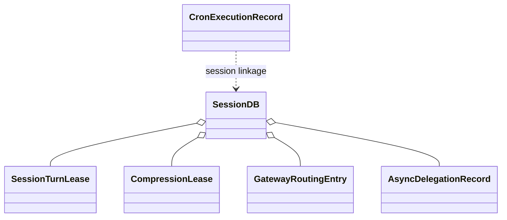
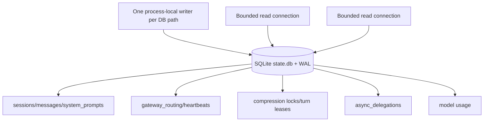
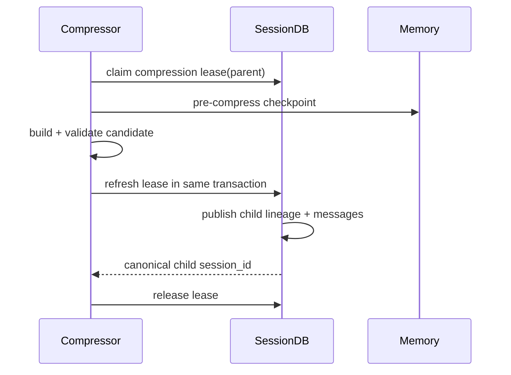
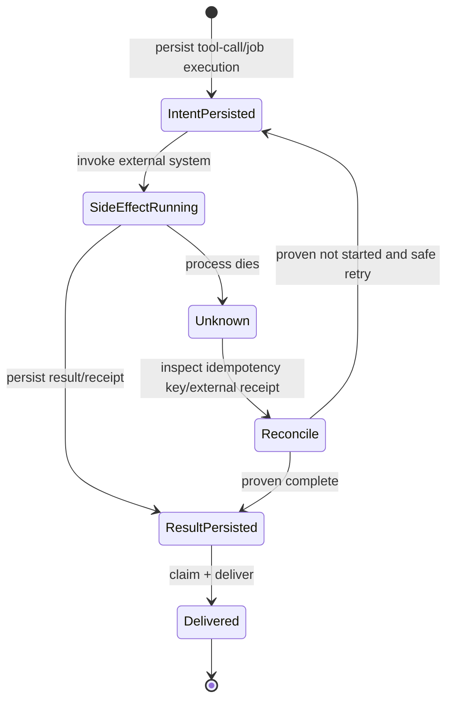
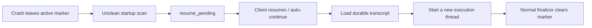
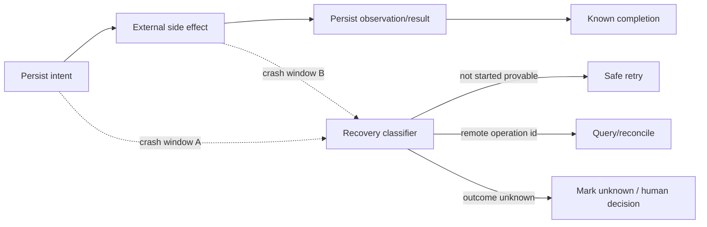

# 13 Persistence：Transcript、租约、账本与语义恢复

## 定位

**实现状态：分散，非通用 durable workflow engine。** Hermes 对“必须跨进程保留”的事实分别建模：会话消息、路由、压缩 lineage、turn lease、后台委派、Cron execution、Goal/Kanban 状态和验证证据。

它没有逐行 checkpoint Python 执行栈，也不承诺所有外部副作用 exactly-once。其策略是：在副作用前后写足够的意图/结果记录，使恢复能够保守判断“已完成、未开始、或状态未知”。

## 持久化地图

| 状态 | 存储 | 恢复强度 |
| --- | --- | --- |
| 会话、消息、usage、routing | `state.db` / `hermes_state*.py` | 强；核心事实 |
| system prompt | 内容 hash + DB row | 强；去重 |
| compression lineage/lease | `state.db` | 强；事务发布 |
| active turn marker | Gateway routing row | 检测异常退出，语义重启 |
| async delegation | `async_delegations` | dispatch/completion/delivery 可恢复；worker 不续栈 |
| Cron jobs/executions | Cron JSON/SQLite stores | 可恢复状态，未知副作用不盲重试 |
| Goal/heartbeat/loop | manager state files/DB | 状态机继续 |
| Kanban graph | board SQLite | 领取、执行、审核继续 |
| tool checkpoint | `tools/checkpoint_manager.py` | 对支持的文件修改提供回滚点 |
| verification evidence | `verification_evidence.db` | 可查询证明，不是业务状态 |

## 核心持久对象

## SessionDB 架构

`hermes_state_registry.py` 为解析后的 DB path 维护单 writer handle、引用计数和 teardown barrier。写操作用 Python lock + SQLite transaction；busy/locked 做有界抖动重试，不能把真正损坏当锁竞争。

## 压缩的原子发布

lease 的查找、刷新和发布共享 transaction；过期 holder 只有在明确 stale 时可回收。turn lease 按 conversation lineage root 加锁，因此压缩前后的两个 session ID 仍属于同一写入所有权域。

## 副作用与 crash 窗口

最危险的是“外部系统已完成，但本地 result 未提交”。Hermes 的原则是未知时保守：Cron interrupted execution 标为 `unknown`，不自动假设失败并重放；API runs、通知和委派分别用 idempotency/claim/delivery 状态降低重复。

## 崩溃恢复

Gateway 的 active-turn CAS marker 只在不干净退出后转为 `resume_pending`。TUI/Gateway 冷恢复会重新构造 agent、加载 transcript、附加中断/恢复说明并启动新 turn。

这提供 at-least semantic continuation，不是 instruction-level replay。

## 损坏与检疫

`SessionDB` 区分：

- `locked/busy`：并发，短时重试。
- lease/compression conflict：所有权错误，调用者必须等待或改用 canonical child。
- IO error：先排除 file generation/WAL 竞争，再判断结构损坏。
- corrupt/zero header：跨进程锁下把原文件移入 quarantine，保存现场后新建 DB。

一旦 handle 判定 corrupt，会进入粘性 quarantine：后续写立即失败，也避免 close-time checkpoint 把旧 WAL 页写入错误 generation。

## 设计模式

- **Write-ahead Log + Transactions**：SQLite WAL 与原子写。
- **Lease / Fencing Token**：跨线程/进程所有权。
- **Outbox/Delivery Claim**：完成与交付分离。
- **Event/Intent Log**：副作用前保存意图。
- **Recovery State Machine**：`resume_pending`、unknown、abandoned。
- **Quarantine**：保留损坏现场，拒绝继续污染。

## 关键不变量

1. 未提交 tool-call 不能产生副作用。
2. unknown 外部副作用不能盲目重试。
3. lease owner 和 commit 必须在同一事务重新验证。
4. canonical lineage child 发布后，旧 session 写入必须被 fencing 拒绝。
5. corrupt 与 busy 必须严格区分。
6. delivery claim 失败要可 rewind；成功交付不能重复 claim。

## 取舍与非目标

- SQLite 简化单机/少量进程部署，但不是分布式共识系统。
- 多个专用 ledger 提供精准语义，却增加理解成本。
- 语义恢复比续栈稳健，但任务必须能从 transcript/状态重新描述。
- exactly-once 需要外部系统幂等键或回执，Harness 单方面无法保证。

## 进一步拆解：持久化的是事实，不是对象图

一个可恢复系统应优先保存可序列化的业务事实，而不是 pickle 一个活的 agent：

| 持久事实 | 能回答的问题 |
| --- | --- |
| user/assistant/tool transcript | 模型和用户说过什么、提议过什么 |
| turn lease + generation | 当前写所有者是谁，迟到提交是否应拒绝 |
| active/resume marker | 上次是否异常中断，是否要重建 |
| compression lineage | 哪个 child 是 canonical，摘要覆盖哪段历史 |
| delivery ledger | 外部消息是否已 claim/send/confirm |
| cron/delegation/goal state | 后台任务处于 queued/running/unknown/completed 哪一态 |

这是一种 write-ahead intent + reconciliation 思路，不是 exactly-once。副作用发生后、结果落库前的 window 永远需要远端幂等或查询协议。对“发消息”和“转账”应采用不同恢复策略，不能用一个通用 `retry=True`。

### Lease、fence 与 lock 的区别

- Lock 解决当前进程/线程的互斥；进程死亡后需要回收。
- Lease 带期限，允许新 owner 在旧 owner 消失后接管。
- Fence/generation 让旧 owner 即使后来醒来，也无法提交到新 lineage。

仅有 lease 没有 fence 会产生“僵尸写”：旧 worker 网络暂停，lease 过期后新 worker 接管，旧 worker 恢复并覆盖新结果。Hermes 在关键 commit 再验证 owner/generation，值得作为通用模式学习。

## 业界横向比较（2026-09）

| 方案 | 恢复粒度 | 强项 | 代价/限制 |
| --- | --- | --- | --- |
| Hermes | transcript/ledger/lease 的语义重建 | SQLite 部署轻、与 session/tool/delivery 事实贴合、损坏检疫清楚 | 非通用 event sourcing；不能自动续任意代码栈 |
| LangGraph checkpointer | graph super-step/checkpoint | thread、time travel、fork、pending writes、HITL | 副作用节点仍需幂等；schema/graph 版本要管理 |
| Temporal | workflow event history + deterministic replay | durable timers、signals、activities、跨进程多年运行 | 运维与确定性/版本迁移复杂度最高 |
| DBOS | 数据库中的 workflow/step 结果 | 部署较轻，普通代码获得恢复；失败后从完成 step 继续 | workflow/step 边界和 retry 仍需谨慎，数据库成为关键依赖 |
| PydanticAI durable capabilities | 把 model/tool/MCP/compaction 映射到多种 backend | agent 层与 Temporal/DBOS/Prefect/Restate/AWS 组合成熟 | backend 语义不同，不能假设一次实现处处等价 |
| 纯 event sourcing | append-only domain events + projections | 审计、重放和派生视图强 | 事件 schema 演进和副作用投递复杂 |

Hermes 更适合单机/少量进程、对话中心、允许“重新询问模型继续”的恢复；Temporal 更适合有业务 SLA、计时器与外部事件的长流程；LangGraph 更适合 agent graph 节点恢复。组合时让 durable engine 记录业务工作流，不要重复成为 transcript 的第二真相源。

## Schema 演进与备份

持久化正确性不只在写入时。还要验证：

1. migration 在中断后能否重入；旧版本能否识别“数据库太新”而拒绝写；
2. 长期 workflow/goal 的 payload 在代码升级后如何兼容；
3. SQLite WAL、主文件与附件/外溢文件是否形成一致备份集；
4. quarantine 保留原始损坏文件与诊断，不能用新空库悄悄覆盖证据；
5. retention/删除是否同时处理 transcript、memory、artifacts 和外部 telemetry。

## 源码阅读题

1. canonical compression child 发布的线性化点是哪条事务？旧 parent 后续写为何会被拒绝？
2. delivery claim 的过期/rewind 与真正发送成功如何区分？
3. corrupt DB、schema incompatible、busy/locked 分别走什么分支？
4. 哪些 ledger 状态允许自动 retry，哪些只能标记 unknown？

## 学习实验

1. 在 tool handler 完成后、result 落库前杀进程，列出能证明与不能证明的事实。
2. 两进程竞争同一 conversation turn lease，验证只有一个进入循环。
3. 复制一个损坏/零字节 state DB，观察 quarantine 路径和保留文件。
4. 中断 Cron execution，确认恢复标为 unknown 而非自动重跑。

## 延伸阅读

- [Session storage](../../website/docs/developer-guide/session-storage.md)
- [State DB recovery](../state-db-recovery.md)
- [Cron internals](../../website/docs/developer-guide/cron-internals.md)
- [LangGraph persistence](https://docs.langchain.com/oss/python/langgraph/persistence)
- [Temporal durable execution](https://docs.temporal.io/)
- [PydanticAI durable execution](https://pydantic.dev/docs/ai/capabilities/durable_execution/overview/)
- [PydanticAI with DBOS](https://pydantic.dev/docs/ai/capabilities/durable_execution/dbos/)
