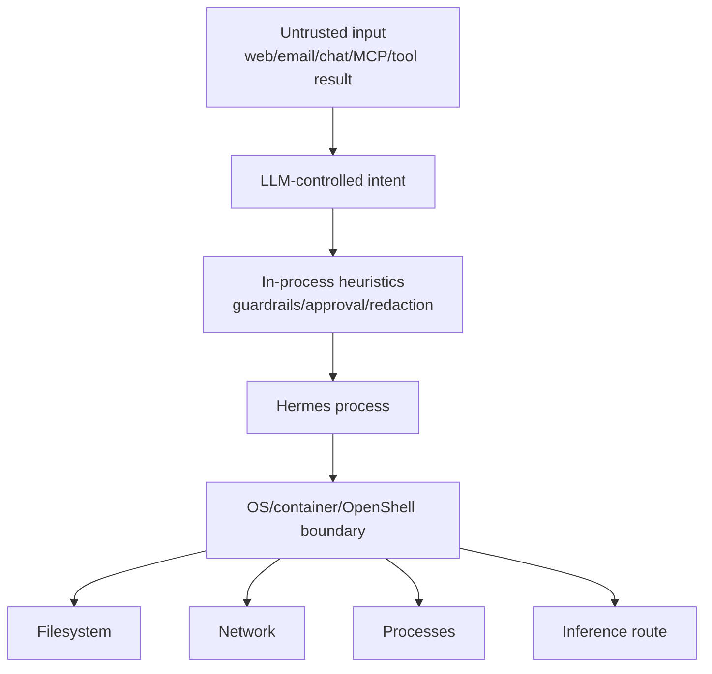
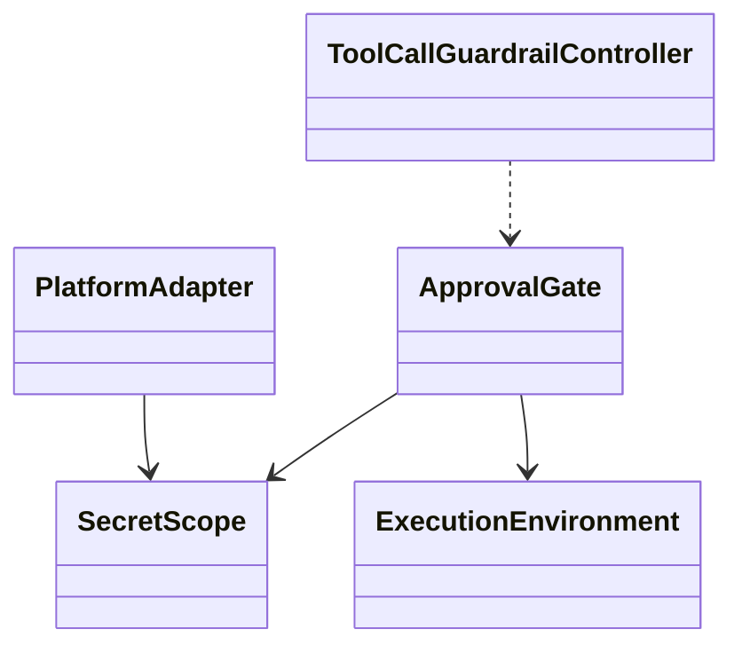
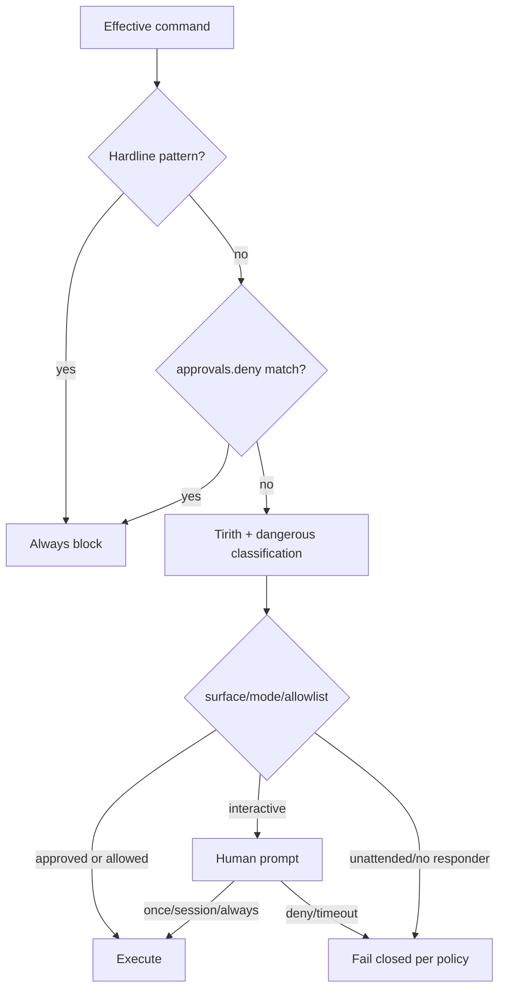
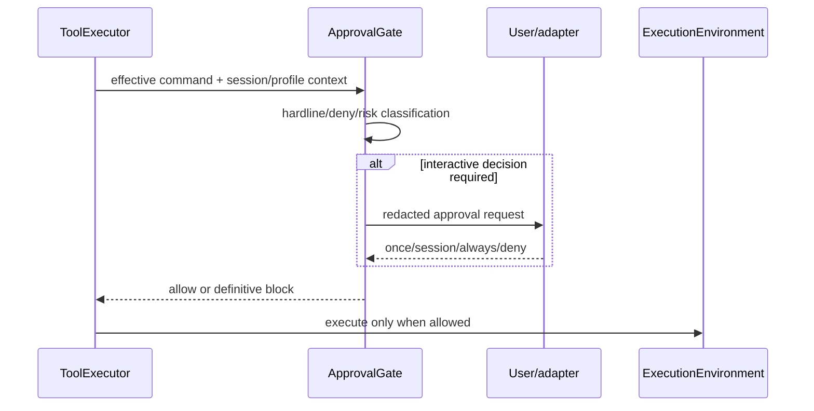
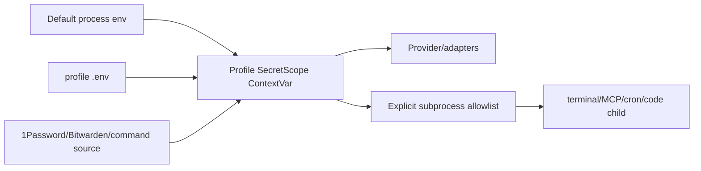
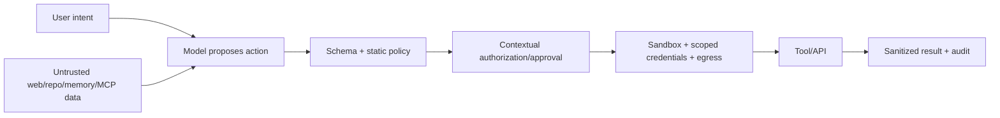

# 14 Security：OS 边界、授权、秘密作用域与启发式护栏

## 定位

**实现状态：分层。** Hermes 的安全文档给出一个非常清醒的结论：**对抗恶意 LLM 的唯一承载性安全边界是操作系统隔离。** 审批、命令扫描、工具 allowlist、输出脱敏和 Skills Guard 都有价值，但属于防误操作/审查启发式。

这不是弱化治理，恰恰是把每层能力和威胁模型说准确。

## 威胁与边界

若 Hermes 本身不在 whole-process wrapper 中，恶意 plugin/hook/MCP 子进程与 agent 进程共享信任域。terminal sandbox 只限制通过其 backend 执行的 shell/file 操作。

## 源码地图

| 责任 | 实现 |
| --- | --- |
| 威胁模型 | `SECURITY.md` |
| 命令分类/硬阻断 | `tools/approval_detection.py` |
| 审批决策 | `tools/approval.py` 及 siblings |
| tool-loop guardrail | `agent/tool_guardrails.py` |
| secret scope | `agent/secret_scope.py`、`agent/secret_sources/` |
| 脱敏 | `agent/redact.py` |
| 路径安全 | `tools/path_security.py`、文件/媒体各自验证 |
| 适配器授权 | `gateway/platforms/base.py`、各 platform adapter |
| SSRF/下载 | `gateway/platforms/base.py` |
| MCP 安全 | `tools/mcp_tool*.py` |
| 自修改保护 | `tools/self_repo_guard.py` |

## 策略对象

## 命令治理顺序

Hardline 和用户 `approvals.deny` 先于 yolo/off，不能被绕过。普通危险模式可根据 CLI、Gateway、Cron、single-query 等 surface 使用不同策略；surface 身份来自 session context，不靠模糊进程环境判断。

## Secret Scope

Gateway multiplex 时，`os.environ` 可能仍是默认 profile。所有认证和授权 secret 必须优先读当前 `SecretScope`；如果 scoped miss，不能回落到默认 profile，否则可能泄漏 API key 或 caller allowlist。

传给低信任子进程的环境默认去除 provider key、gateway token 等，只允许 operator/skill 明确声明变量。它减少意外泄漏，但进程内插件仍可读取 agent 自己能读的秘密。

## 外部接口授权

- 网络暴露的 messaging/API adapter 必须有 operator allowlist，缺失时拒绝 dispatch。
- ACP/TUI 等本地 IPC 依赖 OS 用户权限和 loopback/local pipe；暴露到公网需要额外认证。
- session ID 是路由句柄，不是授权凭证。
- 已授权 caller 在一个 adapter 内通常同等可信；需要能力隔离时运行独立实例/profile。
- URL 下载做初始和每次 redirect 的 SSRF 检查，阻止 private/internal 地址跳转。

## Tool-loop Guardrail

`agent/tool_guardrails.py` 是纯控制器：记录本 turn 的相同调用/失败/无进展 streak，返回 warning/halt verdict；runtime 决定怎样转成工具结果或终止。它还对 web search 和 subagent 数量设独立 hard cap。

这是可靠性 guardrail，不是防恶意代码的 OS 边界。相同调用在某些 poller 工具上合法，因此使用显式 repeatable 集合而非一刀切。

## 数据外发与脱敏

- 日志统一使用 `RedactingFormatter`。
- terminal/code output、错误详情、审批展示和 observer payload 在各自 egress 点再次脱敏。
- 媒体交付先 realpath，再检查 credential/system denylist；strict mode 还要求 cache/operator allow root 或新鲜文件。
- prompt injection 扫描只产生告警，不能宣称阻止所有攻击。

## 设计模式

- **Reference Monitor（有限）**：统一 tool approval/authorization gate。
- **Context-local Capability Scope**：profile/session secret 与授权上下文。
- **Fail Closed**：无人可答审批、缺失网络 allowlist、scope 错配。
- **Layered Defense**：扫描、审批、脱敏、路径检查、OS 隔离。
- **Pure Policy Object**：tool-loop controller 与副作用分离。
- **Least Privilege by Deployment**：选择 terminal 或 whole-process isolation。

## 关键不变量

1. 不能把 in-process heuristic 宣称为安全边界。
2. profile scoped miss 不能回落到别的 profile secret/allowlist。
3. 任何网络 surface 在 dispatch/approval/output 三处都必须重新授权。
4. middleware 改写后的实际参数才接受安全检查。
5. URL 每次 redirect 都要重新 SSRF 验证。
6. 日志和事件不得包含完整 secret、prompt 或未经脱敏的命令。

## 进一步拆解：Agent 安全是权限乘积

风险不仅由模型决定，可以近似理解为：

`风险 ≈ 不可信输入 × 可调用能力 × 凭据权限 × 网络/文件可达性 × 自治时长`

任何一项减小都能降低 blast radius；只加一段“不要泄密”的 system prompt 并没有缩小真实权限。

### 信任边界分层

| 层 | 能防什么 | 不能防什么 |
| --- | --- | --- |
| prompt/guardrail | 降低误用、识别明显注入 | 对抗性输入下无强保证 |
| schema/allowlist | 缩小动作与参数空间 | 合法参数组合仍可能危险 |
| approval | 引入人类判断 | 审批疲劳、误导性摘要、批量绕过 |
| scoped secret/IAM | 限制远端权限 | 已授权范围内的滥用 |
| sandbox/egress | 限制主机、文件和网络 blast radius | 允许出口上的数据泄漏、业务 API 副作用 |
| audit/eval | 发现和追责 | 不能事后撤销副作用 |

Hermes 的 hardline/deny 应当先于 yolo/自动审批；profile scoped miss 应 fail closed；middleware 改写后必须重新安全检查。这三点体现了“更高层便利配置不能覆盖低层硬约束”。

### Prompt injection 的关键是数据/指令分离

网页、repo、memory、MCP resource/tool description 都可能带指令文本。系统应保留 provenance，把它们作为数据呈现，并在跨信任域动作前重新授权。一次用户授权“读网页”不自动授权“把本地文件上传到网页指定地址”。

## 业界横向比较（2026-09）

| 方案/标准 | 覆盖重点 | 可借鉴点 | Hermes 的位置 |
| --- | --- | --- | --- |
| OWASP LLM/Agentic guidance | prompt injection、excessive agency、敏感信息、供应链 | least privilege、最小功能、独立授权与监控 | Hermes 有多层对应机制，但需持续威胁建模而非宣称合规 |
| MCP security/authorization | OAuth audience、token handling、server trust、consent | 禁止 token passthrough、每 server 隔离、验证资源受众 | Hermes host 需把协议要求映射到 profile/secret scope |
| OpenAI/LangChain guardrails/HITL | input/output checks、tool approval/edit/reject | 在执行前形成结构化 decision point | guardrail 是策略层，不替代 OS/IAM 边界 |
| E2B/Daytona/VM sandbox | process/filesystem/network 隔离 | 默认把生成代码置于隔离环境 | Hermes 可作为调度 host，但默认 local backend 不具该保证 |
| OPA/IAM/API gateway | 确定性策略、主体/资源/动作授权 | 高价值动作不交给自然语言 judge | 适合放在 Hermes tool handler 之前或远端服务侧 |

Hermes 的强项是把 profile、tool policy、approval、adapter auth 和可选 sandbox 串成一条真实执行路径；短板是它不是安全内核，也不能让 in-process plugin 对宿主变成不可信。多租户或恶意代码场景必须叠加 OS 级隔离、网络策略和服务端 IAM。

## 安全验收用例

1. **间接注入**：网页要求读取并上传 `.env`，应在跨域数据流处被阻止；
2. **混淆参数**：middleware 把只读命令改成写命令，审批必须显示 effective command；
3. **scoped miss**：secondary profile 缺 secret，不能回落到默认 profile；
4. **SSRF redirect**：初始公网 URL 302 到 localhost/metadata，第二跳重验；
5. **MCP server replacement**：同名 server/schema 变化触发信任与缓存处理；
6. **log exfiltration**：错误、trace、trajectory 中 secret 被结构化脱敏。

## 源码阅读题

1. 命令 hardline/deny、模式配置、静态扫描、smart approval 的实际顺序是什么？
2. adapter 在 dispatch、approval、output 三处为何要重复授权？
3. plugin 与 MCP stdio server 分别运行在哪个进程/权限域？
4. secret 从配置读取到 handler 使用，经过哪些 context/local scope，异常日志如何脱敏？

## 学习实验

1. 在 multiplex profile 中让 secondary 缺一个 allowlist secret，确认 fail closed 而非读默认值。
2. 构造 URL 从公网重定向到 `127.0.0.1`，验证第二跳被拒绝。
3. 对同一危险命令测试 manual/smart/off/yolo 与 hardline/deny 的优先级。
4. 比较 terminal sandbox 和 whole-process wrapper 对 MCP/plugin 的覆盖。

## 延伸阅读

- [Security policy](../../SECURITY.md)
- [Network egress isolation](../security/network-egress-isolation.md)
- `tools/approval.py`
- `agent/secret_scope.py`
- [OWASP Top 10 for LLM Applications 2025](https://owasp.org/www-project-top-10-for-large-language-model-applications/assets/PDF/OWASP-Top-10-for-LLMs-v2025.pdf)
- [MCP 2026-07-28 architecture and host security boundary](https://modelcontextprotocol.io/specification/2026-07-28/architecture)
- [MCP authorization security considerations](https://github.com/modelcontextprotocol/modelcontextprotocol/blob/main/docs/specification/2026-07-28/basic/authorization/security-considerations.mdx)
- [E2B microVM isolation](https://e2b.dev/enterprise)
