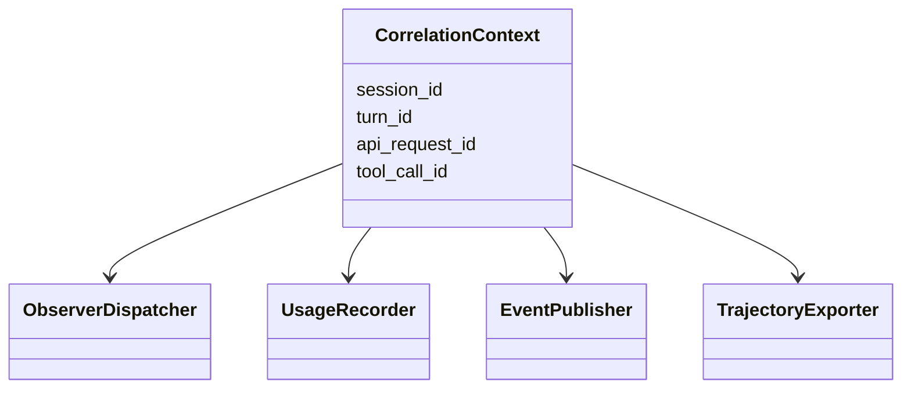
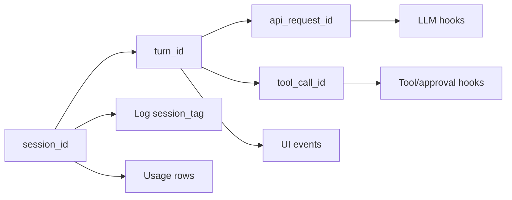
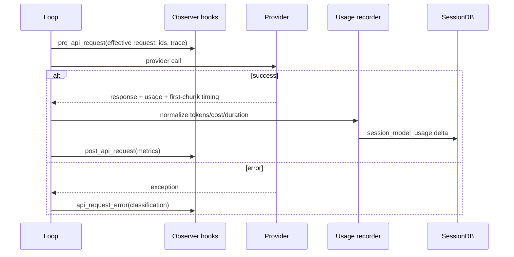
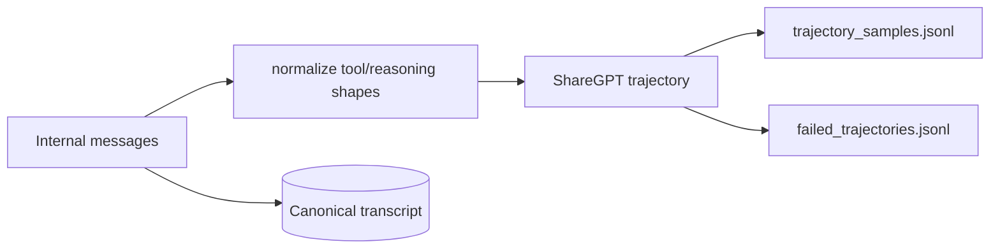
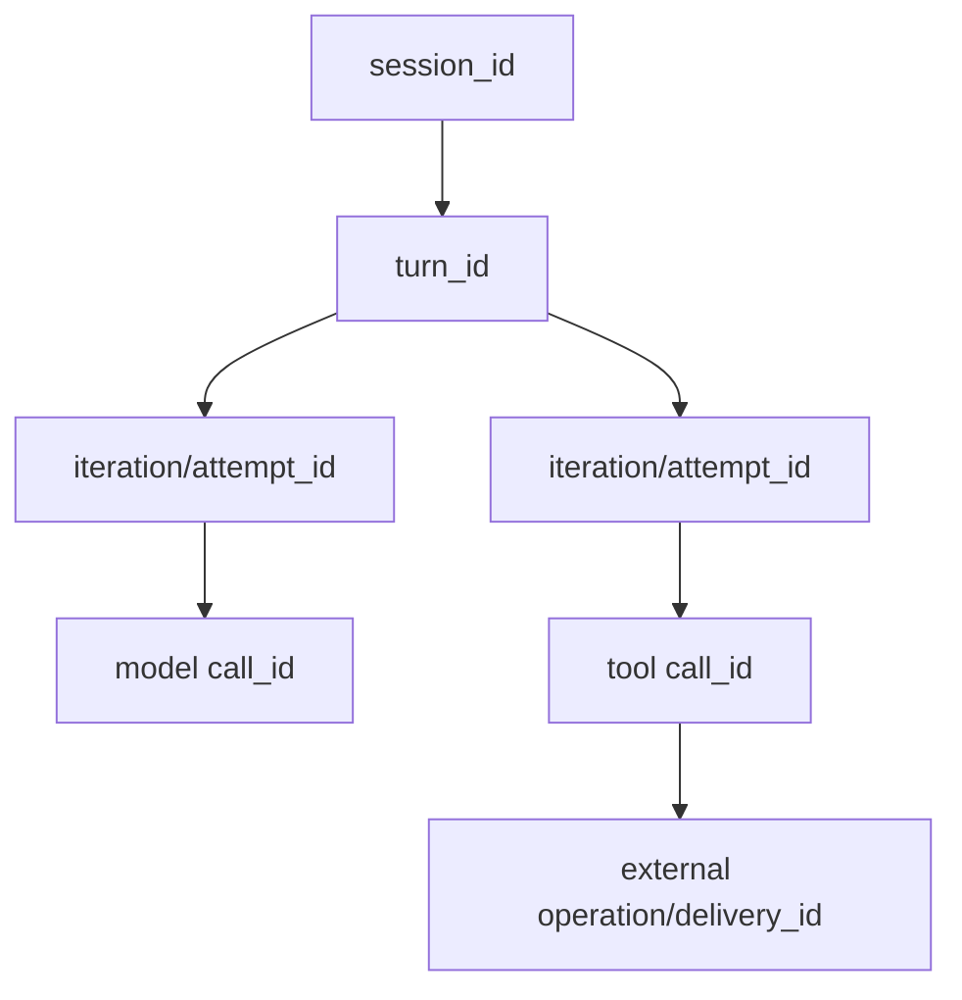

# 15 Observability：相关 ID、生命周期事件、用量与可回放轨迹

## 定位

**实现状态：分散 + 插件。** Hermes 没有把所有信号强制发送到一个 SaaS；核心提供本地轮转日志、结构化 hooks、stream/UI events、usage 账本、trajectory 和少量健康事件，插件可接外部观测系统。

可观测性必须遵守两条边界：不阻塞主循环，不未经 opt-in 外发用户内容/usage analytics。

## 信号地图

| 信号 | 实现 | 主要消费者 |
| --- | --- | --- |
| 轮转文本日志 | `hermes_logging.py` | operator、`hermes logs` |
| session 日志标签 | LogRecord factory/thread context | 故障定位 |
| LLM/tool observer hooks | `hermes_cli/plugins.py` | 插件/审计 |
| 流式 observer | `agent/plugin_stream_hooks.py` | 异步插件 |
| UI/gateway events | `event_callback`、`gateway/stream_events.py`、TUI publisher | 前端 |
| token/cost | `agent/turn_usage.py`、`hermes_state_usage.py` | 状态栏、账单、报表 |
| trajectory JSONL | `agent/trajectory.py` | 训练/回放/失败分析 |
| gateway/cron health | `agent/monitoring/events.py` | operator-owned monitoring |
| verification evidence | `agent/verification_evidence.py` | 完成前证明 |

## 信号对象

## 相关性模型

`session_id` 是可观测身份，Gateway `session_key` 是路由身份，两者不能混用。middleware trace 跟随 effective request/args 进入后续 observer payload，回答“是谁改写了这次调用”。

## 一次 API 调用的信号

usage recorder 同时更新 Context Engine、显示 anchor、session 累计、DB 队列和日志；MoA advisor 用量也折入完整 turn 视图。Provider 缺 usage 时保留“发生了一次调用”的计数，但不伪造 token。

## 日志体系

`hermes_logging.py` 通过一个 async queue 驱动轮转文件：

- `agent.log`：INFO+ 全局。
- `errors.log`：WARNING+。
- `gateway.log`：Gateway 组件。
- `gui.log`：Dashboard/TUI gateway。

统一 `RedactingFormatter` 在落盘前脱敏。LogRecord factory 附加 session tag 和解析后的 Hermes home，使 multiplex profile 的异步 listener 仍写入正确目录。

## Observer 与事件流

Observer hook 适合 API/tool 生命周期审计；UI event 则是产品协议，如 message delta/complete、tool start/progress/complete、approval request、session status。

流式插件 observer 为每个 consumer 建异步队列，不在 token 热路径同步执行插件。Gateway 将同步 agent callback 桥接到 asyncio/platform delivery，并维护已发送段 ledger，避免断线 fallback 重复发送已确认文本。

## Trajectory

`agent/trajectory.py` 可把内部消息转为 ShareGPT 风格 JSONL，包含 human、assistant reasoning/tool-call、tool results 和 completed 标记。它适合离线回放/数据分析，不替代规范 transcript：轨迹导出可能做格式转换、裁剪或只在配置开启时保存。

## 设计模式

- **Correlation Context**：session/turn/request/tool-call ID。
- **Observer**：生命周期回调。
- **Asynchronous Queue**：日志和 stream observer 隔离热路径。
- **Projection**：同一运行事实投影成日志、UI event、usage、trajectory。
- **Redaction at Egress**：每个外发边界再次处理。
- **Local-first Telemetry**：默认不向第三方发 analytics。

## 缺口与取舍

- 没有默认完整 OpenTelemetry distributed trace；可由插件/中间件接入。
- 文本日志易排障但结构化查询有限。
- hooks 很丰富，插件应避免复制完整 prompt/result 到外部。
- trajectory 适合样本，不应被当成 exactly-once 审计账本。
- UI “已排队/已发送/已确认”需要分状态，不能只用一个布尔值。

## 关键不变量

1. 观测失败不能阻塞或重放模型/工具调用。
2. middleware 成功后抛错也不能造成第二次副作用。
3. 所有外发信号需脱敏且带最小必要内容。
4. usage 使用真实 effective provider/model 归因。
5. gateway delivery 要区分 partial、ambiguous 和 confirmed。
6. 外部 telemetry/usage attribution 必须显式 opt-in。

## 进一步拆解：四级相关性与两条时间线

Agent trace 不能只有一个 request ID。建议的层级是：

同时保留两条时间线：

- **逻辑时间**：session → turn → iteration → call，解释因果；
- **墙钟时间**：start/end/duration，解释延迟、并发和超时。

并行 tool call 不能只靠日志行顺序还原因果；fallback 的多个 provider attempt 也不能共用一个“model call success”覆盖前面的错误。

### Metrics、logs、traces、trajectory 各自回答什么

| 信号 | 最适合回答 | 不适合 |
| --- | --- | --- |
| Metrics | p95 latency、error rate、token/cost、queue depth | 单次失败细节 |
| Logs | 离散诊断、异常堆栈、运维事件 | 跨服务因果和聚合趋势 |
| Traces | 一次 turn 的模型/工具/检索/交付链 | 保存完整敏感内容 |
| Trajectory | agent 决策与工具轨迹、离线回放/eval | 低成本在线告警 |
| Audit ledger | 谁在何时批准/执行了什么 | 性能分析 |

不要把所有东西都塞进 prompt log。默认记录结构、hash/摘要、模型与 token、decision reason；完整内容仅在明确 opt-in、访问控制和 retention 下采集。

### 费用也是因果信号

一个用户 turn 的总成本可能来自主模型多次 attempt、fallback、MoA advisors、压缩、memory extraction 和 judge。只在 final response 记一次 usage 会漏掉失败 attempt 和辅助调用。Hermes 的 effective provider/model 归因值得扩展成 cost tree，让优化者知道钱花在“回答”还是“恢复”。

## 业界横向比较（2026-09）

| 方案 | 定位 | 更强的地方 | 取舍 |
| --- | --- | --- | --- |
| Hermes | 本地日志、hooks、usage、trajectory、delivery ledger | 与真实 session/tool/platform 语义紧密，默认本地与 opt-in 外发 | 缺统一分布式 trace UI/标准 schema |
| OpenTelemetry GenAI conventions | 跨厂商 traces/metrics/logs 语义 | 可接现有 observability stack，减少锁定 | GenAI/agent 约定仍演进，内容捕获需隐私决策 |
| LangSmith | 托管/可部署的 LLM trace、dataset、eval | agent/RAG 调试与生产 trace→dataset 工作流成熟 | 外部平台、成本与数据治理要评估 |
| Arize Phoenix/OpenInference | 开源 OTel-based tracing + eval + experiments | 自托管、跨框架 instrumentation、trace 和 eval 联动 | 仍需正确注入业务/session IDs |
| OpenAI Agents tracing | SDK 原生 agent/tool/handoff spans | 使用该 SDK 时几乎零摩擦 | 主要覆盖 SDK 内路径，跨 provider/system 需桥接 |
| 普通日志平台 | 成熟搜索、告警、retention | 运维基础设施通用 | 不理解 agent trajectory/tool causality |

Hermes 适合本地优先、要理解自身 gateway/delivery 语义的用户；团队生产系统应把结构化 spans 映射到 OTel，再接 Phoenix/LangSmith/既有 APM。最好的方向不是再造一个 dashboard，而是保持 Hermes 语义字段和标准 telemetry 之间的薄适配层。

## SLO 与告警建议

- Turn success rate：区分用户取消、policy deny、provider error 和内部 error；
- Time to first token 与 total turn latency：分别暴露交互和任务完成体验；
- Tool outcome unknown rate：比普通 handler error 更需要人工处理；
- Prompt cache hit/miss 与 effective input tokens：直接关联成本；
- Recovery/fallback rate：持续上升可能是 provider 或配置退化；
- Delivery ambiguity rate：避免“模型成功但用户没收到”被算绿。

## 源码阅读题

1. 四级 ID 在 provider、tool、gateway delivery 之间如何传递？哪个环节会丢？
2. streaming observer 采用队列还是同步 callback，背压策略是什么？
3. fallback、MoA 和 auxiliary usage 在 session 汇总中如何避免重复/漏计？
4. trajectory 包含哪些原始内容，默认 retention 和 secret redaction 在哪里做？

## 学习实验

1. 注册 pre/post API 与 tool hooks，用四级 ID 串起一次完整 turn。
2. 让 streaming observer sleep，确认 UI delta 仍持续。
3. 触发 fallback Provider，验证 usage 记到实际目标。
4. 模拟平台发送一半后断线，检查 delivery ledger 如何只补尾部。

## 延伸阅读

- [Trajectory format](../../website/docs/developer-guide/trajectory-format.md)
- [Relay shared metrics](../observability/relay-shared-metrics.md)
- `hermes_logging.py`
- `agent/turn_usage.py`
- [OpenTelemetry semantic conventions](https://opentelemetry.io/docs/specs/semconv/)
- [Arize Phoenix observability and evaluation](https://arize.com/docs/phoenix/)
- [LangSmith observability](https://www.langchain.com/langsmith/observability)
- [OpenAI Managed Agents session events](https://developers.openai.com/api/reference/python/resources/beta/subresources/agents/subresources/sessions/subresources/events/methods/stream)
