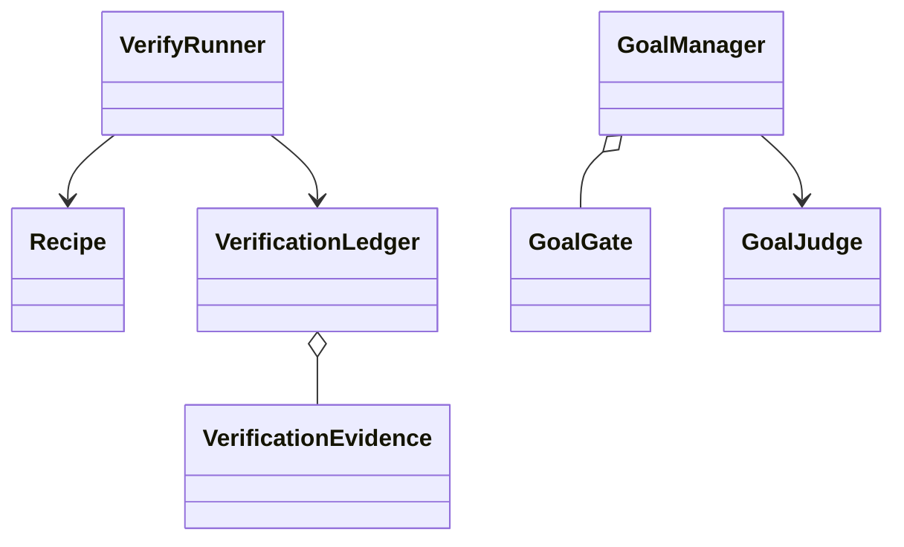
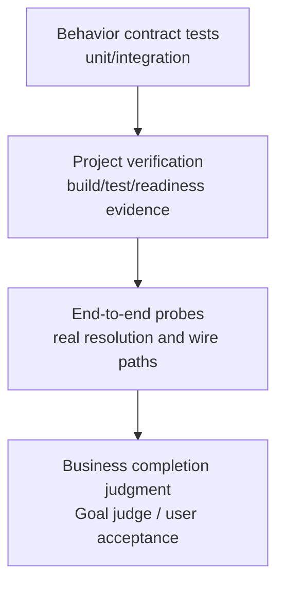
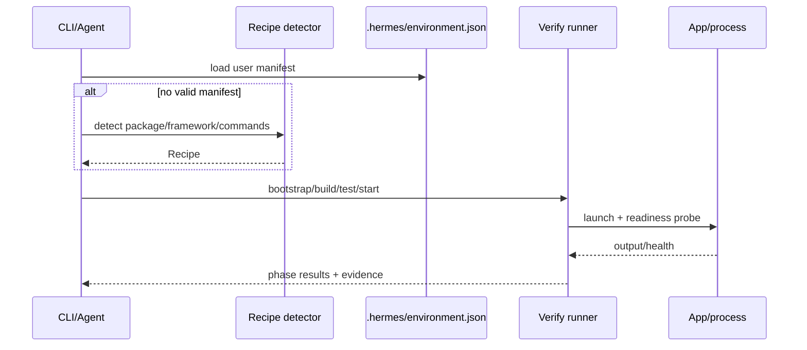
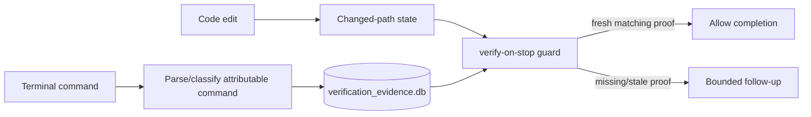
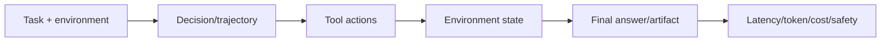

# 16 Eval：离线基准、运行时验证证据与完成判定

## 定位

**实现状态：分散。** Hermes 至少有四类“验证”，不能混成一个分数：

1. `tests/`：代码行为合同和回归测试。
2. `evals/`：真实链路 probe、A/B、benchmark、postmortem。
3. `hermes verify` + verification evidence：项目级 build/test/readiness 证明。
4. Goal judge / verify-on-stop：运行时决定任务是否应继续。

一个 unit test 绿不代表用户任务完成；一个 LLM judge 说 done 也不代表仓库测试通过。

## 源码地图

| 责任 | 实现 |
| --- | --- |
| 回归测试 | `tests/`、`scripts/run_tests.sh` |
| 评测场景 | `evals/` |
| 压缩评测 | `evals/compaction/` |
| 代码导航评测 | `evals/codebase_navigability/` |
| 浏览器任务评测 | `evals/browser_use/` |
| 故障复现/事后分析 | `evals/postmortem/` 与各 live probe |
| 项目 recipe | `agent/verify/recipes.py` |
| verify runner | `agent/verify/runner.py`、`hermes_cli/verify_cmd.py` |
| 被动证据账本 | `agent/verification_evidence.py` |
| 完成前 nudge | `agent/verification_stop.py` |
| 目标 judge/gates | `hermes_cli/goals.py` |

## 验证对象

## 四层验证金字塔

上层不替代下层：完成判断需要证据，E2E 需要可重复的行为合同，测试本身也要服务真实业务不变量。

## 评测目录的形态

`evals/` 不是一个统一 benchmark runner，而是一组针对风险面的工具：

- `compaction`：上下文压缩策略和区域边界。
- `codebase_navigability`：源码布局对 agent 查找成本的影响。
- `browser_use`：真实/云浏览器任务编排。
- provider wire/fallback、token accounting、delivery、liveness：复现跨层故障。
- postmortem：从生产迹象构造可重复探针。

这符合“先验证 premise，再修 bug”：一个好的 eval 要指向当前 main 上的具体失败行/协议，而非只展示模型偶尔答错。

## `hermes verify`

manifest 是用户可编辑事实，存在且有效时优先于静态检测。recipe 识别 Node/Python/Go/Rust/Java 等常见项目，但只是起点；真实项目可覆盖命令与 readiness path。

## 被动 Verification Ledger

`verification_evidence.py` 不自动运行测试。它观察 terminal 中可归因的 test/lint/typecheck/build/format 命令，记录 cwd、root、scope、exit code 和有界输出摘要；编辑后旧证据失效。

`verification_stop.py` 默认 opt-in，只在模型修改代码后想立即结束且缺少新证据时追加一次有界提醒；它自己不跑测试。纯文档修改不会被要求制造无意义测试。

## Goal Judge 与确定性 Gate

Goal 先运行用户定义的 deterministic shell gates，再让辅助模型输出 done/continue/wait/blocked。两者回答不同问题：

- gate：可执行、可重复的客观条件是否满足。
- judge：目标语义是否完成、是否需要下一 turn。

judge 有 turn/解析/传输失败预算并可自动 pause，避免用另一个不稳定模型制造无限循环。

## 好的测试原则

仓库规则强调：

- 使用 `scripts/run_tests.sh` 保持凭据、时区、locale、HERMES_HOME 和文件隔离与 CI 一致。
- 测行为关系，不冻结会正常变化的模型列表/版本/计数。
- 不读源码字符串做“实现形状测试”；提取纯函数后测行为。
- 涉及配置传播、安全、I/O、远程 backend 的修复要有真实 import/path 的 E2E。
- OS 差异在真实 OS lane 测，不 patch `sys.platform` 欺骗解释器。

## 设计模式

- **Test Pyramid + Contract Testing**：从行为合同到 E2E。
- **Evidence Ledger**：把“我跑过什么”变成可查询事实。
- **Recipe / Strategy**：项目验证命令可检测、可覆盖。
- **Oracle Separation**：确定性 gate 与 LLM judge 分离。
- **A/B Probe**：评估基础版本和修复版本的真实差异。

## 关键不变量

1. 证据必须是本次编辑之后、同一 root/scope 的可归因命令。
2. 工具返回 0 不等于业务完成；judge 也不能覆盖失败 gate。
3. 评测不得依赖真实个人凭据或写入默认 `~/.hermes`。
4. E2E 失败要保留真实故障，不用 mock 把链路变绿。
5. eval 结果要标明环境、基线 commit、模型/Provider 和随机性。
6. 自动 judge 必须有停止预算和可人工覆盖状态。

## 进一步拆解：评测对象不是只有最终文本

一个 tool-using agent 至少有五个可评分层面：

| 层面 | 典型 scorer | 为什么需要 |
| --- | --- | --- |
| 最终结果 | exact match、schema、unit test、human rubric | 用户是否得到正确产物 |
| 环境状态 | git diff、DB query、文件/网页状态 | agent 可能说完成却未真正执行 |
| 轨迹 | tool sequence invariants、forbidden action、efficiency | 发现结果偶然正确但过程危险 |
| 恢复性 | fault injection、restart、timeout、duplicate delivery | harness 的核心质量在失败路径 |
| 成本/体验 | tokens、latency、cache hit、approval count | 防止“更准”以不可接受成本换来 |

`hermes verify` 的关键价值是把“本次编辑之后产生的证据”绑定到 root/scope，而不是把任意一次历史 `pytest` 绿色当完成。LLM judge 只能补充语义判断，不能覆盖确定性 gate 失败。

### 三种测试层次

1. **行为不变量测试**：关系恒真，如每个 tool-call 恰有一个 result；
2. **真实链路 E2E**：用临时 `HERMES_HOME`、真实 import/DB/filesystem 验证解析链；
3. **统计 eval**：固定 dataset 上比较模型/prompt/harness 的成功率、成本与置信区间。

源码快照、固定模型枚举、硬编码版本号是 change detector，不是行为测试。它们会阻碍合理变更，却抓不到 wiring 错误。

## 业界横向比较（2026-09）

| 方案 | 强项 | 与 Hermes 的互补关系 |
| --- | --- | --- |
| Hermes evals + verification ledger | repo-specific E2E、完成证据、compaction/navigation benchmark、Goal gates | 贴近实际 harness 不变量；通用 dataset/UI 较少 |
| Inspect AI | dataset/solver/scorer/tool/sandbox 一体，安全与 agent eval 环境成熟 | 可把 Hermes/模型作为被测 solver，做隔离 benchmark |
| OpenAI Evals/Graders | 托管 data source、run、grader 与 usage 结果 | 适合模型/响应评测；本地多 provider/system state 需自接 |
| LangSmith evaluation | production traces → datasets、online/offline eval、实验比较 | 与 observability 闭环强，适合持续回归 |
| Arize Phoenix | OTel/OpenInference traces、datasets、experiments、LLM/code/human eval | 开源自托管，适合把 Hermes trajectory 导入分析 |
| pytest/Vitest + scenario harness | 确定性、代码级、CI 友好 | 必须保留；不能被 LLM judge 替代 |

Hermes 更好在验证自身缓存、角色交替、DB、gateway 与恢复路径；Inspect/LangSmith/Phoenix 更好在管理大规模数据集、实验和 trace-based eval；OpenAI Evals 适合使用 OpenAI API 的托管 grader。实践中应组合：确定性 gate 兜底，统计 eval 比较质量，人工复核校准 judge。

## 设计一个有意义的回归集

每个真实 bug 收录一条最小 scenario，保留：输入、初始环境、允许工具、期望状态关系、禁止动作和失败注入点。数据集按能力切片，避免一个总平均分掩盖退化：

- provider/fallback；context/compaction；tool protocol；session recovery；
- security/approval；memory isolation；gateway delivery；multi-agent coordination。

报告至少给出样本数、基线 commit、模型与版本、temperature/seed（若适用）、重试策略、成本和置信区间。只报“通过率提高 5%”而不说明 retry 和样本，很难复现。

## Judge 风险清单

1. judge 是否看到参考答案中可能泄漏给被测 agent 的信息？
2. judge 与被测模型是否同源，存在系统性偏好？
3. rubric 是否把风格误当正确性？
4. 多次 judge 投票的成本与方差是否记录？
5. 对安全/金钱副作用，是否有确定性 veto 而不是只看 judge 分数？

## 源码阅读题

1. evidence ledger 如何保证命令发生在当前 edit watermark 之后？
2. detector、manifest、recipe 的优先级和 root scope 如何解析？
3. Goal judge、deterministic gate、人工 override 的状态机是否可审计？
4. 哪些 eval 使用真实 provider，如何隔离凭据、随机性与成本？

## 学习实验

1. 修改一行代码，先结束、再跑 targeted test，比较 verify-on-stop verdict。
2. 给同一项目写 manifest 覆盖 detector，观察 recipe 优先级。
3. 从一个历史 bug 写“base 红、fix 绿”的 E2E probe，再补 1–2 个行为不变量测试。
4. 对一个 Goal 同时配置 shell gate 与 LLM judge，分别制造失败。

## 延伸阅读

- `evals/compaction/README.md`
- `evals/codebase_navigability/README.md`
- `agent/verification_evidence.py`
- `agent/verify/`
- [Inspect AI documentation](https://inspect.aisi.org.uk/)
- [Inspect AI sandboxing](https://inspect.aisi.org.uk/sandboxing.html)
- [OpenAI Evals API](https://developers.openai.com/api/reference/java/resources/evals/methods/create)
- [Arize Phoenix](https://arize.com/docs/phoenix/)
- [LangSmith platform: observability and evaluation](https://www.langchain.com/langsmith-platform)
