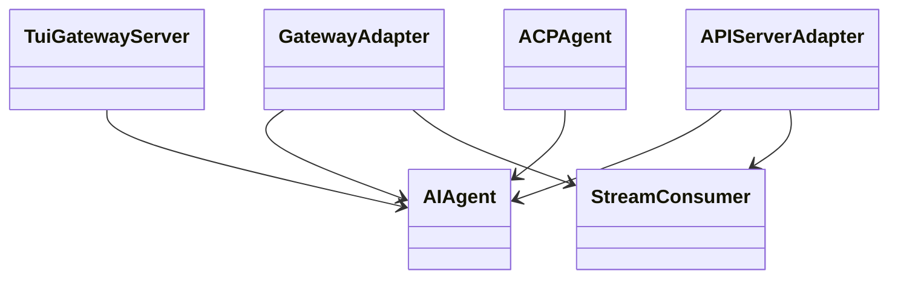
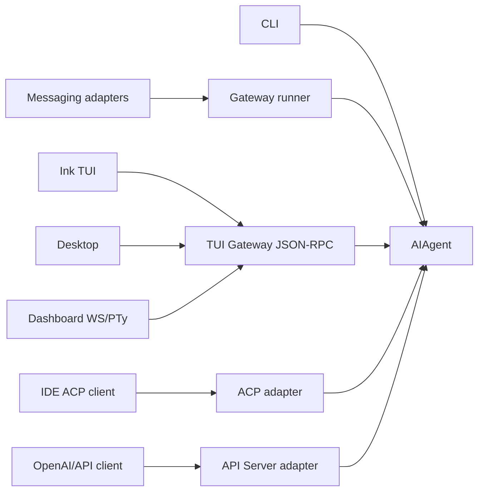
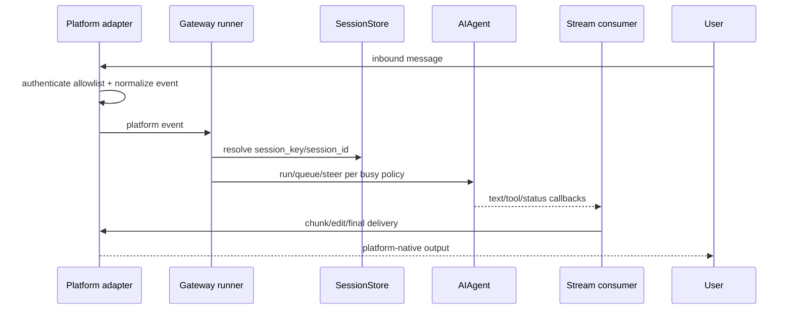
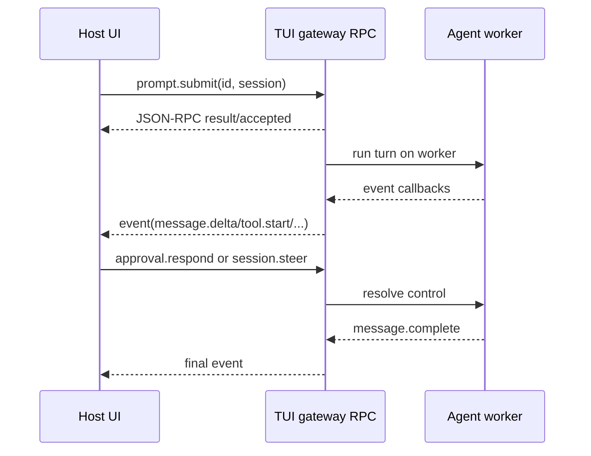
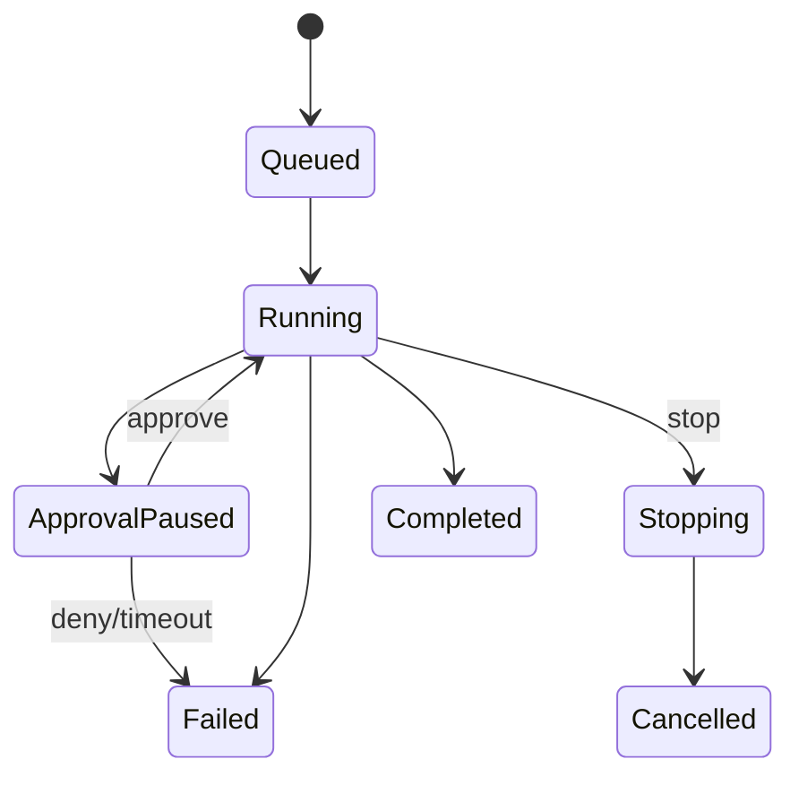
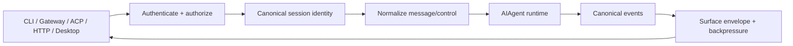

# 17 Interfaces：一个 Agent Core，多个传输与产品表面

## 定位

**实现状态：核心边缘。** Hermes 的 CLI、消息平台、TUI、Desktop、Dashboard、ACP 与 OpenAI-compatible API 最终都驱动同一个 `AIAgent`。差异在身份、传输、流式事件、审批能力和 session 生命周期，不在于复制一套 agent loop。

## 接口总览

| 表面 | 传输 | 入口 | 特点 |
| --- | --- | --- | --- |
| CLI | stdin/stdout | `cli.py`、`main.py` | 单用户交互、slash commands |
| Messaging Gateway | 平台 SDK/Webhook | `gateway/`、`plugins/platforms/` | 多平台、路由/allowlist/交付 |
| Ink TUI | JSON-RPC stdio | `ui-tui/` ↔ `tui_gateway/server.py` | 完整 session/approval/event 控制 |
| Desktop | WebSocket/JSON-RPC | `apps/desktop/` ↔ TUI gateway | 原生 panes + 同一 backend |
| Dashboard | FastAPI + WS/PTy | `hermes_cli/web_server*.py` | 嵌入真实 TUI、管理 REST |
| ACP | JSON-RPC stdio | `acp_adapter/` | IDE session/tool/permission 协议 |
| API server | HTTP + SSE + WS | `gateway/platforms/api_server*.py` | OpenAI-compatible + runs 控制 |
| Python embed | in-process call | `run_agent.AIAgent` | 最小协议层 |

## 端口与适配器

## 总体适配结构

## Gateway 请求链

Gateway 有两个 busy-message guard：早期 guard 决定新消息是否 interrupt/queue；session-lock 内 guard 处理竞态。审批/控制命令必须绕过两者，否则 agent 正在等 `/approve`，命令却被自己挡住造成死锁。

## TUI Gateway RPC

TUI gateway 的方法覆盖 prompt、session、steer/interrupt、history/compress/branch、approval/clarify/sudo/secret、MCP reload、process、delegation、terminal resize、clipboard 和 image。stdout 保留给 JSON-RPC，普通 print 重定向到 stderr，避免破坏 framing。

同一 live session 可有多个 attached client 订阅事件；断开一个 client 不应中断仍被其他 client 观看的 turn。浏览器 controller 等请求绑定能力仍属于注册它的 connection。

## ACP

`acp_adapter` 把 Hermes session 和 events 映射到 Agent Client Protocol：new/load/resume/fork session、prompt、cancel、tool-call progress、usage、MCP attachment、permission request。危险命令审批通过 ACP permission options 映射回 once/session/deny 等 Hermes 语义。

ACP cancel 会保存被取消 prompt 的必要状态；随后 steer/新 prompt 可以作为明确 correction 重放，而非丢掉用户原始意图。

## HTTP / SSE Runs

主要 endpoint：

- `POST /v1/chat/completions`：OpenAI Chat Completions，支持 SSE。
- `POST /v1/responses`：Responses 形态与 stateful transcript。
- `POST /v1/runs`、`GET /v1/runs/{id}`：异步 run。
- `GET /v1/runs/{id}/events`：生命周期 SSE。
- `POST .../approval|steer|stop`：run 控制。
- `GET /v1/capabilities`、`GET /v1/models`。
- 可选 browser-control WebSocket。

Run SSE 用 thread-safe queue 从同步 agent callback 桥到 asyncio handler，带 keepalive 和终止 sentinel。client 断线会触发受控 abandon/interrupt，并保存不完整 snapshot；不能让孤儿 turn 无限运行。

## Dashboard 与 Desktop

Dashboard 的 Chat 不是重新实现一个缩水版 React agent；它通过 PTY/WS 嵌入真实 TUI 或共享 TUI gateway。Desktop 则有自己的 renderer，但复用相同 JSON-RPC backend。这样 slash command、session、approval、MCP 和恢复协议只有一个后端事实来源。

REST 管理面由多个 `hermes_cli/web_routers/` 组成，覆盖 sessions、skills、cron、config、files、ops 等。管理 REST 与聊天事件协议职责不同，不应把 FastAPI route 直接塞进 agent loop。

## 设计模式

- **Hexagonal Architecture**：`AIAgent` 是核心端口，多种 adapter 在边缘。
- **Protocol Adapter**：平台、ACP、OpenAI wire 映射为统一 turn/control。
- **Event Stream**：生成与交付解耦。
- **Backpressure/Busy Policy**：每个 surface 明确 queue/interrupt/steer。
- **Single Backend of Truth**：Desktop/TUI/Dashboard 共享 RPC 能力。
- **Capability Negotiation**：API capabilities、ACP options、toolsets。

## 关键不变量

1. 每个网络 surface 先授权再解析 session/控制请求。
2. transport 断开与用户 stop 必须区分，但都要处理孤儿 turn。
3. SSE/WS 的 accepted/queued/consumed/completed 是不同状态。
4. 任何 adapter 都不能绕开核心 tool policy 与 transcript 持久化。
5. session-scoped surface 能力由 session/platform 决定，不由 backend 进程环境猜测。
6. UI 重连要从 durable history + event snapshot 恢复，不依赖错过的内存 delta。

## 进一步拆解：Interface 是协议翻译，不是第二个 runtime

每个 adapter 应只做五类工作：认证/授权、身份归一、输入规范化、事件翻译、平台交付。模型循环、tool policy、memory 和 transcript 必须继续走同一核心。

若一个 REST endpoint 自己调用 provider、自己拼 tools、自己保存 history，它就形成第二套 harness：缓存、安全、恢复和 usage 迟早漂移。Hermes 的多入口价值恰恰来自 adapter 薄、核心一致。

### 事件协议需要状态而非只有文本 delta

| 事件类别 | 示例 | 重连价值 |
| --- | --- | --- |
| lifecycle | accepted、queued、started、idle、completed | 知道请求是否真正开始/结束 |
| content | text delta、reasoning summary、artifact | 渐进渲染 |
| tool | proposed、approval required、started、result | 重建工具卡片与人类决策 |
| control | steer accepted/applied、cancel requested | 避免 UI 控制错觉 |
| recovery | resume pending、ambiguous delivery、snapshot | 断线后恢复一致状态 |

SSE/WS delta 是易失优化；durable transcript + 当前 event snapshot 才是重连真相。事件应带单调 sequence/cursor，客户端去重且能检测 gap。

### Backpressure 与取消

慢客户端不能无限拖住 model stream。adapter 要决定 bounded buffer、coalescing、drop 仅限哪些非关键 delta，以及断开时是否取消 turn。关键 lifecycle/tool/approval 事件不可像 token delta 一样随意丢弃。多个 subscriber 时，一个断开也不应自动杀死其他订阅者拥有的 live session。

## 业界协议横向比较（2026-09）

| 协议/接口 | 连接双方 | 擅长 | 不负责 |
| --- | --- | --- | --- |
| Hermes Gateway/TUI RPC/HTTP | 用户 surface ↔ Hermes runtime | 多聊天平台、Desktop/TUI、审批/控制、共享 session | 跨厂商通用标准 |
| ACP（Agent Client Protocol） | IDE/client ↔ coding agent | JSON-RPC session new/resume/prompt/update/cancel 与 permission request | agent-to-agent 业务委派 |
| A2A | 独立 agent/service ↔ agent/service | AgentCard 发现、task/message、streaming、push notification、artifact | 本地 tool/resource 接入 |
| MCP | host ↔ tool/context server | tools/resources/prompts、capability negotiation | 完整 user session UI 或 agent-to-agent 所有权 |
| OpenAI Responses/Realtime | 应用 ↔ provider agent/model runtime | SSE/WebSocket streaming、hosted tools、conversation/background/steering | 跨 provider 的本地产品 session |
| 普通 REST + webhook | service ↔ service | 简单、生态成熟、业务 schema 自由 | 标准 agent progress/tool/permission 语义 |

协议不是互斥替代：一个 Desktop 可用 ACP 控制 Hermes，Hermes 用 MCP 调工具，再用 A2A 把独立任务交给外部 agent；每层身份、授权和 trace context 都要显式转换。

Hermes 更好在需要现成多平台产品壳和同一 agent 行为时；只做一个 IDE agent 可直接实现 ACP；跨组织代理协作优先 A2A；只暴露工具/数据优先 MCP；完全绑定单 provider 的实时语音/响应则使用其原生 Realtime/Responses 更省工程。

## 版本与兼容策略

1. wire schema 版本与内部 Python/TS 对象版本分离；
2. 未知 event type 客户端可忽略，但关键状态必须 capability negotiate；
3. 重连携带 cursor/session ID，不重新提交可能产生副作用的 prompt；
4. adapter 错误使用稳定 code + safe message，详细堆栈只进脱敏日志；
5. auth principal 与 session ID 分离，每次 attach/control 重新校验权限；
6. UI capability 由当前 session/platform 声明，不能由 backend 的 `HERMES_DESKTOP` 等进程环境猜测。

## 源码阅读题

1. CLI、Gateway、TUI RPC、ACP 与 HTTP 最终在哪个公共入口汇合？
2. canonical event 到各 surface envelope 的映射是否保留 call/turn/sequence ID？
3. SSE/WS 断开后由谁 interrupt，多个 subscriber 时所有权如何判定？
4. ACP permission request 怎样映射到 Hermes approval，而不绕过 tool policy？
5. gateway session key 与网络认证 principal 分别在哪里验证？

## 学习实验

1. 用同一 prompt 分别走 Python、TUI RPC 和 `/v1/chat/completions`，比较共同 transcript 和不同事件 envelope。
2. SSE 中途断开，确认 agent 被 interrupt 且不完整状态可恢复。
3. Gateway 正在等待审批时发送 `/approve`，确认绕过 busy guards。
4. 两个 WS client attach 同一 live session，断开一个后验证另一个仍收流。

## 延伸阅读

- [Programmatic integration](../../website/docs/developer-guide/programmatic-integration.md)
- [Gateway internals](../../website/docs/developer-guide/gateway-internals.md)
- [ACP internals](../../website/docs/developer-guide/acp-internals.md)
- `tui_gateway/AGENTS.md`
- [Agent Client Protocol overview](https://github.com/agentclientprotocol/agent-client-protocol/blob/main/docs/protocol/v2/overview.mdx)
- [Agent2Agent Protocol specification](https://github.com/a2aproject/A2A/blob/main/docs/specification.md)
- [Model Context Protocol 2026-07-28 architecture](https://modelcontextprotocol.io/specification/2026-07-28/architecture)
- [OpenAI Responses API](https://developers.openai.com/api/reference/cli/resources/responses/methods/create)
