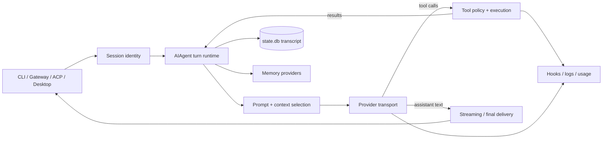

# Hermes Agent Harness 学习地图

> 基线：`031696de70519a86615d79c4e4dae28f3a96fe40`（2026-09-12）。本文档把“17 层 Harness”当作分析坐标系，而不是假设仓库里必须存在 17 个同名目录。

## 先读结论

Hermes 不是“一个 Agent 类加一组工具”，而是一个以 `AIAgent` 为窄腰、由会话、上下文、工具、插件和多种宿主共同驱动的长期运行系统。它最值得学习的不是某个框架 API，而是以下工程判断：

1. **持久记录与单次请求上下文分离**：SQLite 中的完整会话不等于本次发给模型的消息。
2. **先持久化意图，再执行副作用**：assistant 的 tool-call 先落库，工具才开始执行。
3. **缓存是协议约束**：一段会话内 system prompt 尽量字节稳定，技能或配置变更默认延后生效。
4. **能力在边缘，核心保持窄**：工具集、插件、MCP、适配器承担扩展，核心循环只编排稳定协议。
5. **恢复是重建，不是魔法续栈**：通过 transcript、租约、活动标记和状态机恢复语义，不恢复 Python 调用栈。
6. **安全分层但不自欺**：审批、扫描、脱敏是启发式；真正对抗恶意模型的边界是 OS 级隔离。

## 成熟度图例

| 标记 | 含义 |
| --- | --- |
| 核心 | 有明确的稳定抽象和主调用链 |
| 分散 | 能力完整，但由多个目录共同实现 |
| 插件 | 核心只定义端口，具体能力由插件提供 |
| 部分 | 覆盖常用语义，不是通用工作流/平台 |
| 非目标 | 项目明确没有承诺这种能力 |

## 17 层实现总览

| # | 学习文档 | Hermes 中的主要实现 | 判断 |
| --- | --- | --- | --- |
| 01 | [Runtime](./01-runtime.md) | `run_agent.py`、`agent/conversation_loop.py`、`agent/turn_*.py` | 核心 |
| 02 | [Models](./02-models.md) | `providers/`、`agent/transports/`、`hermes_cli/runtime_provider.py` | 核心 |
| 03 | [Context](./03-context.md) | `agent/system_prompt.py`、`agent/context_engine.py`、压缩器 | 核心 + 插件 |
| 04 | [Memory](./04-memory.md) | `agent/memory_provider.py`、`agent/memory_manager.py`、`plugins/memory/` | 核心端口 + 插件 |
| 05 | [Session](./05-session.md) | `hermes_state*.py`、`gateway/session*.py` | 核心 + 分散 |
| 06 | [Tools](./06-tools.md) | `tools/registry.py`、`model_tools.py`、`agent/tool_executor.py` | 核心 |
| 07 | [MCP](./07-mcp.md) | `tools/mcp_tool*.py` | 核心客户端适配 |
| 08 | [Orchestration](./08-orchestration.md) | delegation、MoA、Goal、Cron、Kanban | 分散 |
| 09 | [Skills](./09-skills.md) | `tools/skills_tool*.py`、`agent/skill_commands.py`、Curator | 核心 + 插件 |
| 10 | [Control](./10-control.md) | interrupt/steer/redirect、审批、Goal/Loop 控制 | 分散 |
| 11 | [Middleware](./11-middleware.md) | `hermes_cli/middleware.py`、插件 hooks | 核心端口 + 插件 |
| 12 | [Sandbox](./12-sandbox.md) | `tools/environments/`、Docker/云沙箱/SSH | 可选；本地默认非沙箱 |
| 13 | [Persistence](./13-persistence.md) | state DB、租约、Cron/Delegation ledger、检查点 | 分散；非通用 durable engine |
| 14 | [Security](./14-security.md) | OS 隔离、审批、secret scope、适配器授权 | 分层 |
| 15 | [Observability](./15-observability.md) | 日志、hooks、usage、trajectory、事件流 | 分散 + 插件 |
| 16 | [Eval](./16-eval.md) | `evals/`、verification ledger、`hermes verify`、Goal judge | 分散 |
| 17 | [Interfaces](./17-interfaces.md) | CLI、Gateway、TUI RPC、ACP、HTTP/SSE/WS | 核心边缘 |

## 一次请求如何穿过系统

图里最重要的是两个回路：模型与工具之间的多轮回路，以及任何关键事件与持久层之间的提交回路。前者产生能力，后者使长期运行变得可解释、可恢复。

## 五个上位视角

| 上位视角 | 包含层 | 要回答的问题 |
| --- | --- | --- |
| 推理内核 | Runtime、Models、Context、Memory | 下一步怎么想、拿什么上下文想 |
| 行动系统 | Tools、MCP、Skills、Sandbox | 能做什么、在哪里做、如何受控 |
| 多任务系统 | Session、Orchestration、Control、Persistence | 多会话/多任务怎样并发、暂停和恢复 |
| 治理系统 | Middleware、Security、Observability、Eval | 如何约束、观察并证明行为 |
| 产品边缘 | Interfaces | 同一内核如何服务 CLI、聊天、IDE、桌面和 HTTP |

## 横向学习入口

[业界方案横向地图](./industry-landscape.md) 把 17 层重新投影到五类常见产品形态：轻量 SDK、图式运行时、durable workflow、状态化个人代理与协议/基础设施。它不是“排行榜”，而是帮助你先判断问题类型，再选实现：

| 你的首要问题 | 优先研究 | 为什么 |
| --- | --- | --- |
| 快速嵌入一个工具调用 agent | OpenAI Agents SDK、PydanticAI、Vercel AI SDK | 小而清晰的对象模型，应用自己掌握生命周期 |
| 分支、回放、HITL、图节点状态 | LangGraph | checkpoint/thread/interrupt 是一等抽象 |
| 跨天任务、宕机续跑、计时器与外部信号 | Temporal、DBOS、Restate | durable execution 比 transcript 恢复更强 |
| 本地优先、跨入口、长期个人代理 | Hermes、Letta | 会话、记忆、工具、终端和产品入口是一体化系统 |
| 跨宿主接工具或跨 agent 协作 | MCP、A2A、ACP | 标准协议降低框架绑定，但不替你实现业务语义 |

每篇的“业界横向比较”均以 **2026-09** 为时间截面。比较表中的“更适合”是场景判断，不代表永久或绝对优劣；链接尽量指向协议规范、项目官方文档或一手仓库。

## 横切不变量

| 不变量 | 主要代码 | 破坏后的典型后果 |
| --- | --- | --- |
| system prompt 在会话内字节稳定 | `agent/system_prompt.py` | 前缀缓存失效，成本/延迟增加 |
| 消息角色严格交替、tool-call/result 配对 | `agent/turn_*.py`、`agent/agent_runtime_helpers.py` | Provider 拒绝请求或语义错位 |
| tool-call 先持久化再执行 | `agent/turn_tool_round.py` | 崩溃后无法判断副作用来自哪次意图 |
| 同一会话根只有一个活跃 turn lease | `hermes_state_compression.py` | 多进程并发写入同一对话 |
| 请求上下文选择不改写原始 transcript | `agent/context_engine.py` | 历史永久丢失、恢复不可审计 |
| profile 的路径、秘密、授权隔离 | `agent/secret_scope.py`、`gateway/session*.py` | 跨租户泄漏 |
| 未知副作用不盲目重放 | Cron/Delegation/turn recovery | 重复发送、重复扣款或重复修改 |

## 推荐学习路线

### 两小时：建立心智模型

按 `01 → 03 → 06 → 05 → 17` 阅读。然后从 `AIAgent.run_conversation()` 追一次“用户消息 → 模型 → 工具 → 最终回复”。

### 一天：理解工程不变量

补读 `02、04、10、13、14`，重点比较软中断、硬中断、steer、redirect 和 crash recovery 的差异，再观察压缩事务和会话租约。

### 一周：形成可迁移能力

读完其余层；给一个最小插件注册 observer hook 和 middleware；接一个本地 MCP server；运行 `evals/compaction` 或 `evals/codebase_navigability`；最后画出你自己的失败语义矩阵。

## 建议的源码入口

- [架构概览](../../website/docs/developer-guide/architecture.md)
- [Agent loop](../../website/docs/developer-guide/agent-loop.md)
- [Prompt assembly](../../website/docs/developer-guide/prompt-assembly.md)
- [Context compression](../../website/docs/developer-guide/context-compression-and-caching.md)
- [Tools runtime](../../website/docs/developer-guide/tools-runtime.md)
- [Session storage](../../website/docs/developer-guide/session-storage.md)
- [Gateway internals](../../website/docs/developer-guide/gateway-internals.md)
- [Programmatic integration](../../website/docs/developer-guide/programmatic-integration.md)

## 阅读方法

每篇都按“边界 → 源码地图 → 组件图 → 时序图 → 数据流 → 模式 → 失败语义 → 实验”组织。先看“它不是什么”，再看正常路径，最后看失败路径；Harness 的质量通常不由 happy path 决定，而由重复提交、断线、取消、超时和跨进程竞争时的行为决定。
