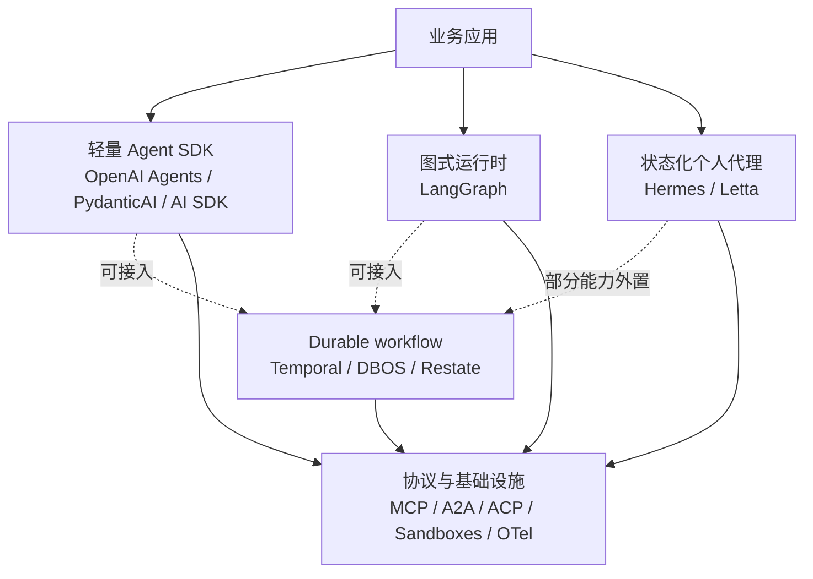
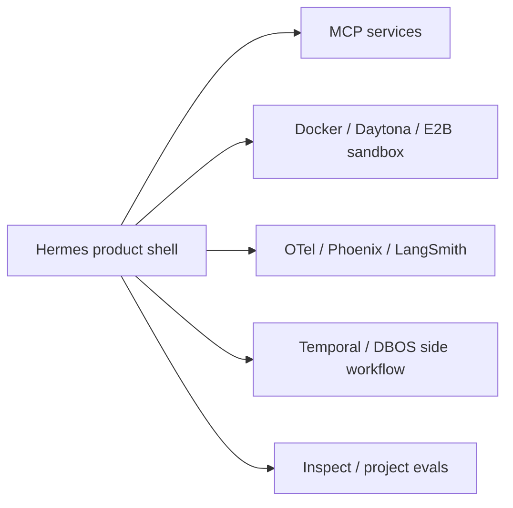

# Agent Harness 业界横向地图（2026-09）

这篇不是第 18 层，而是 17 层的索引。框架经常用同一个“agent”标签覆盖不同问题：有的只包装一次模型调用，有的维护对话状态，有的执行有向图，有的保证任务在进程崩溃后继续。先区分问题，比较才有意义。

## 五类架构家族

| 家族 | 核心抽象 | 天然擅长 | 天然不负责 |
| --- | --- | --- | --- |
| 轻量 SDK | `Agent + Tool + Run` | 快速组合、类型化工具、handoff、应用内集成 | 跨进程工作流历史与完整产品壳 |
| 图式运行时 | node/edge/state/checkpoint | 分支、回放、可中断图、节点级恢复 | 多聊天平台、终端后端等产品集成 |
| 状态化个人代理 | session/transcript/memory/tool surface | 长期关系、多入口、用户态配置、真实工作环境 | 任意 DAG 和 exactly-once workflow |
| Durable workflow | workflow/activity/event history | 宕机续跑、计时器、信号、重试、长任务 | prompt、tool schema、记忆质量本身 |
| 协议/基础设施 | transport/schema/isolation/telemetry | 互操作、隔离和统一观测 | agent 的目标、策略与完成标准 |

## 关键能力矩阵

“强”表示该能力是该方案的一等抽象；“可接”表示通常通过扩展或外部系统获得；“非目标”表示不应期待它单独解决。

| 方案 | Agent loop | 图/回放 | 长期会话/记忆 | Durable execution | 多入口产品壳 | 标准协议 |
| --- | --- | --- | --- | --- | --- | --- |
| Hermes | 强 | 部分 | 强 | transcript 级恢复 | 强 | MCP + ACP |
| OpenAI Agents SDK | 强 | 代码编排 | session 可插拔 | 可接第三方 | 非目标 | MCP |
| LangGraph | 强 | 强 | store + thread | checkpoint 级 | 非目标 | 可接 |
| PydanticAI | 强 | 图能力可组合 | 可插拔 | 强调多后端集成 | 非目标 | MCP |
| Letta | 强 | 非重点 | 强，自管理 memory blocks | 服务状态恢复 | API/SDK | MCP/skills 生态 |
| Temporal / DBOS | 非目标 | workflow | 非目标 | 强 | 非目标 | 应用自接 |
| Vercel AI SDK | 强，偏 TS/流式 UI | 代码编排 | 应用自管 | 可接 workflow | Web UI 强 | provider/API 适配 |

## Hermes 的独特组合

Hermes 的差异不在于某个单点算法，而在于这些约束同时存在：

1. 同一个 `AIAgent` 服务 CLI、消息网关、TUI、Desktop、ACP 与 HTTP。
2. system prompt 被当作长期会话的缓存协议；技能与工具变更必须考虑前缀稳定性。
3. 工具不是纯函数：它们面对真实终端、浏览器、远程后端、审批和消息渠道。
4. session、profile、secret scope、turn lease 与 transcript 一起定义多用户/多进程边界。
5. 能力优先放到 skill、plugin、MCP 或受服务门控的 tool，核心 schema 保持窄。

这使 Hermes 特别适合研究“agent 作为长期运行产品”而不只是“agent 作为库”。反过来，如果你的需求是可视化任意 DAG、严格事件溯源或跨服务 exactly-once，LangGraph 或 durable workflow 应作为更底层/旁路的执行器，而不是强迫 Hermes 核心模拟它们。

## 不要混淆的四组概念

### Transcript 恢复 vs continuation 恢复

- Hermes 主要从持久 transcript、活动标记和 ledger 重建语义。
- LangGraph 从 checkpoint 恢复图状态。
- Temporal/DBOS 从事件历史或步骤结果重放 workflow。

三者都叫“恢复”，但重复副作用、代码版本和恢复粒度完全不同。

### Memory vs context

Memory 是跨 turn 可持久知识；context 是这次请求实际送进模型的有限视图。把向量库搜到的所有内容都塞进 context，不会自动得到好记忆，只会得到昂贵且可能冲突的 prompt。

### Handoff vs delegation

Handoff 通常转移当前对话的控制权；delegation 通常保留父 agent 所有权，等待子任务结果。共享同一消息上下文的 swarm 又是第三种语义。选择前必须写清所有权、上下文和失败传播。

### Tool protocol vs tool policy

MCP 规范“怎么发现和调用”，不替 host 决定“谁能调用、何时审批、能否联网、结果是否可信”。Hermes 的 tool registry、session toolset、secret scope 和 sandbox 位于 MCP 之上的策略层。

## 选型问题清单

在采用或自研 harness 前，逐项写下答案：

1. 一个 run 的真相源是内存对象、数据库 row、图 checkpoint 还是事件历史？
2. 进程在副作用返回前后分别崩溃时，会重放、跳过还是等待人工确认？
3. tool schema、system prompt、memory 在长会话中能否变化；变化怎样影响缓存和旧状态？
4. interrupt 是取消协程、写状态、发 signal，还是只停止 UI 流？
5. 用户、session、agent、workflow 和 channel 的 ID 怎样映射？
6. 权限绑定到进程、用户、session、tool call，还是外部 OAuth token？
7. traces 是否可以回答“哪个模型、哪次尝试、哪项工具副作用导致结果”？
8. eval 是否检查最终文本，还是也检查轨迹、真实环境变化和恢复行为？

## 推荐组合，而非单选

- 个人/团队工作代理：Hermes 负责入口、会话、技能、工具与用户态；高价值跨天流程交给 Temporal/DBOS。
- 图式业务流程：LangGraph 负责明确节点状态；Hermes 可作为交互宿主或外层入口。
- Web 生成式应用：Vercel AI SDK 负责流式 UI；后端需要长期自治时再接专门 runtime。
- 强记忆产品：Letta/Mem0 提供更专注的记忆抽象；接入前先定义 provenance、过期与删除语义。

## 官方扩展阅读

- [OpenAI API quickstart：Agents SDK](https://platform.openai.com/docs/quickstart/make-your-first-api-request)
- [LangGraph persistence](https://docs.langchain.com/oss/python/langgraph/persistence)
- [PydanticAI durable execution](https://pydantic.dev/docs/ai/capabilities/durable_execution/overview/)
- [Temporal durable execution](https://docs.temporal.io/)
- [Letta：stateful agents](https://docs.letta.com/)
- [MCP 2026-07-28 architecture](https://modelcontextprotocol.io/specification/2026-07-28/architecture)
- [A2A specification](https://github.com/a2aproject/A2A/blob/main/docs/specification.md)
- [Agent Client Protocol v2](https://github.com/agentclientprotocol/agent-client-protocol/blob/main/docs/protocol/v2/overview.mdx)
- [Agent Skills specification](https://agentskills.io/specification)
- [OpenTelemetry semantic conventions](https://opentelemetry.io/docs/specs/semconv/)
