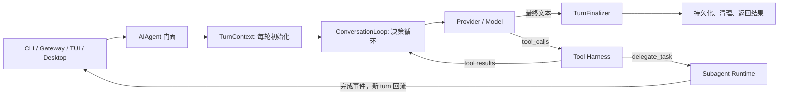
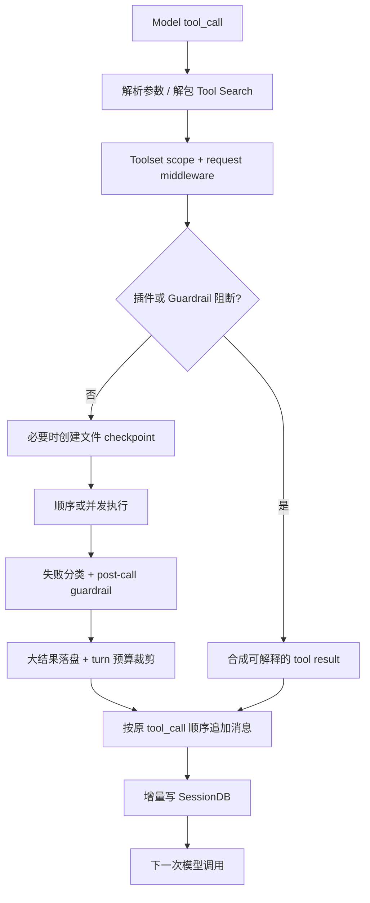
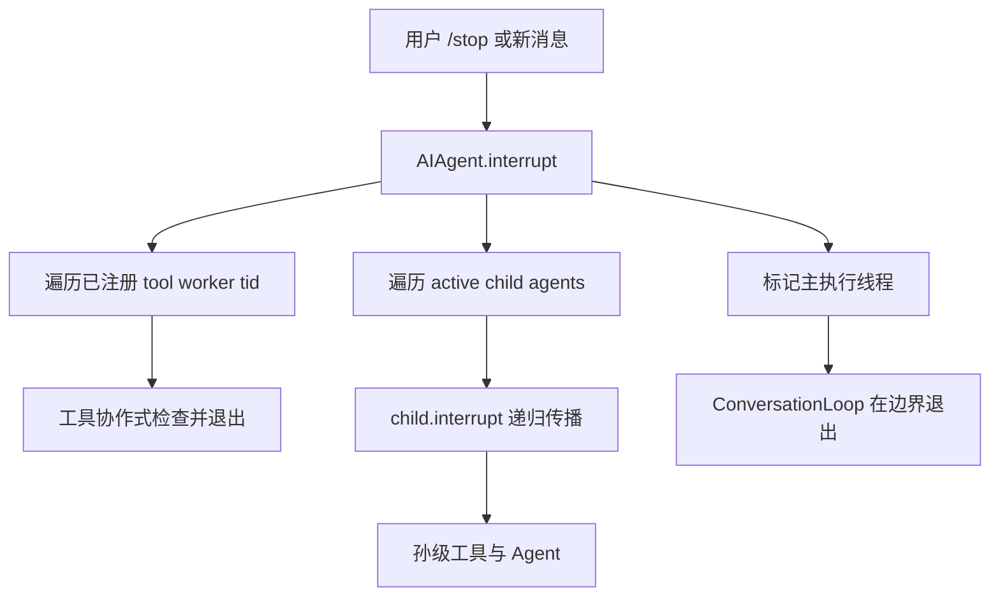
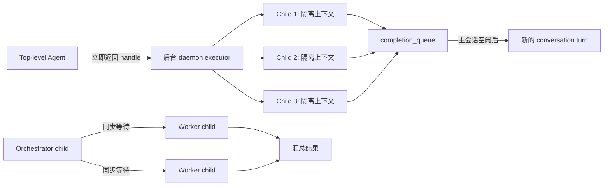

# Hermes Agent Runtime Harness

> 记录时间：2026-07-15
> 相关文件：`run_agent.py`, `agent/turn_context.py`, `agent/conversation_loop.py`, `agent/tool_executor.py`, `agent/tool_dispatch_helpers.py`, `tools/delegate_tool.py`, `tools/async_delegation.py`

---

## 一句话概述

用受控运行时把模型决策变成可恢复、可中断的行动。

---

## 面试官可能会问

1. 一个 Agent 的主循环怎么设计，才能既支持工具调用，又避免无限重试和状态混乱？
2. 多个工具和子 Agent 怎么并发执行，如何保证安全、顺序和可中断？
3. 长会话里怎么同时处理动态上下文、Prompt Cache 和严格消息角色交替？

---

## 背景：为什么需要 Harness？

先给结论：LLM 只负责“下一步想做什么”，Harness 负责“这一步能不能做、怎么做、失败后怎么办”。如果只写一个 `while` 循环，把模型输出直接交给工具，Demo 很快能跑起来，但一到真实环境就会遇到几类问题：

- 模型可能连续失败、空回复、输出坏 JSON，或者在工具调用里原地打转。
- 多个工具并发时可能写同一个文件，完成顺序也可能破坏 API 期待的消息顺序。
- 用户发出停止指令时，主线程、工具 worker、子 Agent 可能都还在工作。
- 子 Agent 如果继承完整父上下文和全部工具，token、权限和副作用会一起放大。
- 动态插件、后台任务和记忆结果如果随意插入历史消息，会破坏角色交替和 Prompt Cache。

**关键约束：**

- 同一套 Agent Core 要服务 CLI、Gateway、TUI、Desktop 等不同入口。
- System Prompt 和历史前缀要尽量稳定，不能在一个进行中的 turn 里随意改写。
- 工具带真实副作用，默认要保守；并发只在能证明相对独立时开启。
- Python 线程不能强制杀死，所以中断必须是协作式的，并覆盖整棵执行树。
- 失败恢复要有边界，不能让“恢复机制”本身变成新循环。

---

## 先建立一个正确心智模型

Hermes 里的 `AIAgent` 更像一个有状态的运行时门面。真正的工作被拆到 turn 构建、对话循环、工具执行、收尾和 delegation 模块中。

```text
入口层 -> AIAgent 门面 -> Turn 上下文 -> 模型/工具循环 -> Turn 收尾
                                   |-> 工具 Harness
                                   |-> 子 Agent 执行树
```



这张图里最重要的不是模块数量，而是职责边界：

| 层 | 核心职责 | 不负责什么 |
|---|---|---|
| `AIAgent` | 保存 session/runtime 状态，提供稳定调用入口 | 不继续承载所有循环实现 |
| `TurnContext` | 做一次性的 turn 初始化和状态重置 | 不处理每次模型重试 |
| `ConversationLoop` | 驱动模型、恢复、压缩和工具往返 | 不直接实现每种工具 |
| `Tool Harness` | 权限、拦截、并发、结果治理、持久化 | 不决定业务目标 |
| `Subagent Runtime` | 隔离上下文、限制能力、并发执行和回流 | 不修改父 Agent 的历史前缀 |
| `TurnFinalizer` | 兜底总结、清理、持久化、诊断 | 不让清理异常吞掉最终回答 |

---

## 核心设计思想

### 1. 模型循环是受控状态机，不是无限 `while`

每个用户 turn 都有明确边界：先重置计数器和 guardrail，再进入有预算的模型循环。每次模型调用内部还有一组 one-shot 恢复标记，例如认证刷新、格式修复、压缩重启；同一种恢复在一次尝试里最多触发一次。

这里用了三层保护：

1. `IterationBudget` 限制模型迭代总数，而且读写都加锁。
2. `TurnRetryState` 限制单次模型调用中的恢复分支，防止认证刷新或格式修复反复触发。
3. `ToolCallGuardrailController` 更早识别重复失败和幂等无进展，不必等总预算耗尽。

预算耗尽也不是直接丢一个空响应。收尾阶段会再发一次不带工具的总结请求，让模型解释已经完成了什么、为什么停下。

### 2. Prompt Cache 是不变量，动态信息走当前 turn

System Prompt 在 session 内只构建一次，并保存到数据库；恢复会话时按原字节读取，不做 trim、拼接或格式化。动态插件上下文、外部记忆预取和用户 steer 不回写 System Prompt，而是进入当前 user/tool message。

这背后的原则是：**稳定信息进入前缀，动态信息进入本轮追加区。** 压缩上下文是少数允许重建 prompt 的边界操作；MCP 工具刷新也放在 turn 序言里完成，不在一次正在运行的模型循环中途换工具快照。

后台子 Agent 的结果同样不硬塞进当前消息列表。它先进入共享完成队列，等主会话空闲后再形成一个新 turn。这样同时守住：

- `user -> assistant -> tool -> assistant` 的合法角色序列；
- 已经发送给模型的历史前缀不被回头修改；
- CLI 和 Gateway 可以复用同一条后台完成事件通道。

### 3. Tool Harness 是一条策略流水线

工具执行不是“名字查 handler 然后调用”。在真正产生副作用前，Hermes 会依次完成参数解析、Tool Search 解包、session scope 校验、middleware、插件拦截、循环 guardrail 和 checkpoint；执行后再做失败分类、结果压缩/落盘、上下文预算治理和增量持久化。



这条流水线有两个很好的工程细节：

- 被 block 的工具不会占 checkpoint、callback 和执行计数，观测数据不会把“未执行”误报成“执行失败”。
- assistant 的 tool-call 消息在工具副作用前先持久化，每个 tool result 也增量落库。即使工具重启或终止 Hermes，恢复时仍能知道哪些调用已经发生。

### 4. 并发按语义开放，不按数量开放

Hermes 不会看到两个 tool call 就直接开线程。`_should_parallelize_tool_batch` 会先判断：

- `clarify` 这类交互工具永远顺序执行；
- 明确只读、没有共享可变状态的工具可以并发；
- `read_file`、`write_file`、`patch` 只有目标路径不重叠时才并发；
- MCP 工具默认顺序，只有 server 显式声明支持并行才放行；
- 参数解析失败或遇到未知工具时，保守回退到顺序执行。

真正执行时最多使用 8 个 worker。线程完成顺序可以不同，但结果先写入固定下标槽位，最后仍按模型原始 `tool_call` 顺序追加到 `messages`，避免并发时序泄漏到对话协议。

### 5. 线程上下文和中断都要显式传播

裸 `ThreadPoolExecutor` 不会自动继承 `ContextVar` 和 thread-local callback。Hermes 在提交任务前复制当前上下文，并把审批、sudo callback 安装到 worker；退出时再清掉，避免线程池复用后把 A 会话的权限上下文带到 B 会话。



worker 一启动就注册自己的 thread id，并在 `finally` 中注销和清除中断位。`clear_interrupt()` 还会主动清理记录过的 worker id，防止线程池复用同一个 id 后，把上一轮停止信号误带到下一轮。

### 6. 子 Agent 是隔离执行单元，不是复制父上下文

每个 child `AIAgent` 都有新的 conversation、task id、session 和迭代预算，只继承必要的 provider、模型配置和父 Agent 已拥有的 toolset。子 Agent 请求的工具还会和父权限取交集，并额外移除 `memory`、`clarify`、`send_message` 等高风险能力。

顶层模型发起 delegation 时，Hermes 强制后台执行并立即返回 handle；如果调用者本身是 orchestrator 子 Agent，则默认同步等待 workers，因为它需要结果才能在自己的 turn 内汇总。这个选择体现了“并发语义由调用层级决定”，不是把 `background` 参数完全交给模型。



后台池有并发上限，容量满时直接拒绝，不把无限任务偷偷排队。fan-out batch 只占一个后台名额，而 batch 内部再由独立的 `max_concurrent_children` 控制并行度；这把“后台工作单元数量”和“单个工作单元内部并行度”拆成两个限流维度。

---

## 核心 trade-off

| 设计问题 | 方案 A | 方案 B | Hermes 的选择 |
|---|---|---|---|
| 主循环组织 | 所有逻辑继续塞进 `AIAgent` | 完全重写成新框架 | 保留稳定门面，逐步抽出 turn、tool、finalizer 模块 |
| 动态上下文 | 每轮重建 System Prompt | 动态信息追加到本轮消息 | 选后者，换取 Prompt Cache 和历史稳定性 |
| 工具并发 | 所有批次都并发 | 所有批次都顺序 | 按只读、路径冲突和 server 能力做语义判定 |
| 并发结果 | 谁先完成谁先写消息 | 等全部完成后按原顺序提交 | 选后者，牺牲一点实时性换协议确定性 |
| 子 Agent 上下文 | 复制完整父历史 | 隔离上下文，只给 goal/context | 选后者，降低 token 和权限扩散 |
| 后台结果回流 | 直接修改运行中的 messages | 完成队列触发新 turn | 选后者，守住角色交替和缓存前缀 |
| 执行载体 | 每个 child 独立进程 | I/O 型工作用线程池 | 选线程降低启动成本，但接受不能强杀的限制 |
| 预算模型 | 父子共享一个硬总额 | 每个 Agent 独立预算 | 当前选独立预算，隔离简单，但总成本可能放大 |

**为什么这套选择合理：**

1. Agent 的瓶颈主要是模型、网络和外部工具 I/O，线程并发能用较低成本隐藏等待时间。
2. 真实工具有副作用，确定性和权限边界比“尽可能并行”更重要。
3. Hermes 同时服务长会话和多入口，稳定前缀、可恢复消息和统一事件回流比单次 Demo 的代码简短更重要。

---

## 工程落地：一个 turn 怎么跑

```text
构建 TurnContext
  -> 恢复稳定 System Prompt / 预压缩 / 动态上下文预取
  -> 有预算地调用模型
  -> 文本则结束；tool_calls 则进入 Tool Harness
  -> 工具结果按协议回填，再调用模型
  -> 中断、guardrail 或预算触发退出
  -> Finalizer 独立完成总结、持久化、清理和诊断
```

**生命周期：**

1. `build_turn_context` 生成 `turn_id`、`task_id`，重置 retry/guardrail，绑定 session 和执行线程。
2. 恢复数据库里的 System Prompt；新 session 才重新构建，并尽早保存用户消息。
3. `run_conversation` 消耗迭代预算，构造 API messages，调用 provider。
4. 模型返回 tool calls 时，先保存 assistant tool-call，再进入安全判定和执行流水线。
5. 工具结果经过预算治理后按原顺序追加，并增量持久化，然后回到模型循环。
6. 正常文本、中断、guardrail、重试耗尽或预算耗尽都会落到明确的 exit reason。
7. `finalize_turn` 分别保护轨迹保存、资源清理和 session 持久化；某一步失败不会吞掉已有回答。

---

## 线程与共享状态清单

| 共享状态 | 保护方式 | 解决的问题 |
|---|---|---|
| `IterationBudget._used` | `threading.Lock` | 并发 consume/refund/read 的一致性 |
| Tool Registry | `threading.RLock` + generation | MCP/plugin 刷新时给读者稳定快照 |
| 工具 worker id 集合 | Lock + worker `finally` 清理 | 中断扇出与线程 id 复用污染 |
| Active child 列表/注册表 | Lock + snapshot 遍历 | 中断、TUI 状态和 child 生命周期竞争 |
| Async delegation records | 同一把 Lock 内做容量检查和插入 | 避免两个 session 同时越过并发上限 |
| Session/审批上下文 | `ContextVar` 复制 + TLS callback 安装 | 防止跨会话权限和路由串线 |
| 并发工具结果 | 预分配 index slots | 完成顺序不改变消息顺序 |

一个很实用的面试表达是：**锁只保护短小的内存状态，耗时 I/O 不放在锁里；跨线程语义靠 ContextVar 快照，中断靠协作式 token/标志传播。**

---

## 优点

- [ ] **控制面完整：** 预算、重试、guardrail、checkpoint、持久化和最终解释形成多层兜底，单个模型异常不容易演变成无限循环。

- [ ] **并发有确定性：** 只并发可证明独立的工作，结果仍按原请求顺序回填，兼顾延迟和协议正确性。

- [ ] **权限边界清楚：** 子 Agent 只能拿到父 Agent 已拥有能力的子集，高风险工具默认剥离；线程中的审批上下文也显式传播并清理。

- [ ] **长会话成本意识强：** System Prompt 按 session 稳定复用，动态信息和后台结果只追加新 turn，不回头改历史。

- [ ] **故障可诊断：** turn 有 exit reason，subagent 有 heartbeat、超时诊断和 tool trace，清理错误也会进入结果而不是让回答消失。

- [ ] **演进方式稳：** `AIAgent` 保留兼容门面，复杂实现逐步下沉到独立模块，旧调用点和测试 patch 契约不必一次性推翻。

---

## 改进点

- [ ] **把工具语义统一成声明式 metadata。** 当前“能否并发、是否幂等、是否写文件、最大结果大小”等规则分散在多处集合里。可以让 registry 中的 `ToolEntry` 统一声明，再由并发、guardrail 和预算模块共同消费。

- [ ] **提供可选的父子总预算。** 独立 budget 简单，但 fan-out 后总 API 调用可能是父预算的数倍。可以保留 child 上限，再增加 session 级 token/cost/iteration 配额。

- [ ] **继续把 ConversationLoop 显式状态化。** 现在模块已经拆出，但循环仍很长。后续可把 provider recovery、compression restart、response normalization 做成明确 transition，减少布尔标记组合。

- [ ] **统一 CancellationToken。** 当前中断同时依赖 Agent flag、thread-id 集合和 child 递归传播。统一 token 能减少线程 id 复用和遗漏检查点的复杂度。

- [ ] **后台结果增加持久化 outbox。** 当前 daemon worker 和内存 completion queue 更适合交互进程；如果要求进程重启后也保证结果回流，需要可恢复队列和幂等消费 id。

---

## 风险点

- [ ] **线程无法强制终止。** 当第三方工具卡在不响应中断的阻塞 I/O 里，Hermes 只能 cancel 未启动 future，并等待运行中的线程自行返回；进程退出时 daemon worker 的结果也可能丢失。

- [ ] **并发规则依赖维护。** 新工具如果被错误标成 parallel-safe，或者路径参数不是统一的 `path`，就可能绕过冲突判断；反过来没登记会损失并发收益。

- [ ] **父子成本会乘法增长。** 当提高 `max_concurrent_children`、`max_spawn_depth` 和 child iterations 时，独立预算会让总 token 与 API 请求快速放大。

- [ ] **模块级注册表是进程级状态。** 多 gateway session 共用 async delegation 和 tool registry；容量和锁是全局的，隔离单位不是单个用户。

- [ ] **兼容门面仍有状态耦合。** 抽模块后函数依然通过 `agent.*` 访问大量字段；如果字段生命周期没有写清楚，未来重构可能出现隐式前置条件。

- [ ] **缓存正确性依赖纪律。** 如果插件或新功能绕过 turn 序言，直接修改历史 System Prompt、tool schema 或角色序列，性能回退和 provider 协议错误会同时出现。

---

## 哪些细节面试时不用展开

- 不用背所有 provider 的认证和错误分支，讲清 `TurnRetryState` 的 one-shot 恢复思想即可。
- 不用列出全部 parallel-safe 工具，举“只读工具”和“不同路径的文件工具”两个例子就够。
- 不用解释每个 UI callback，重点说事件向上汇报，但核心执行不依赖某个界面。
- 不用逐个讲 toolset；强调 child 能力是父能力的子集，并有额外 deny list。
- 不用背每个配置默认值，记住工具 worker 上限、child 并发/深度有界、预算分层即可。

---

## 面试回答框架（3-5 分钟）

**开场：** “我会讲 Hermes 的 Agent Runtime Harness。LLM 负责决定下一步，Harness 负责把决定变成受控、可恢复、可中断的行动。”

**主循环：** “每个 turn 先构建隔离上下文，再进入带 IterationBudget 的模型循环；单次恢复用 one-shot 状态约束，工具重复用 guardrail 提前发现。”

**工具链：** “工具调用先过 scope、middleware、plugin block、guardrail 和 checkpoint，执行后再做失败分类、结果预算和增量持久化。”

**并发：** “不是全部并发，只放行只读、路径不冲突或显式声明安全的工具；worker 可乱序完成，但结果按原 tool-call 顺序回填。”

**线程：** “ContextVar 和审批 callback 显式复制到 worker；中断从主 Agent 扇出到 tool workers 和 child agents，并清理 stale thread id。”

**子 Agent：** “child 用独立上下文、受限工具和独立预算；顶层后台执行，结果通过完成队列形成新 turn，避免破坏角色交替和 Prompt Cache。”

**反思：** “当前最大改进空间是统一工具 metadata、增加父子总成本预算，以及把长循环进一步变成显式状态机。”

---

## 源码阅读路线

按这个顺序读，比从 `run_agent.py` 第一行一路翻到最后更容易建立全局图：

| 顺序 | 阅读目标 | 文件 |
|---|---|---|
| 1 | 先理解两条架构不变量：Prompt Cache、Narrow Waist | `AGENTS.md` |
| 2 | 看稳定门面和 interrupt / delegate / tool forwarder | `run_agent.py` |
| 3 | 看一个 turn 怎样初始化、恢复 prompt、绑定线程 | `agent/turn_context.py` |
| 4 | 看主循环、预算、工具往返和退出原因 | `agent/conversation_loop.py`, `agent/turn_retry_state.py` |
| 5 | 看工具注册、筛选与 schema/handler 分离 | `tools/registry.py`, `model_tools.py` |
| 6 | 看并发判定、执行流水线和结果顺序 | `agent/tool_dispatch_helpers.py`, `agent/tool_executor.py` |
| 7 | 看线程上下文和中断传播 | `tools/thread_context.py`, `tools/interrupt.py` |
| 8 | 看 child 隔离、后台回流与容量控制 | `tools/delegate_tool.py`, `tools/async_delegation.py` |
| 9 | 最后用测试确认边界，而不是只信注释 | `tests/run_agent/`, `tests/tools/`, `tests/agent/` |

---

## 证据索引

> 这里只做源码复习定位，不放代码或代码片段。建议先看这 6 处，再按上面的阅读路线扩展。

- `agent/conversation_loop.py` — `run_conversation` / `_restore_or_build_system_prompt`：主循环和稳定前缀的核心入口。
- `agent/turn_context.py` — `build_turn_context`：每轮状态重置、上下文预取、prompt 恢复和线程绑定。
- `agent/tool_dispatch_helpers.py` — `_should_parallelize_tool_batch`：只读、路径冲突和 MCP 并发能力的判定中心。
- `agent/tool_executor.py` — `execute_tool_calls_concurrent` / `execute_tool_calls_sequential`：工具策略流水线、线程池和结果回填。
- `run_agent.py` — `AIAgent.interrupt` / `_dispatch_delegate_task`：中断树和顶层/子层 delegation 语义。
- `tools/delegate_tool.py` / `tools/async_delegation.py` — `_build_child_agent` / `_run_single_child` / `dispatch_async_delegation`：child 隔离、容量限制与完成事件回流。

---

## 延伸阅读

- [ToolCallGuardrailController](./tool-call-guardrail-controller.md)
- `tests/run_agent/test_run_agent.py` — 并发工具顺序、路径冲突和 MCP 并发声明。
- `tests/run_agent/test_concurrent_interrupt.py` — worker 中断扇出和 stale thread id 清理。
- `tests/run_agent/test_tool_executor_contextvar_propagation.py` — session/审批上下文跨线程隔离。
- `tests/agent/test_system_prompt_restore.py` — System Prompt 字节级稳定性。
- `tests/tools/test_async_delegation.py` — 后台容量、完成事件和 interrupt 生命周期。

