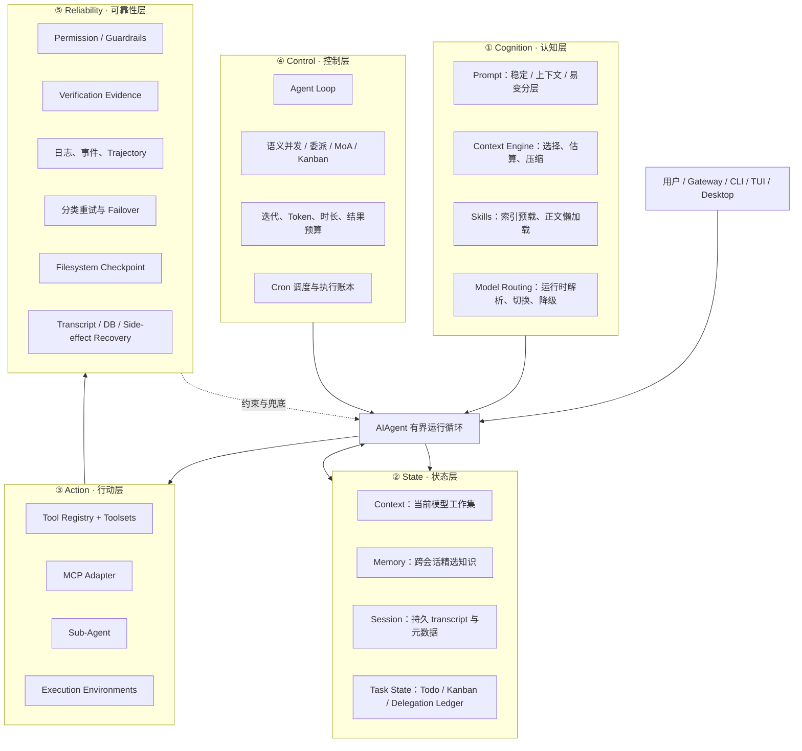
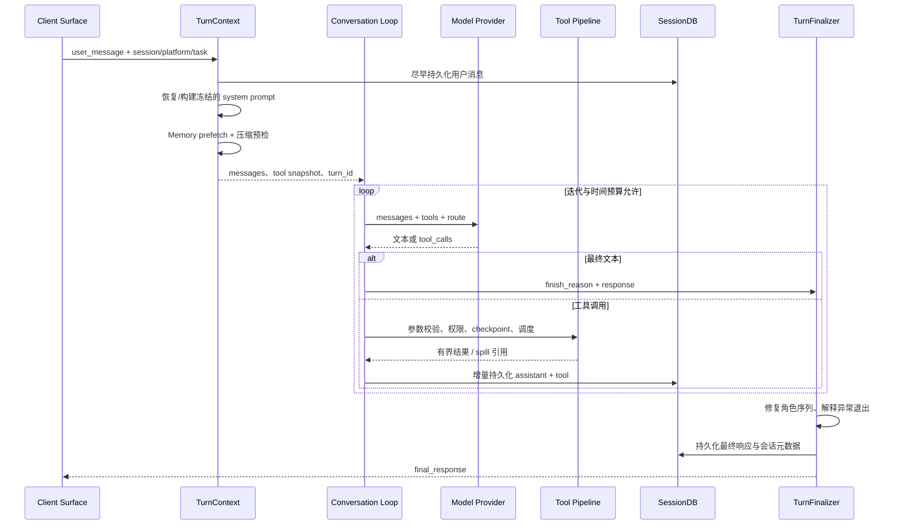

# Hermes Agent 五层 Harness 架构

> 记录时间：2026-09-03  
> 代码基线：`e0756a2ea0b5`，并结合当前工作区源码阅读  
> 目标：解释 Hermes 如何把模型包装成一个可长期运行、可扩展、可恢复的 Agent，并提炼可迁移的设计方法。

## 一句话总结

Hermes 的 Harness 不是一个巨型 `AgentHarness` 类，而是围绕同一个 `AIAgent` 运行时建立的一组协议：认知层决定模型看到什么，状态层保存事实与工作进度，行动层把意图变成受控副作用，控制层推进有界状态机，可靠性层确保失败可观察、可停止、可恢复。

它最值得复用的不是某个具体模块，而是三个贯穿全局的不变量：

1. **会话提示词前缀稳定**：长会话中不随意重建 system prompt 或更换工具集合，保护 Prompt Cache。
2. **核心窄腰、能力外置**：尽量通过已有工具、CLI + Skill、服务门控、Plugin 或 MCP 扩展，而不是持续增加核心工具 schema。
3. **事实、工作集与副作用分离**：持久 transcript 是事实来源，模型 context 是可压缩工作集；副作用失败时宁可标记 `unknown`，也不盲目重放。

## 面试官可能怎么问

- 一个 Agent 从收到用户消息到完成工具调用，完整生命周期是什么？
- Prompt、Context、Memory、Session 为什么不能混成一个概念？
- 如何让工具、MCP、子 Agent 都进入同一套治理链路？
- 长会话如何同时控制 token、延迟、工具循环和子任务成本？
- 进程崩溃、网络失败、上下文压缩失败、工具产生副作用时分别如何恢复？
- 哪些设计可以直接复用，哪些只适合单机个人 Agent？

## 1. 五层全景图



### 能力与实现映射

| 层 | Harness 能力 | Hermes 中的主要实现 | 成熟度/边界 |
|---|---|---|---|
| 认知 | Prompt | `agent/system_prompt.py`、`agent/prompt_builder.py`、`agent/prompt_cache_boundary.py` | 核心路径；按会话冻结 |
| 认知 | Context Engine | `agent/context_engine.py`、`agent/context_compressor.py`、`agent/conversation_compression.py` | 可插拔，但一个会话只启用一个引擎 |
| 认知 | Skills | `agent/skill_commands.py`、`agent/skill_preprocessing.py`、`tools/skills_tool.py` | 索引常驻、正文懒加载 |
| 认知 | Model Routing | `hermes_cli/runtime_provider.py`、`providers/`、`hermes_cli/fallback_config.py`、`agent/moa_loop.py` | 确定性解析与降级；不是通用意图路由器 |
| 状态 | Context | OpenAI 格式 `messages`、Context Engine | 易失、可压缩的模型工作集 |
| 状态 | Memory | `agent/memory_provider.py`、`agent/memory_manager.py` | 跨会话知识；外部 Provider 单选 |
| 状态 | Session | `hermes_state.py`、`agent/transcript_repair.py` | SQLite/WAL/FTS5 持久事实源 |
| 状态 | Task State | `tools/todo_tool.py`、`hermes_cli/kanban.py`、`tools/async_delegation.py` | Todo 轻量；Kanban/异步委派账本持久化 |
| 行动 | Tool | `tools/registry.py`、`toolsets.py`、`model_tools.py`、`agent/tool_executor.py` | 统一注册、暴露、策略、执行流水线 |
| 行动 | MCP | `tools/mcp_tool.py` | MCP 工具适配到同一个 Registry |
| 行动 | Sub-Agent | `tools/delegate_tool.py`、`tools/async_delegation.py` | 隔离子会话；受深度、能力和预算约束 |
| 行动 | Execution | `tools/environments/`、`agent/tool_dispatch_helpers.py` | 本地/远端环境；按语义而非数量并发 |
| 控制 | Agent Loop | `agent/conversation_loop.py`、`agent/turn_context.py`、`agent/turn_finalizer.py` | 有界、可中断的同步状态机 |
| 控制 | Orchestration | 工具批处理、Delegate、MoA、Kanban | 多种编排粒度共存，不强塞进一个抽象 |
| 控制 | Budget | `agent/iteration_budget.py`、Context Engine、结果裁剪与 spill | 多维预算；目前并非统一成本账本 |
| 控制 | Scheduling | `cron/jobs.py`、`cron/scheduler.py`、`cron/executions.py` | 持久声明、claim、heartbeat、执行账本 |
| 可靠性 | Permission | `tools/approval.py`、`agent/file_safety.py`、`tools/path_security.py` | 能力裁剪 + 硬规则 + 用户审批 |
| 可靠性 | Verification | `agent/verification_evidence.py`、`agent/verification_stop.py`、`agent/verify/` | 记录证据；可选且有界地提醒，不伪造验证 |
| 可靠性 | Trace | `hermes_logging.py`、`agent/monitoring/`、`agent/trajectory.py` | 本地诊断充分；不是完整分布式追踪平台 |
| 可靠性 | Retry | `agent/turn_retry_state.py`、`agent/retry_utils.py`、Conversation Loop | 分类、退避、一次性恢复开关 |
| 可靠性 | Checkpoint | `tools/checkpoint_manager.py` | 文件副作用的可选 Git 快照与安全恢复 |
| 可靠性 | Recovery | SessionDB、压缩事务、异步委派/cron 账本、Finalizer | 多平面恢复；副作用不承诺 exactly-once |

## 2. 一次请求如何穿过五层

下面这条链路比逐文件阅读更接近真实运行时：



几个容易忽略但很关键的顺序：

- 用户消息在首次模型调用前就写入 SessionDB，进程即使中途死亡，恢复时仍知道这一轮发生过。
- system prompt 要么恢复原字节，要么在合法边界构建；不能因为 memory、skill 或时间变化而每轮偷偷变化。
- tool result 不是等最终答案一起保存，而是增量落盘，因此能修复中断在工具调用中间的 transcript。
- steer/interrupt 不通过在半轮中插入第二条 user message 实现；否则会破坏角色交替和 Provider 协议。
- Finalizer 是独立可靠性边界：保存 trajectory、清理资源、修复 transcript、持久化响应互不连坐。

## 3. ① Cognition：模型如何形成“当下认知”

### 3.1 Prompt：把稳定性当成数据模型，而不是优化开关

`build_system_prompt_parts()` 将提示内容按变化性质分成三层：

| 分层 | 典型内容 | 生命周期 |
|---|---|---|
| Stable | 身份、核心行为规范、工具使用指导 | 跨轮保持稳定，形成缓存前缀 |
| Context | 工作区规则、`AGENTS.md`/`CLAUDE.md`、调用方 system message | 会话建立时装配 |
| Volatile | Skill 清单、Memory/User Profile、时间等 | 名称表示“下次重建时可能变化”，不是每个 API 调用都变化 |

真正的设计点是：三层在一次会话内最终组成一个**冻结快照**。`_restore_or_build_system_prompt()` 优先恢复 SessionDB 中内容寻址保存的原始 prompt；`_ensure_cached_system_prompt_static()` 防止后续逻辑无意改变它；只有上下文压缩等显式边界才调用 `invalidate_system_prompt()` 重新构建。

这解决了两个冲突目标：

- Agent 需要吸收最新 Skill、Memory 和工作区规则；
- Provider 的 Prompt Cache 需要前缀字节级稳定。

Hermes 的选择是**边界一致性**，而不是实时一致性：新配置通常在新会话或压缩提交边界生效。代价是当前会话不能立即看到所有变化，但收益是成本、延迟和行为稳定性可预测。

可复用原则：给 prompt 每一部分声明 `scope = process | session | turn`；只有 `turn` 数据进入普通消息，禁止混入 session-stable system prefix。

### 3.2 Context Engine：把 transcript 和模型工作集拆开

`ContextEngine` 是端口，`ContextCompressor` 是默认实现。引擎生命周期包括：

1. `on_session_start` 初始化会话级状态；
2. `select_context` 为单次请求选择消息；
3. `update_from_response` 吸收真实用量；
4. `should_compress` 判断是否越过阈值；
5. `compress` 生成新的模型工作集；
6. `on_turn_complete` / `on_session_end` 收尾。

默认压缩器不是简单“把前半段总结一下”。它组合了：

- 路由感知的 token 估算与 preflight；
- 先确定性裁剪旧 tool result，再调用模型总结；
- 保护最近消息、当前用户轮和未完成工具链；
- 冷却、反抖和 micro-compaction，避免频繁压缩；
- 压缩租约与 commit fence，防止两个执行者同时提交；
- 压缩后重新注入活跃 Todo 与 Skill 调用标记。

`conversation_compression.py` 负责“事务”，压缩器负责“算法”。如果总结失败、Memory checkpoint 不成功或提交条件已变化，旧 transcript 仍然是事实源，不能用半成品覆盖。

可复用原则：Context Engine 的输出必须继续满足 Provider 的消息协议；压缩是一次带前置条件的状态迁移，不是字符串替换。

### 3.3 Skills：发现、展示和加载分成三件事

Hermes 没有把所有 Skill 正文塞进 system prompt，而是分三步：

1. `scan_skill_commands()` 扫描项目、用户及外部 Skill 目录，处理平台、环境、禁用项和命名冲突；
2. Prompt 中只放 Skill 名称、描述和定位形成 manifest；
3. 模型确定需要某项能力后，再通过 Skill 工具读取完整正文。

Slash Skill 又是另一条入口：`build_skill_invocation_message()` 把调用展开成**用户消息**，而不是修改 system prompt。这样既符合“用户触发工作流”的语义，也不会让 Prompt Cache 因每次 `/skill` 调用失效。

扫描结果带 platform/home 标签并在锁下整体发布，避免同一进程服务多个会话时把一个 Profile 的 Skill 泄漏到另一个 Profile。

可复用原则：Skill 系统至少要分离 `catalog`、`loader`、`invocation`。目录变化不应该等价于在活跃会话中热改 system prompt。

### 3.4 Model Routing：路由的是完整运行时身份

Hermes 当前核心并没有一个根据用户意图自动挑“最聪明模型”的通用分类器。它实现的是更可控的四种机制：

- `resolve_runtime_provider()` 根据配置、凭证和 Provider Profile 确定主路由；
- 显式 `/model` 或配置切换运行时；
- `get_fallback_chain()` 产生去重、有顺序的故障转移链；
- `moa_loop.py` 在特定模式下并行请求参考模型，再由聚合模型汇总。

一次 route 不只是 `model` 字符串，而是一个一致性单元：

```text
RouteIdentity = provider + base_url + api_mode + model + credentials + capabilities
```

切换时还要同步更新 prompt cache 策略、上下文窗口/压缩器、reasoning 配置、计费路由和 fallback 状态。如果只改 model 名称，最常见的后果不是立即报错，而是能力判断、token 预算或缓存策略悄悄错位。

可复用原则：把 Route 做成不可分割的值对象；切换采用 snapshot → validate → commit，失败恢复旧快照。

## 4. ② State：四种状态为什么必须分开

### 4.1 Context：给模型的临时工作集

Context 是当前 API 调用使用的 `messages`。它必须满足 system/user/assistant/tool 的协议、工具调用关联和严格角色序列，但允许被选择、裁剪和压缩。

它不是历史事实源。把 Context 当数据库会导致压缩时丢历史；把数据库全文当 Context 又会让 token 成本无限增长。

### 4.2 Memory：跨会话的精选知识

`MemoryProvider` 定义外部记忆端口，`MemoryManager` 负责生命周期、提示块、prefetch、写入队列、工具暴露和关闭排空。设计上一个会话最多启用一个外部 Provider，避免多套 schema 同时占用工具面、写入冲突和召回结果互相污染。

Memory 与 Session 的差异是：

| 维度 | Session | Memory |
|---|---|---|
| 内容 | 发生过的消息与元数据 | 提炼后值得跨会话保留的知识 |
| 完整性 | 尽量保真 | 有选择、有损 |
| 主要读法 | resume、search、repair | prompt 注入、prefetch、memory tool |
| 写入顺序 | 对话主链路增量写 | 单 worker FIFO，保持轮次与边界顺序 |

Prefetch 会跳过过短或无意义请求，既省延迟，也减少不相关旧记忆把当前任务带偏。Memory 注入还会做长度限制、清洗与敏感内容处理。

压缩前可要求 Memory Provider 做 checkpoint；checkpoint 失败时压缩可以 fail closed，因为丢失未经保存的重要信息比多保留一段上下文更糟。

### 4.3 Session：可修复的持久事实源

`SessionDB` 使用 SQLite、WAL 和 FTS5 保存 session、message、system prompt、压缩谱系和检索索引。选择 SQLite 很贴合“本地个人 Agent”的负载：部署零依赖、事务清楚、可全文检索；同时也明确接受单写者和非分布式协调的边界。

关键工程措施包括：

- system prompt 内容寻址保存，session 只引用 hash；
- 用户、assistant、tool 消息增量追加；
- WAL、多读连接与带抖动的写重试；
- transcript 写入与普通 heartbeat 使用不同耐心值；
- FTS 损坏可降级，主 transcript 不因索引失败不可用；
- 压缩 lease、父子 session 谱系、软归档与恢复；
- malformed/zeroed DB 检测、修复锁、备份和恢复账本。

`transcript_repair.py` 专门处理崩溃留下的空 assistant 行、不完整 tool 尾部和并发恢复中的 canonical winner。它说明 Session 恢复不是“重新请求模型”，而是先把事实序列修复到协议合法。

### 4.4 Task State：从便签到工作流账本

Hermes 有三档任务状态，不应该混为一种：

- **Todo Store**：每个 AIAgent 内存中的有序、带 revision 列表；适合当前任务规划。resume 时可从 transcript 重新水合，压缩后只注入活跃节点及其父节点。
- **Kanban**：SQLite 持久化的多 Agent 工作板；有依赖提升、原子 claim、heartbeat、review/block 和 failure limit，适合跨 worker 编排。
- **Async Delegation Ledger**：记录异步子 Agent 的 dispatch、completion、delivery。执行线程本身不能跨进程续跑，但父进程重启后可以恢复“结果是否待交付”的事实。

这里最重要的诚实边界是：异步子 Agent 的**计算**仍是进程内 daemon executor；持久化的是生命周期与交付状态。崩溃后一个正在运行的任务被标记为 `unknown`，不会自动重跑，因为它可能已经产生外部副作用。

可复用原则：先问任务状态要回答什么问题——“我现在要做什么”“谁拥有这项工作”“副作用是否可能已发生”——再决定用内存列表、工作流数据库还是执行账本。

## 5. ③ Action：把模型意图变成受控副作用

### 5.1 Tool：注册、暴露、策略、执行四段分离

Hermes 的 Tool 链不是 `name -> function` 这么简单：


`tools/registry.py` 的 `ToolEntry` 保存 schema、handler、toolset、动态可用性、异步标记和结果上限。内置工具通过 AST 只扫描顶层 `registry.register()` 后再导入，减少无关模块的副作用；插件注册使用 Profile overlay 和显式 override 权限。

`toolsets.py` 解决“谁应该看见工具”。核心工具非常克制，桌面 UI、Project 或特定服务能力进入命名 toolset，由会话来源启用。表面能力不能用进程环境变量判断，因为同一个后端进程可以同时服务 CLI 和 GUI 会话。

`agent/tool_executor.py` 解决“允许怎样调用”：

1. 参数和 scope 校验；
2. middleware、plugin hook 与 guardrail；
3. 权限检查和必要审批；
4. 文件变更前 checkpoint；
5. 执行、错误分类、结果预算与 spill；
6. 生成安全的 tool message 并持久化。

Web、Browser、MCP 等外部结果会被标记为不可信内容，并中和伪造的边界标记，防止工具返回值伪装成 system 指令。

### 5.2 MCP：协议适配器，而不是第二套工具系统

`tools/mcp_tool.py` 把 stdio、Streamable HTTP 或 SSE MCP Server 发现出的工具转换成 Registry 条目，统一命名为碰撞安全的 `mcp_<server>_<tool>`。因此 MCP 工具自动继承 Hermes 的 toolset、权限、结果处理、transcript 和调度规则。

管理器还处理：

- 安全环境变量白名单与配置插值；
- OAuth、超时、工具过滤和 schema 归一化；
- `list_changed` 通知及动态刷新；
- reconnect、指数退避、抖动、熔断与自探测；
- schema cache 加速启动；
- Server 声明的并行安全能力。

动态工具刷新发生在 turn boundary，并通过 registry generation 更新 Agent 的 definition snapshot；不能在某次模型调用中途改 schema，否则“模型看到的定义”和“执行器能处理的实现”会不一致。

### 5.3 Sub-Agent：隔离上下文，不等于无限复制能力

`delegate_tool.py` 为子任务创建新的 `AIAgent`、session、task id 和执行环境。子 Agent 继承父路由，但工具能力取父 toolset 的受限交集；默认叶子节点不能继续委派、发消息、改 cron 或直接使用父 Memory，只有 orchestrator 模式在深度上限内继续分解。

这形成几个隔离面：

- **认知隔离**：子任务拥有独立 context，不污染父对话；
- **能力隔离**：不是父工具全集复制；
- **预算隔离**：每个子 Agent 有自己的迭代预算和超时；
- **结果隔离**：返回有界摘要，过长内容 spill；
- **生命周期隔离**：心跳、取消和 stall detection 独立。

异步完成结果不会硬插入当前 assistant/tool 序列，而是在父 Agent 空闲时作为一个新 turn 交付。这同时保护消息角色交替和 Prompt Cache。

### 5.4 Execution：并发由副作用语义决定

`tools/environments/` 抽象 local、Docker、SSH、Modal、Daytona、Singularity 等终端后端；`task_id` 用于复用或隔离执行上下文。

模型一次返回多个 tool calls 时，Hermes 不采用简单的 `gather(all)`：

- 只读操作通常可并行；
- 文件操作先归一化路径，有重叠则串行；
- 写操作、交互式操作和声明为 barrier 的工具串行；
- MCP 只有 Server 声明 parallel-safe 才并行；
- 分段执行保持最终 tool result 与原调用顺序一致。

可复用原则：并发分类器应依据资源集合和副作用，而不是工具名称白名单；至少建模 `read_set`、`write_set`、`barrier` 和 `idempotency`。

## 6. ④ Control：谁推进、限制和调度工作

### 6.1 Agent Loop：一个显式退出原因的有界状态机

`run_conversation()` 虽然外观是 `while`，语义上是：

```text
Turn Prologue
  -> Model Request
  -> Normalize Response
  -> Final Answer ? Finalize
  -> Tool Plan
  -> Guard / Execute / Persist
  -> Budget & Interrupt Check
  -> Next Iteration
```

循环同时受 `max_iterations`、线程安全的 iteration budget、运行时长、interrupt 和有限 grace call 约束。每个 API attempt 都创建新的 `TurnRetryState`，确保 auth refresh、payload repair、failover 等恢复分支最多触发一次，不演变成隐蔽死循环。

Python 线程无法安全强杀，所以 interrupt 采用协作式传播：主循环设置标志，工具 worker、子 Agent 和流式读取在安全点检查并退出。Finalizer 再把中断原因转成用户可理解的完成状态。

### 6.2 Orchestration：不同粒度用不同机制

| 粒度 | 机制 | 适用场景 |
|---|---|---|
| 单轮多个调用 | 语义工具批处理 | 无依赖的只读查询、互不冲突的文件操作 |
| 单个复杂子问题 | Delegate | 独立上下文完成研究、编码或诊断 |
| 多模型观点 | MoA | 并行参考模型 + 聚合模型 |
| 跨 worker 工作流 | Kanban | 有依赖、claim、review、heartbeat 的长期任务 |
| 定时/后台触发 | Cron | 时间驱动、持久声明的任务 |

Hermes 没有强行让这些机制继承一个万能 Orchestrator。共同部分沉到 session、tool registry、budget、permission 和 ledger，编排语义留在各自模块。这是“窄腰”的另一种体现。

### 6.3 Budget：预算是向量，不是一个计数器

Hermes 实际控制的资源至少包括：

- **迭代预算**：限制模型—工具往返次数；
- **上下文预算**：token 估算、preflight、压缩阈值；
- **运行时长预算**：主任务、子 Agent、工具的 wall-clock 限制；
- **结果预算**：tool result、子 Agent 摘要的裁剪与 spill；
- **重试预算**：每类恢复分支的次数与退避；
- **调度预算**：并发 worker、cron catch-up 和 failure limit。

当前父子 Agent 的 iteration budget 相互独立，隔离简单，但 fan-out 时总成本可能倍增。这是可改进点：若用于团队级或云端系统，应增加 session/job 级共享成本账本，同时保留每个子任务的局部上限。

### 6.4 Scheduling：调度声明与执行事实分开

Cron job 声明持久化在 Profile 范围的 `cron/jobs.json`，包含 schedule、prompt/script、模型、技能、工作目录、toolset 和投递设置；执行事实进入独立 ledger。

Scheduler 的关键顺序是：

1. 获取进程级调度锁并检查 emergency pause；
2. 找到到期任务；
3. **先推进 `next_run`**，避免同一时间点反复派发；
4. 原子建立 fire claim，记录 owner、开始时间和 heartbeat；
5. 写入 execution ledger，再交给 worker；
6. 保存结果后再投递通知。

工作目录任务会串行，因为它涉及进程级环境变化；其他独立任务可以并行。Owner 死亡留下的 claim 被恢复为 `unknown`，而不是自动重跑。

因此这里追求的是“尽量 at-most-once 派发 + 明确 unknown”，不是虚假的 exactly-once。对于可能产生付款、发消息、部署等副作用的任务，这是更安全的默认值。

## 7. ⑤ Reliability：失败时系统如何保持诚实

### 7.1 Permission：先裁能力，再判调用，最后审批

权限不是一个布尔开关，而是三层防线：

1. **Capability surface**：toolset/profile/session 决定模型根本看不看得到某项能力；
2. **Hard policy**：危险命令、路径穿越、禁止读写区域等不可由模型绕过；
3. **User approval**：对合法但高风险的具体动作按 session、永久规则或交互审批。

`tools/approval.py` 统一命令 guard、用户 deny rule、危险操作识别、审批 transport 和无人值守策略。`agent/file_safety.py`、`tools/path_security.py` 负责安全根、跨 Profile 访问、路径 containment 和敏感位置。

设计原则是：审批不能补救一个过宽的 capability surface；应该先让无关会话看不到工具，再对剩余动作做细粒度判断。

### 7.2 Verification：记录真实证据，不让模型自我认证

`verification_evidence.py` 使用独立 SQLite ledger 记录真实执行过的终端检查、`hermes verify` 结果和文件变更。它是**被动证据系统**：不会因为模型说“测试通过”就写入成功，也不会把一个定向测试推断成全仓库通过。

`verification_stop.py` 是可选策略：发现代码已改但没有新鲜通过证据时，最多给模型一个有界提醒；它不替模型运行测试，也不会无限阻止结束。docs-only 改动被排除，默认策略可关闭或按 surface 自动选择。

这个选择比“完成前强制跑所有测试”更适合异构项目：可靠性来自证据精度，而不是昂贵且经常不相关的全量门禁。

### 7.3 Trace：足够定位问题，但有意不收集内容遥测

Hermes 使用 `turn_id`、`task_id`、request id 串联日志、工具事件和会话记录；可选 trajectory 保存成功/失败轨迹。Monitoring emitter 采用非阻塞有界队列、丢弃最旧事件和 sink 隔离，监控失败不能拖垮 Agent 主循环。

监控事件有意保持 content-free：不发送 prompt、tool args/result 或未授权的使用归因。日志则保存在 Profile 范围目录，通过 `hermes logs` 查询。

边界也要讲清楚：这是一套面向本地 Agent 的诊断骨架，不等同于具备跨服务 span、全链路采样和集中检索的完整分布式 Trace 平台。

### 7.4 Retry：先分类，再退避；恢复动作只能触发一次

`retry_utils.py` 提供带 jitter 的退避和 `Retry-After` 解析；Conversation Loop 根据错误类型决定普通重试、凭证刷新、Provider failover、payload 修复、上下文压缩或图片缩减。

`TurnRetryState` 为每次模型调用记录一次性恢复标记，防止以下循环：

```text
认证失败 -> 刷新凭证 -> 仍失败 -> 再刷新 -> 永不退出
上下文过长 -> 压缩 -> 仍过长 -> 重复压缩同一状态
Provider 失败 -> 切换 -> 恢复旧路由 -> 再切换
```

工具层另有 no-progress、重复失败和循环 guardrail。API retry 与 tool-loop guard 分开，是因为前者处理传输/Provider 暂态，后者处理 Agent 决策失控。

### 7.5 Checkpoint：自动回滚也不能覆盖用户后续编辑

`CheckpointManager` 在文件变更前创建隐藏 bare Git 快照，并限制根目录、快照数、总大小和单文件大小。恢复时不是无条件 checkout：agent-write ledger 记录 Hermes 最后写入的 hash，`restore(..., safe=True)` 先通过 `safe_restore_plan()` 选出仍与该 hash 一致的文件；若用户随后编辑过，就跳过并报告冲突。

恢复前还会再做一个 checkpoint，形成“撤销撤销”的可能。超限或无法证明来源的文件宁可保留，不以清理为名删除用户数据。

这是一种很值得复用的副作用协议：

```text
prepare checkpoint -> execute mutation -> record ownership/evidence -> conditional compensate
```

### 7.6 Recovery：恢复被拆成四个平面

| 平面 | 典型故障 | Hermes 的恢复策略 |
|---|---|---|
| 模型/API | 限流、认证、Provider 故障、坏 payload | 分类重试、退避、一次性修复、fallback route |
| Context/Transcript | 中断在 tool chain、压缩失败、角色序列损坏 | 增量持久化、repair、lease/commit fence、旧 transcript 保底 |
| 本地存储 | WAL/FTS/DB 损坏、并发 writer | 重试、索引降级、修复锁、备份与恢复账本 |
| 外部副作用 | 子 Agent/cron 崩溃时状态不明、文件误改 | `unknown` 而非盲重放、fire/delivery ledger、safe restore |

这里有一个通用原则：**只有已知幂等的操作才适合自动 retry；可能已生效的操作要恢复“认知状态”，而不是重复“执行动作”。**

## 8. 跨层设计决策与 Trade-off

| 决策 | 得到什么 | 付出什么 | 适用边界 |
|---|---|---|---|
| 会话内冻结 prompt/tool snapshot | Cache 命中、行为稳定 | 配置与 Skill 更新延迟生效 | 长会话、高重复前缀成本 |
| SQLite + WAL | 零运维、事务、FTS | 单写者、跨主机协调弱 | 单机/个人 Agent |
| 一个外部 Memory Provider | schema 小、语义一致 | 不能原生融合多个记忆后端 | 核心窄腰优先 |
| MCP 适配到 Registry | 统一权限和执行语义 | 动态 schema 刷新更复杂 | 多协议工具生态 |
| 协作式线程取消 | 实现简单、共享上下文方便 | 无法强制终止阻塞调用 | 可信本地工具；外部命令需进程级 timeout |
| 父子预算独立 | 隔离与实现简单 | fan-out 总成本难全局约束 | 个人任务；云端需共享账本 |
| 副作用失败标记 unknown | 避免重复付款/发送/部署 | 需要人工或幂等键对账 | 非幂等动作 |
| Verification 证据 + 有界提醒 | 不伪造、不强跑无关全测 | 不是强制 CI gate | 交互式编码 Agent |
| Checkpoint best-effort | 降低误改文件损失 | 不能回滚任意外部系统 | 文件型副作用 |

## 9. 如何在自己的 Agent 中复用

### 9.1 先复用协议，不要照搬目录

建议先定义六个最小端口：

```text
PromptSnapshotStore   保存/恢复会话稳定前缀
ContextEngine         select / estimate / compress / commit
StateStore            append_event / load_session / acquire_lease
ToolRegistry          snapshot / authorize / dispatch
ExecutionLedger       claim / heartbeat / complete / mark_unknown
EvidenceLedger        record_check / query_fresh_evidence
```

然后让 Agent Loop 只依赖这些端口。Memory、MCP、Cron、Sub-Agent 都作为端口实现或上层编排接入，不直接污染主循环。

### 9.2 推荐的最小目录

```text
harness/
  cognition/    prompt_snapshot, context_engine, skill_catalog, route
  state/        transcript, memory, task_store, leases
  action/       registry, policy, executor, mcp_adapter, delegate
  control/      loop, budget, scheduler, orchestration
  reliability/ approval, retry, checkpoint, evidence, recovery
  contracts/    ids, events, result, exit_reason, capability
```

目录不是重点；重点是依赖方向：五层都可以依赖 `contracts`，行动与认知不能反向依赖某个 UI，可靠性通过策略/事件包围执行，而不是散落在每个工具里。

### 9.3 分阶段落地

**阶段一：单 Agent 可恢复闭环**

- 固定 system prompt snapshot；
- 追加式 transcript；
- 有界 loop 和显式 exit reason；
- Tool registry + allowlist；
- API retry 与文件 checkpoint。

**阶段二：长会话与扩展**

- Context Engine 和压缩事务；
- Skill manifest + lazy loader；
- MCP adapter；
- 多维预算和 verification evidence。

**阶段三：后台与多 Agent**

- Delegate 的能力交集、深度和结果预算；
- Execution ledger、heartbeat、unknown 状态；
- Cron/Kanban claim；
- 全局 session/job 成本账本与观测。

### 9.4 必须写成测试的不变量

- 活跃会话中 system prompt 的字节和 tool schema generation 不会无边界变化；
- 任意持久化 transcript 都能归约成合法角色序列；
- 工具定义快照中的每个名称都能由同一 generation 的 Registry dispatch；
- 只读并发不改变结果顺序，重叠写集合绝不并行；
- 压缩失败不覆盖旧 transcript；
- user deny/hard block 不能被 yolo 或插件绕过；
- crash 后非幂等执行只进入 `unknown`，不会自动重复；
- safe restore 不覆盖 checkpoint 之后的用户编辑；
- “测试通过”必须来自执行证据，而不是模型文本；
- 子 Agent 获得的 capability 是父能力交集，不是重新从全局配置扩权。

## 10. 做得好的地方、改进方向与风险

### 做得好的地方

1. **架构原则和代码机制一致。** Prompt cache、窄腰和角色交替不是口号，分别落实到快照、toolset/registry、turn boundary 和 transcript repair。
2. **恢复策略尊重副作用语义。** Cron 和异步委派不把“进程死了”等价成“任务没执行”，用 `unknown` 防止双重副作用。
3. **本地 Agent 的可靠性深度很高。** SQLite repair、压缩 lease、checkpoint、verification evidence 和 Profile 隔离共同覆盖了常见故障面。
4. **扩展能力复用治理链。** MCP、插件工具和内置工具最终进入统一 Registry，而不是各自绕过权限和 transcript。

### 可以改进的地方

1. **统一成本账本。** 当前迭代、token、wall-clock、子 Agent 和调度限制分散，适合局部控制，但不利于回答“这个用户/任务总共花了多少预算”。
2. **显式化状态机。** Conversation Loop 已经是状态机，但仍表现为大型同步控制流；将 transition、exit reason 和 recovery action 数据化，会更容易模型检验和故障注入。
3. **统一幂等元数据。** Tool Registry 可增加标准 `idempotency`、`read_set/write_set`、`compensation` 描述，让 retry、并发和 recovery 少依赖名称与特例。
4. **跨进程执行隔离。** daemon thread 适合轻量子任务，但真正需要强取消、资源限额和重启续作时，应使用 worker process/queue，并把 execution id 作为幂等键。
5. **Trace 关联标准化。** 现有本地事件已经有 turn/task/request id，可进一步统一成 span-like 结构，但必须保持内容遥测 opt-in。

### 主要风险

- 压缩、Memory、Skill 和 prompt snapshot 横跨多模块，边界改动容易破坏 cache 或丢失上下文；
- 动态 MCP/Plugin schema 与长会话冻结工具集存在天然张力，只能在明确边界刷新；
- SQLite 设计一旦迁移到多主机，不应靠增加 retry 硬撑，需要真正的分布式 claim/lease 存储；
- 自动恢复如果没有幂等键，会从“提高可用性”变成“重复产生副作用”；
- capability surface、命令审批和文件路径安全任何一层失守，其他层都不能完全补救。

## 11. 面试表达框架

### 30 秒版本

> 我会把 Agent Harness 分成认知、状态、行动、控制和可靠性五层。Hermes 的核心做法是把同一个 AIAgent 变成有界状态机：会话内冻结 prompt 和工具快照，Context 可压缩但 Session transcript 是事实源；所有内置、插件和 MCP 工具走统一 Registry、权限与执行流水线；迭代、token、时长和结果分别限额；副作用通过 checkpoint、claim 和 execution ledger 恢复，崩溃后不确定的任务标记 unknown 而不盲目重试。这样既保护长会话缓存，又保持核心工具面很小。

### 深挖时抓住三组矛盾

1. **实时更新 vs Prompt Cache**：选择会话快照和边界刷新；
2. **能力扩张 vs 核心 schema 成本**：选择 toolset、Skill、Plugin、MCP 的 Footprint Ladder；
3. **自动恢复 vs 重复副作用**：选择 transcript 可重建、执行不盲重放，使用 claim/ledger/unknown。

### 反问或改进题

如果要把 Hermes 改造成多租户云服务，我会优先替换三处：SQLite lease 改分布式事务存储，thread executor 改隔离 worker，分散预算改成 tenant/session/job 三级共享账本；Prompt Snapshot、Tool Registry、Context Engine 和 Evidence Ledger 的协议可以保留。

## 12. 推荐源码阅读顺序

1. `agent/conversation_loop.py`：先建立主循环骨架；
2. `agent/turn_context.py` 与 `agent/turn_finalizer.py`：看一轮如何进入和离开；
3. `agent/system_prompt.py`、`agent/prompt_builder.py`：理解 cache 不变量；
4. `agent/context_engine.py`、`agent/conversation_compression.py`：区分工作集与事实源；
5. `hermes_state.py`：看 session、message、lease 和 repair；
6. `tools/registry.py`、`toolsets.py`、`agent/tool_executor.py`：看行动治理；
7. `tools/mcp_tool.py`、`tools/delegate_tool.py`：看扩展如何复用窄腰；
8. `tools/approval.py`、`tools/checkpoint_manager.py`、`agent/verification_evidence.py`：看可靠性；
9. `cron/scheduler.py`、`tools/async_delegation.py`：看 crash 后的执行语义。

## 13. 证据索引

| 主题 | 文件 | 关键符号/入口 |
|---|---|---|
| Agent 主循环 | `agent/conversation_loop.py` | `run_conversation`、`TurnRetryState` 使用处 |
| Turn 边界 | `agent/turn_context.py`、`agent/turn_finalizer.py` | `build_turn_context`、finalize 路径 |
| Prompt 分层与冻结 | `agent/system_prompt.py` | `build_system_prompt_parts`、`invalidate_system_prompt` |
| Prompt 内容装配 | `agent/prompt_builder.py` | context files、skill manifest |
| Cache 边界 | `agent/prompt_cache_boundary.py` | stable prefix 注册/查找 |
| Context 接口 | `agent/context_engine.py` | `ContextEngine` |
| 压缩事务 | `agent/context_compressor.py`、`agent/conversation_compression.py` | preflight、lease、commit fence |
| Skill | `agent/skill_commands.py`、`tools/skills_tool.py` | `scan_skill_commands`、lazy load |
| Provider/Route | `providers/base.py`、`hermes_cli/runtime_provider.py` | `ProviderProfile`、`resolve_runtime_provider` |
| Fallback/MoA | `hermes_cli/fallback_config.py`、`agent/moa_loop.py` | `get_fallback_chain`、reference/aggregator |
| Memory | `agent/memory_provider.py`、`agent/memory_manager.py` | `MemoryProvider`、`MemoryManager` |
| Session | `hermes_state.py` | `SessionDB`、message append、compression lease、FTS |
| Transcript 修复 | `agent/transcript_repair.py` | interrupted/canonical repair |
| Task State | `tools/todo_tool.py`、`hermes_cli/kanban.py` | revisioned todo、claim/heartbeat |
| Tool Registry | `tools/registry.py`、`model_tools.py` | `ToolEntry`、definition/dispatch |
| Tool 暴露 | `toolsets.py` | `_HERMES_CORE_TOOLS`、`TOOLSETS` |
| Tool 执行 | `agent/tool_executor.py`、`agent/tool_dispatch_helpers.py` | policy pipeline、semantic concurrency |
| MCP | `tools/mcp_tool.py` | server manager、discovery、refresh、breaker |
| 子 Agent | `tools/delegate_tool.py`、`tools/async_delegation.py` | capability inheritance、delivery ledger |
| 执行环境 | `tools/environments/` | local/docker/ssh/modal/daytona/singularity |
| Budget | `agent/iteration_budget.py` | consume/refund/remaining |
| Cron | `cron/jobs.py`、`cron/scheduler.py`、`cron/executions.py` | schedule、fire claim、heartbeat、ledger |
| Permission | `tools/approval.py`、`agent/file_safety.py`、`tools/path_security.py` | command guard、path policy、approval |
| Verification | `agent/verification_evidence.py`、`agent/verification_stop.py`、`agent/verify/` | evidence ledger、bounded nudge、recipes |
| Checkpoint | `tools/checkpoint_manager.py` | snapshot、agent-write ledger、`safe_restore_plan`、`restore(safe=True)` |
| Trace | `hermes_logging.py`、`agent/monitoring/`、`agent/trajectory.py` | structured ids、nonblocking emitter、JSONL |
| Retry | `agent/retry_utils.py`、`agent/turn_retry_state.py` | jitter、Retry-After、one-shot recovery |

### 代表性行为测试

| 不变量 | 测试文件 |
|---|---|
| Prompt cache 的边界、scope 与 Provider 策略 | `tests/agent/test_prompt_cache_boundary.py`、`tests/agent/test_prompt_cache_scope.py`、`tests/run_agent/test_anthropic_prompt_cache_policy.py` |
| Context Engine 宿主契约、选择与轮次回调 | `tests/agent/test_context_engine_host_contract.py`、`tests/agent/test_context_engine_select_context.py`、`tests/agent/test_context_engine_on_turn_complete_usage.py` |
| 迭代预算的并发安全 | `tests/run_agent/test_iteration_budget_race.py` |
| 子 Agent 能力只能受限继承 | `tests/tools/test_delegate_capability_inheritance.py`、`tests/tools/test_delegate_toolset_scope.py` |
| 异步委派的状态与交付 | `tests/tools/test_async_delegation.py`、`tests/gateway/test_async_delegation_session_binding.py` |
| MCP 动态发现、缓存与故障恢复 | `tests/tools/test_mcp_dynamic_discovery.py`、`tests/tools/test_mcp_circuit_breaker.py`、`tests/gateway/test_mcp_reload_refreshes_cached_agents.py` |
| 文件 checkpoint 与恢复 | `tests/tools/test_checkpoint_manager.py`、`tests/integration/test_checkpoint_resumption.py` |
| Session lease 和 FTS 降级/重建 | `tests/state/test_session_turn_lease.py`、`tests/state/test_fts_runtime_rebuild.py` |
| Cron claim、死 owner 与执行账本 | `tests/cron/test_claim_job_for_fire.py`、`tests/cron/test_dead_owner_claim_reclaim.py`、`tests/cron/test_execution_ledger.py` |
| 权限边界与审批隔离 | `tests/tools/test_approval.py`、`tests/acp/test_approval_isolation.py`、`tests/gateway/test_approval_boundary.py` |
| Verification 只记录实际证据 | `tests/agent/test_verification_evidence.py` |

## 延伸阅读

- [Hermes Agent Runtime Harness](./agent-runtime-harness.md)：主循环、工具策略与子 Agent 的运行时深挖。
- [ToolCallGuardrailController](./tool-call-guardrail-controller.md)：重复失败、无进展与工具循环停止策略。
- [学习笔记索引](./README.md)：后续模块化研读入口。
