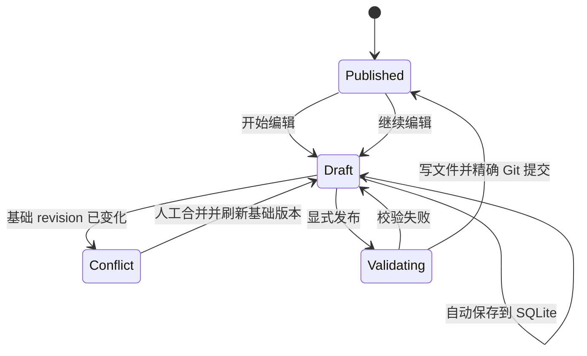
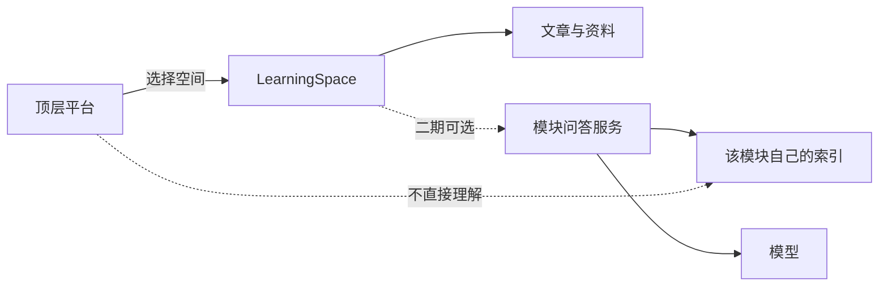

# 01 产品调研：从代码 Wiki 到个人学习操作系统

## 研究问题

本次调研不是寻找一个可以原样复制的站点，而是回答四个问题：

1. 多个学习主题如何在同一个顶层被发现，而不互相污染目录？
2. Markdown 如何同时服务源码编辑和非源码编辑？
3. 批注怎样经受正文更新，而不是一次编辑后全部错位？
4. 哪些 DeepWiki 能力属于首版核心，哪些会把个人学习站误做成公共 SaaS？

## 证据边界

调研时间截面为 2026-09-13。DeepWiki 首页在当前环境中未能完成浏览器截图采集，因此这里只引用官方产品说明，不声称复刻其视觉布局。下面的“观察”可从一手资料核对；“采用/不采用”是结合本项目目标做出的设计判断。

## 横向比较

| 产品/标准 | 可观察能力 | 本项目采用 | 本项目不采用 |
| --- | --- | --- | --- |
| [DeepWiki](https://docs.devin.ai/work-with-devin/deepwiki) | 为多个仓库生成层级 Wiki、架构图和源码链接；可用配置指定页面层级；Ask Devin 使用 Wiki 进行代码语境问答 | 多知识库入口、模块主页、架构图、来源明确的内容组织 | 公共仓库输入框、自动索引、首版 AI 问答、成本档位 |
| [GitBook](https://gitbook.com/docs/getting-started/quickstart) | 可视编辑与 docs-as-code 并存；编辑、变化、预览、合并分离；Git 同步保留版本 | 富文本/源码/diff/预览四视图；显式发布；Git 历史 | 多人 change request、团队通知和审阅流 |
| [Mintlify](https://www.mintlify.com/docs/organize/pages) | 页面由 Markdown/MDX 与 frontmatter 描述；MDX 可承载交互组件 | 文档元数据、可控组件、文档型侧栏 | 任意 JSX、任意 import 或在内容中执行脚本 |
| [Keystatic](https://keystatic.com/docs/introduction) | 可以把 CMS 接入现有项目，写本地文件或 GitHub | “Git 是已发布内容真相，网页是编辑界面”的模型 | 首版不引入另一套 CMS 数据层，避免和自定义批注/发布协议重叠 |
| [MDXEditor](https://mdxeditor.dev/editor/docs/diff-source) | 编辑器可在 rich-text、source、diff 间切换，输入输出仍是 Markdown | 后台编辑器 | 不使用其内容格式作为数据库真相 |
| [W3C Web Annotation](https://www.w3.org/TR/annotation-model/) | Annotation 由 body 与 target 组成；TextQuoteSelector 保存 exact/prefix/suffix；TextPositionSelector 保存 start/end | 组合锚点、内容 revision、孤立状态 | 只用 XPath 或只用字符偏移 |

## 关键推导

### 1. 顶层是目录，不是采集器

DeepWiki 面向“输入仓库并生成知识库”，而这里的真实需求是“组织我已经决定学习的主题”。因此首页只提供搜索、分类、继续学习和模块入口。新模块由站长后台创建，不开放访客提交。

这样做有三个直接收益：

- 避免引入抓取、版权、任务队列、配额和失败重试系统。
- vLLM 与 CS336 可以共享平台，但保持完全不同的内容结构。
- 后续加入论文阅读、操作系统课程或个人项目时，无需伪装成 Git 仓库。

### 2. 发布内容和工作草稿分离

Git 适合审计和回滚，但不适合每次键盘输入都生成提交。后台因此采用两层状态：

### 3. 阅读交互不应改变公开内容

高亮、批注和进度属于个人状态，不应写回 Markdown。访客读取干净文章，站长登录后才加载私有层。这样同一篇文章既能作为博客公开，也能作为个人学习工作台。

### 4. “支持 HTML”必须有安全定义

如果任意 HTML/JavaScript 与后台登录运行在同一页面，恶意或误粘贴脚本可以读取管理界面、伪造操作或窃取内容。首版的 HTML 支持因此定义为：

- 普通 HTML 标签经 allowlist 清洗。
- 独立 HTML 文档进入无 `allow-scripts` 权限的 sandbox iframe。
- 禁止事件属性、脚本、表单提交、顶层导航和危险 URL。
- 受限 MDX 首版采用 Markdown 兼容子集：允许安全的普通 Markdown 和小写 HTML 标签，不允许 import/export、花括号表达式或自定义 JSX 组件。

这与 [DOMPurify 的安全模型](https://github.com/cure53/DOMPurify/wiki/Security-Goals-%26-Threat-Model)一致：清洗必须针对最终插入上下文，CSS、外部资源和解析差异不能被当作“已经自动安全”。

## 产品原则

1. **先暴露学习活动**：首页首屏直接出现搜索和学习空间，不放大段营销 Hero。
2. **空间隔离，工具共享**：目录、进度、批注以空间隔离；阅读器和后台共享。
3. **已发布内容可移植**：删掉应用后，Markdown 和 Git 历史仍然可读。
4. **用户状态不污染文章**：进度、批注、草稿存入 SQLite。
5. **来源比“聪明”重要**：首版优先呈现源码路径、commit 和实验，不自动编造总结。
6. **恢复通过新事实完成**：文章恢复产生新提交，不重写 Git 历史。
7. **扩展依靠数据**：新增模块更新 catalog 与内容目录，不修改路由和组件。

## 首版边界

### 包含

- 多学习空间首页与分类。
- 模块主页、学习目录和文章阅读器。
- Markdown、受限 MDX、安全 HTML、Mermaid。
- 跨空间搜索、阅读进度、私有划词批注。
- 单站长后台、草稿、diff、预览、Git 发布和历史。
- 本地运行与 Docker 单机部署。

### 不包含

- 访客提交模块或匿名评论。
- 多用户、团队权限和实时共同编辑。
- 外部网页抓取、仓库自动索引和定时同步。
- AI 问答、自动测验、掌握度判断。
- 在内容中执行任意 JavaScript。

## 后续 AI 能力的正确位置

未来 AI 问答属于模块内部能力：Hermes 可以接源码索引，CS336 可以接课程材料，vLLM 可以接实验日志。顶层只增加一个统一入口和结果归属，不承担某种领域的检索策略。

