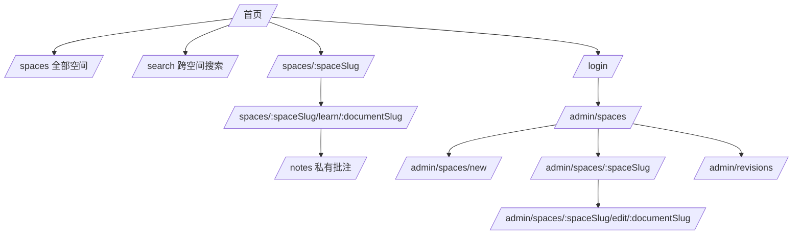
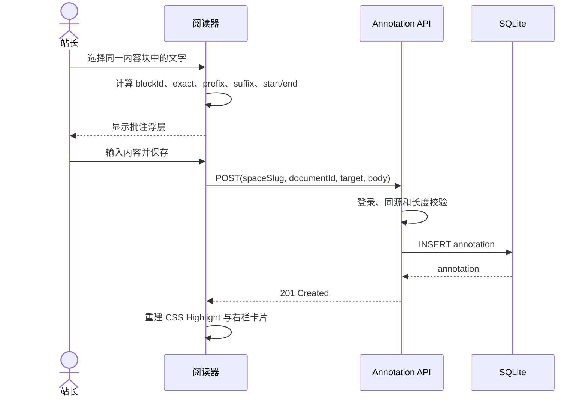
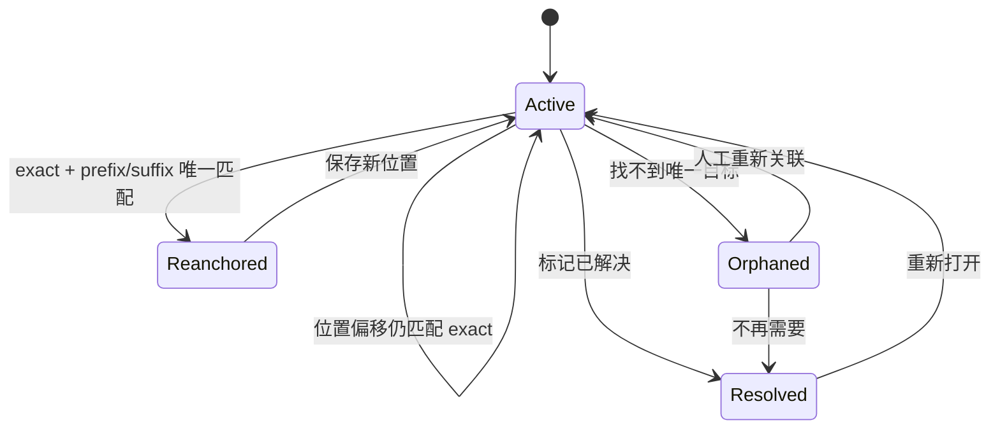
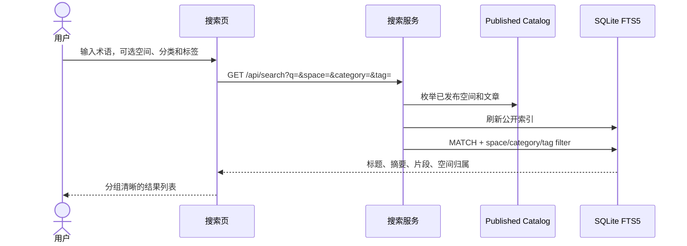
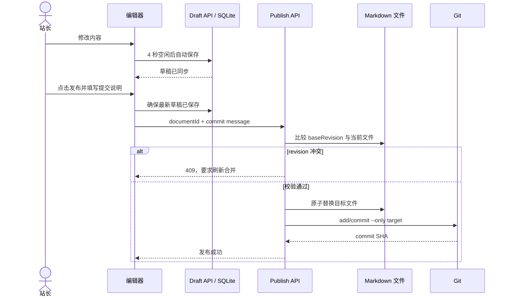

# 02 信息架构与 UI：从书架到可批注阅读器

## 路由地图



命名空间 `/spaces/` 是刻意选择：它避免学习模块 slug 与 `/admin`、`/search`、`/notes` 冲突，也允许两个空间中存在相同的文章 slug。

## 首页

### 首屏任务

用户进入后应能立刻完成两件事：搜索一个概念，或进入一个学习空间。首页不是产品宣传页。

```text
┌──────────────────────────────────────────────────────────────┐
│ 学习图谱       学习空间   搜索              主题   站长登录 │
├──────────────────────────────────────────────────────────────┤
│ PERSONAL KNOWLEDGE ATLAS                                     │
│ 把复杂系统，学成一张能持续生长的图。      ┌───────────────┐ │
│ 从 Agent Harness 到推理引擎与课程。       │ 搜索概念… ⌘K │ │
│                                            └───────────────┘ │
│ 3 学习空间      21 篇笔记      覆盖方向 [Agent] [LLM] [...] │
├──────────────────────────────────────────────────────────────┤
│ 从一个学习空间开始                           查看全部 →      │
│ ┌──────────────┐ ┌──────────────┐ ┌──────────────┐          │
│ │ Hermes       │ │ vLLM         │ │ CS336        │          │
│ │ 17 层架构    │ │ 推理系统     │ │ 训练课程     │          │
│ │ ...          │ │ ...          │ │ ...          │          │
│ │ 进入模块 →   │ │ 进入模块 →   │ │ 进入模块 →   │          │
│ └──────────────┘ └──────────────┘ └──────────────┘          │
│ [精选模块] [最近更新] [学习路线]                              │
└──────────────────────────────────────────────────────────────┘
```

### 卡片合同

每张卡片只能有一个主要动作。卡片展示：

- 分类、标题和一句话职责。
- 最多四个标签。
- 已发布文章数量。
- 最近更新时间。
- 登录后可替换为“继续学习”和空间完成度。

卡片颜色由数据中的 `accent` 选择，但布局、字号和状态颜色一致。颜色不是空间身份的唯一线索，标题与分类始终可见。

## 模块主页

```text
┌──────────────────────────────────────────────────────────────┐
│ Inference Systems                                            │
│ vLLM 推理系统                                                │
│ 围绕调度、PagedAttention、KV Cache…          [继续学习 →]   │
│ [在当前模块中搜索…]                          3 / 8 篇完成    │
├──────────────────────────────────────────────────────────────┤
│ [快速入门]             [深入材料]             [动手实验]      │
├──────────────────────────────────────────────────────────────┤
│ 模块目录                                                     │
│ 01  学习地图                         20 分钟             →   │
│ 02  Scheduler 主路径                 35 分钟             →   │
│ 03  PagedAttention                   45 分钟             →   │
└──────────────────────────────────────────────────────────────┘
```

模块主页不假设固定栏目。快速入门、深入材料、动手实验是学习方式，不是内容目录的强制层级。文章排序来自 frontmatter `order`。

## 阅读页

### 桌面布局

```text
┌───────────────┬───────────────────────────────┬───────────────┐
│ 模块目录      │ 面包屑 / 标题 / 摘要          │ 本文目录      │
│               │                               │               │
│ 学习地图      │ Markdown / HTML 正文          │ 私有批注      │
│ Runtime       │                               │ “选中文字…”  │
│ Models        │ 代码块 / Mermaid / 表格       │               │
│ Context       │                               │ 批注卡片      │
│ ...           │ 源码链接 / 实验               │               │
└───────────────┴───────────────────────────────┴───────────────┘
    248 px              最高 820 px                   284 px
```

### 响应式规则

| 视口 | 行为 |
| --- | --- |
| `> 980px` | 三栏；左右栏 sticky；正文保持可读行长 |
| `681–980px` | 两栏；隐藏右栏；正文优先，批注入口后续可放抽屉 |
| `≤ 680px` | 单栏；模块目录变为顶部双列滚动区；长表格横向滚动 |

正文保持至少 16px 字号和约 1.8 行高。所有固定区域必须在 200% 文字缩放下仍可滚动，而不是裁切内容。

## 前台批注

### 创建时序



### 重定位状态



选择不得跨越两个内容块；超长选择被拒绝。浮层不覆盖当前选区，Esc/关闭按钮可取消。批注正文按文本显示，不直接注入 HTML。

## 跨空间搜索



每个结果必须显示空间名和分类。搜索不到时提供清空空间过滤器的提示，不伪造相似结果。

## 后台内容管理

### 模块列表

后台模块列表同时展示 `draft/published/archived`，而公开页面只读 `published`。每个模块显示内容目录，方便站长知道 Git 中真正修改了哪里。

### 编辑器

```text
┌──────────────────────────────────────────────────────────────┐
│ 文章标题  [草稿已同步]       [预览] [保存草稿] [发布到 Git] │
├──────────────────────────────────────────────────────────────┤
│ [撤销] [标题] [粗体] [代码] [链接] [列表] [表格] [视图]     │
├──────────────────────────────────────────────────────────────┤
│                                                              │
│  Rich Text / Source / Diff                                   │
│                                                              │
└──────────────────────────────────────────────────────────────┘
```

编辑时序：



## 页面状态清单

| 场景 | UI 响应 |
| --- | --- |
| 没有学习空间 | 展示后台创建入口；访客看到尚未发布内容 |
| 空模块 | 模块主页保留简介，显示“创建第一篇笔记” |
| 搜索无结果 | 保留查询词和筛选，提供修改搜索的明确提示 |
| Mermaid 语法错误 | 显示原始 Mermaid 与局部错误，不让整篇文章崩溃 |
| 批注失去位置 | 标记“原文位置已变化”，进入 `/notes` 待处理 |
| 草稿与文件冲突 | 禁止覆盖，保留草稿，要求比较新版本 |
| Git 提交失败 | 报告明确错误，不把失败伪装成已发布 |
| 未登录访问后台/API | 页面跳转登录；API 返回 401 |
| 归档模块 | 公开目录隐藏，后台、Git、批注和进度保留 |

## 可访问性合同

- 所有图标按钮有可读 `aria-label`。
- 键盘可以完成登录、搜索、模块导航、编辑和发布。
- 焦点环在明暗主题下均清晰可见。
- 状态不能只靠颜色表达，必须同时显示文字。
- `prefers-reduced-motion` 下关闭非必要动画。
- Mermaid 图失败时保留文本替代；HTML iframe 有明确标题。
- 移动端触摸目标不小于约 38–44px，正文链接除外。
