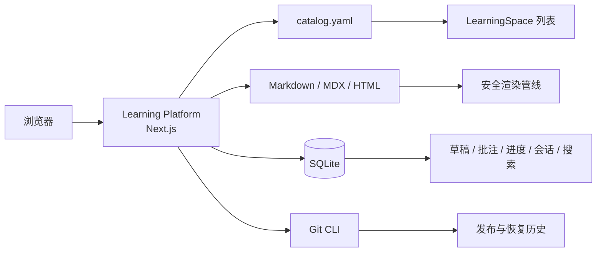
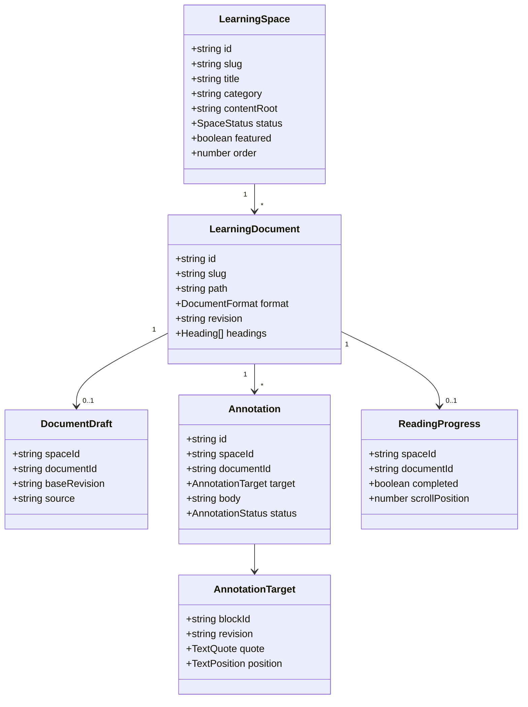
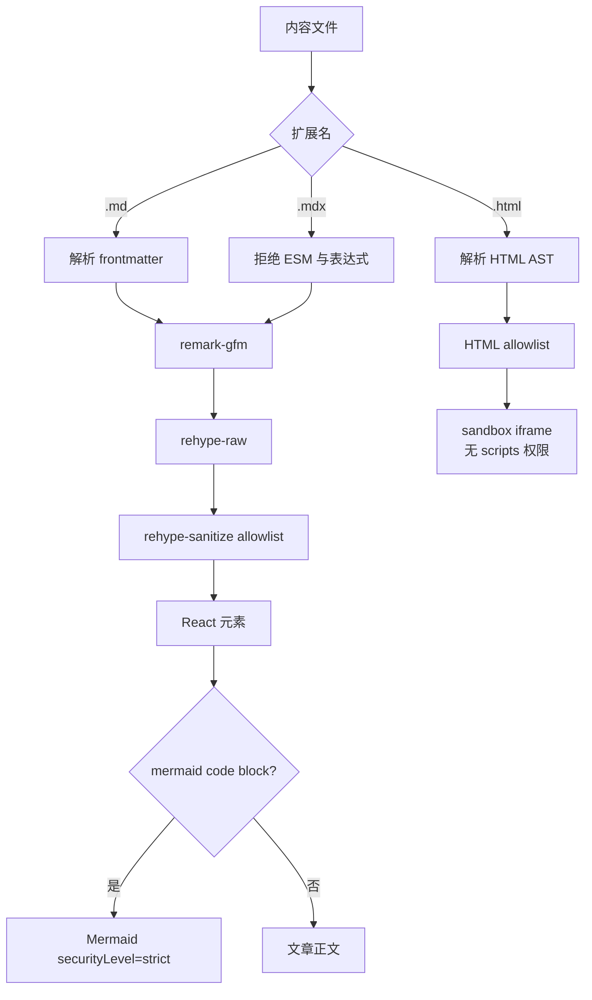
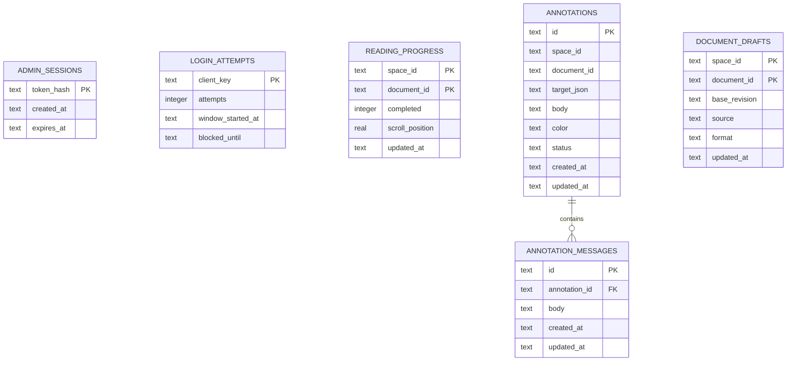
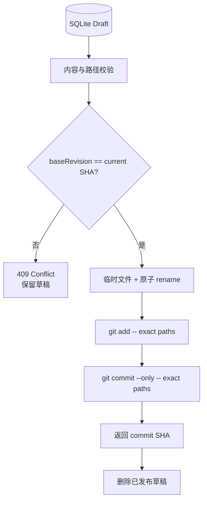

# 03 技术架构：Git 内容、SQLite 工作状态与安全渲染

## 系统边界

学习平台是 Hermes 仓库边缘的独立 Next.js 应用，不进入 Agent Core、工具 schema 或现有 Dashboard。它读取学习文档，但不调用 Hermes runtime。



## 目录与部署单元

```text
apps/learning-platform/
├── app/                 # 页面和 Route Handlers
├── components/          # 阅读、批注、编辑和导航组件
├── db/                  # SQLite schema 与迁移
├── lib/                 # catalog、内容、认证、搜索和 Git 发布
├── tests/               # 行为合同
├── Dockerfile
└── docker-compose.yml

docs/
├── learning-platform/catalog.yaml
├── agent-harness-learning/
└── learning-spaces/<spaceSlug>/
```

`LEARNING_REPO_ROOT` 只用于部署时定位仓库；本地开发会从当前目录向上寻找同时拥有 `package.json` 和 `.git` 的根目录。任何内容路径最终都必须重新验证仍处在允许目录中。

## 核心对象



真实主键是 `(spaceId, documentId)`。`documentId` 当前等于内容根目录下不带扩展名的相对路径；`README` 归一化为 `index`。

## 内容注册

`catalog.yaml` 是发布空间的清单：

```yaml
version: 1
spaces:
  - id: hermes-agent-harness
    slug: hermes
    title: Hermes Agent Harness
    category: Agent Harness
    contentRoot: docs/agent-harness-learning
    entryDocument: README.md
    status: published
    featured: true
    order: 10
```

`contentRoot` 不能是绝对路径，也不能通过 `..` 或符号链接离开以下根：

- `docs/agent-harness-learning/`
- `docs/learning-spaces/`

后台创建的新模块固定进入第二个根，不接受任意文件系统路径。

## 内容读取与渲染



设计约束：

- Markdown 内相对 `.md/.mdx` 链接转成模块内路由。
- 指向内容根外的仓库相对路径转成 GitHub 源码链接。
- HTML 清洗后放入 `sandbox=""` iframe，不授予脚本、同源、表单或导航权限。
- Mermaid 在客户端隔离渲染；局部错误不会中止文章页面。
- `sourceRevision` 和文章 SHA 用于显示内容基线及批注锚定。

## 数据模型



搜索使用单独的 FTS5 虚拟表，仅写入已发布空间和文章。索引记录包含空间归属，使过滤发生在查询端而不是结果返回后。

## 批注锚定协议

批注目标遵循 W3C selector 思路：

```json
{
  "blockId": "p-42",
  "revision": "sha256...",
  "quote": {
    "exact": "tool-call 先持久化再执行",
    "prefix": "Hermes 的关键设计是",
    "suffix": "，否则崩溃后无法审计"
  },
  "position": { "start": 12, "end": 31 }
}
```

重定位算法：

1. 查找 `blockId` 对应的规范化文本块。
2. 如果 `start/end` 位置仍等于 `exact`，直接恢复范围。
3. 否则查找所有 `exact`，按候选与 `prefix/suffix` 的公共上下文长度评分。
4. 单一候选或唯一最高分候选视为重新锚定。
5. 没有候选或最高分并列时标记 `orphaned`，禁止猜测。

只用位置会被前文插入破坏；只用 quote 会被重复文本混淆；只用 DOM 路径会被渲染器结构变化破坏。组合选择器使常见正文编辑可恢复，同时把不确定性显式暴露。

## 认证与授权

首版是单站长模型：

- 密码来自 `LEARNING_ADMIN_PASSWORD`；开发环境缺省为 `learn-local`，生产环境没有默认密码。
- 成功登录产生 256-bit 随机 token；数据库只保存 SHA-256 hash。
- Cookie 为 HttpOnly、SameSite=Strict，生产环境 Secure，有 14 天过期时间。
- 登录按客户端地址做 15 分钟窗口限流，连续失败五次暂时阻断。
- 每个管理页面在服务端验证会话；每个写 API 再验证一次。
- 写请求检查 `Origin` 与目标 host，降低跨站请求伪造风险。
- 公开页面不会把批注、草稿或未发布空间发送到客户端。

## API 合同

### 公开读取

| 方法 | 路径 | 结果 |
| --- | --- | --- |
| GET | `/api/spaces` | 已发布空间及文章数量 |
| GET | `/api/spaces/:spaceSlug` | 单个已发布空间 |
| GET | `/api/spaces/:spaceSlug/documents` | 已发布文章元数据 |
| GET | `/api/search?q=&space=&category=&tag=` | 带空间归属的搜索结果；`query` 也是 `q` 的兼容参数 |

### 登录用户状态

| 方法 | 路径 | 作用 |
| --- | --- | --- |
| GET/PUT | `/api/spaces/:spaceSlug/progress/:documentId` | 读取或更新完成度和滚动位置 |
| GET/POST | `/api/spaces/:spaceSlug/annotations` | 查询或创建私有批注 |
| PATCH/DELETE | `/api/spaces/:spaceSlug/annotations/:id` | 解决、重开、孤立或删除批注 |

### 后台写入

| 方法 | 路径 | 作用 |
| --- | --- | --- |
| POST | `/api/admin/spaces` | 创建草稿模块及入口文章 |
| PATCH | `/api/admin/spaces/:spaceId` | 更新元数据、排序、精选状态和发布状态 |
| POST | `/api/admin/spaces/:spaceId/archive` | 归档空间但保留历史与个人状态 |
| GET/PUT | `/api/admin/spaces/:spaceId/documents/draft?document=` | 读取/保存草稿 |
| POST | `/api/admin/spaces/:spaceId/documents/publish` | 乐观锁校验并发布 |
| POST | `/api/admin/spaces/:spaceId/documents/restore` | 从旧 revision 恢复并创建新提交 |

## Git 发布协议



禁止使用通配符、目录级 `git add`、`git reset --hard` 或历史重写。恢复读取旧 blob，写成当前内容，再创建一个新的恢复提交。

## 主要设计模式

| 模式/理念 | 使用位置 | 价值 |
| --- | --- | --- |
| 两层架构 | 平台目录与模块内容 | 顶层稳定，模块可异构增长 |
| Repository | catalog/content/Git 访问函数 | UI 不直接拼接文件系统命令 |
| CQRS-lite | Git 发布读模型与 SQLite 草稿写模型 | 公开内容稳定，编辑体验连续 |
| Strategy | Markdown 与 HTML 渲染分支 | 安全策略按格式明确 |
| Optimistic Concurrency | `baseRevision` | 防止后台覆盖外部编辑 |
| Composite Selector | 批注锚点 | 在可恢复性和不确定性之间取得平衡 |
| Append-only Recovery | Git restore commit | 审计链不断裂 |

## 页面操作接口

浏览器实现 WebMCP imperative API 时，根布局注册只读工具 `search_learning_content`。它复用可见搜索页背后的 `/api/search`，支持空间、分类和标签过滤，返回带模块路径的精简 JSON；结果来自站长内容，因此声明 `untrustedContentHint: true`。不支持 WebMCP 的浏览器不会加载 polyfill，也不影响任何可见功能。本次没有可用的 WebMCP 浏览器验证上下文，所以不声称完成了运行时注册验证。

## 已知边界

- 当前 FTS 索引在查询时重建，适合个人规模；文章达到数千篇后应改为按文件 hash 增量更新。
- 后台富文本编辑器的上游 `@mdxeditor/editor@4.2.4` 固定依赖 `js-yaml@4.3.1`；当前 npm advisory 将其报告为高危 CPU DoS 且上游无可用修复。风险面限于登录站长打开的本地内容，另有 2 MB 草稿上限，但升级或替换编辑器前不能视为已消除。
- 文章内 block ID 基于源位置，结构性编辑后主要依赖 quote selector 恢复。
- 首版只有单站长，不实现成员、权限组、审核或通知。
- Docker 运行时若要发布，必须让容器访问可写 Git 元数据和内容目录。
- AI 问答未来必须以 `spaceId` 隔离索引、引用与费用，不能变成顶层隐式全库搜索。
