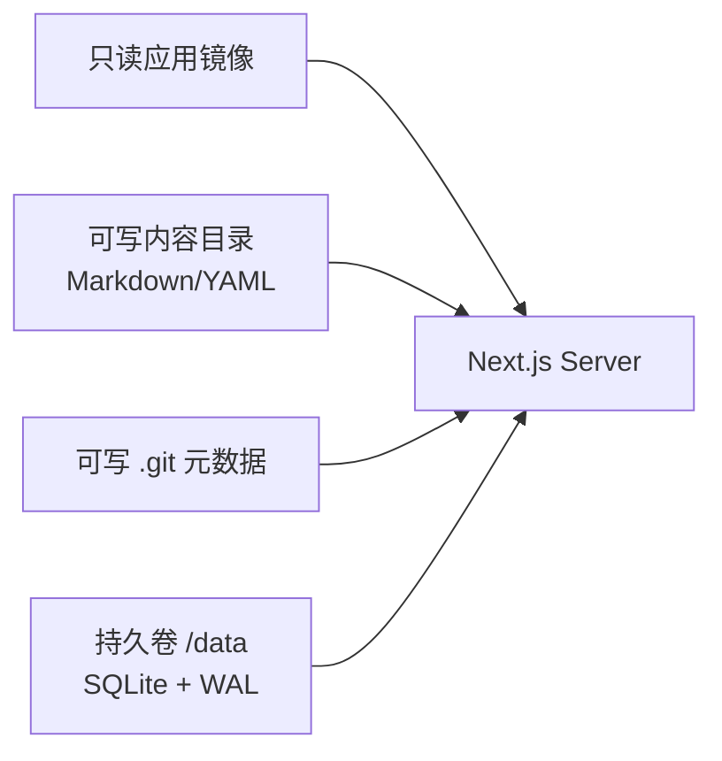

# 04 实施与验收：可运行、可恢复、可继续扩展

## 实施切片

```mermaid
gantt
    title 多学习空间平台实施顺序
    dateFormat  YYYY-MM-DD
    section 基础
    产品与技术规格        :done, docs, 2026-09-13, 1d
    首页与空间目录        :done, catalog, after docs, 1d
    section 阅读
    模块页与阅读器        :done, reader, after catalog, 1d
    Markdown HTML Mermaid :done, render, after catalog, 1d
    搜索                  :done, search, after reader, 1d
    section 个人状态
    登录与会话            :done, auth, after catalog, 1d
    进度与批注            :done, notes, after auth, 1d
    section 内容管理
    草稿与编辑器          :done, editor, after auth, 1d
    Git 发布与历史        :done, publish, after editor, 1d
    section 交付
    自动化验证            :test, verify, after publish, 1d
    Docker 与运维说明     :deploy, after verify, 1d
```

`done` 表示功能代码已具备；`test/deploy` 表示交付前必须通过验证，不代表线上已经发布。

## 分阶段完成定义

### A. 平台与目录

- `catalog.yaml` 可以注册多个空间。
- 首页、`/spaces` 和 `/spaces/:slug` 由数据生成，不含模块名分支。
- Hermes 继续读取 `docs/agent-harness-learning/`。
- vLLM、CS336 使用标准新模块目录。
- `draft/archived` 空间不出现在公开目录。

### B. 阅读体验

- `.md`、受限 `.mdx`、`.html` 被识别为文章。
- frontmatter 控制标题、摘要、状态、顺序、标签和预计时间。
- 相对学习文档链接进入模块路由；源码路径进入 GitHub。
- Mermaid 支持缩放、重置和全屏，错误为局部状态。
- 桌面三栏、平板两栏、手机单栏均可阅读。

### C. 个人学习状态

- 未登录时进度与批注 API 返回 401。
- 登录后滚动位置节流保存，完成状态可手动切换。
- 划词只能发生在一个稳定内容块内。
- 批注以复合 selector 保存并在加载时重定位。
- 无法唯一匹配的批注显示为孤立，不静默绑定错误文本。
- `/notes` 跨模块展示私有批注。

### D. 后台与发布

- 后台能创建草稿模块、生成 README 并更新 catalog。
- 编辑器支持 rich-text、source、diff 和 preview。
- 自动保存只写 SQLite。
- 发布比较 `baseRevision`；冲突返回 409 并保留草稿。
- 成功发布只提交明确目标文件。
- 恢复旧版本产生新提交，不重写历史。

## 自动化测试矩阵

| 测试层 | 场景 | 合同 |
| --- | --- | --- |
| Unit | catalog 解析 | 唯一 id/slug、状态过滤、稳定排序 |
| Unit | 路径约束 | 拒绝绝对路径、`..` 和越界符号链接 |
| Unit | 内容扫描 | 嵌套目录、README slug、frontmatter、格式识别 |
| Unit | 批注定位 | 原位置、前文插入、重复 quote、目标删除 |
| Unit | 搜索 | 空查询、空间过滤、中文/英文文本、未发布排除 |
| Integration | 认证 | 正确密码、错误密码、限流、过期 session |
| Integration | 隔离 | 相同 document slug 在不同 space 不串进度或批注 |
| Integration | 草稿 | 保存草稿不修改内容文件 |
| Integration | 发布 | 正确 revision 成功；过期 revision 冲突 |
| Integration | Git | 提交只包含目标内容路径，不包含其他 staged 文件 |
| Security | 渲染 | script、事件属性、危险 URL、MDX ESM 被拒绝或移除 |
| E2E | 主流程 | 首页 → 模块 → 阅读 → 登录 → 批注 → 编辑 → 发布 |
| E2E | 响应式 | 390px、768px、1440px 下核心功能可操作 |
| Accessibility | 键盘 | 搜索、目录、登录、批注和编辑发布无需鼠标完成 |
| Persistence | 重启 | SQLite、内容和 Git 历史在容器重启后保留 |

测试不能断言模块或模型的固定数量。应构造至少三个 fixture 空间，并验证它们之间的关系和隔离合同。

## 手工验收脚本

### 公开阅读

1. 打开 `/`，确认 Hermes、vLLM、CS336 卡片及文章数量。
2. 按分类查看 `/spaces`，确认 URL 可分享和刷新。
3. 进入 Hermes，打开 Runtime 文章。
4. 检查目录、代码、表格、Mermaid 和源码链接。
5. 搜索 `prompt cache`，确认结果带有 Hermes 空间名。
6. 未登录访问 `/notes`，确认被送到登录页。

### 私有批注

1. 使用管理密码登录。
2. 在文章中选择一段不超过 500 字的文字。
3. 保存批注，确认高亮与右栏卡片立即出现。
4. 刷新页面，确认批注仍存在。
5. 修改目标段落前的内容并发布，确认批注能重定位。
6. 删除目标文字并发布，确认批注进入孤立状态。

### 编辑与发布

1. 从后台打开一个文档。
2. 在 rich-text 模式修改，再切到 source 和 diff。
3. 等待自动保存，确认 Git 工作区没有因草稿变化而变化。
4. 点击发布，填写提交说明。
5. 确认文章更新、草稿清除、版本记录出现新 SHA。
6. 从旧 revision 恢复，确认生成新提交而非移动 HEAD。

### 新增模块

1. 后台创建唯一 slug 的模块。
2. 确认模块处于 draft，访客不可见。
3. 编辑入口文章并发布。
4. 将模块状态改为 published，确认首页无需代码修改即出现卡片。
5. 归档模块，确认公开入口消失但文章、批注和进度仍在。

## 本地运行

```bash
npm install --workspace @hermes/learning-platform
npm run dev --workspace @hermes/learning-platform
```

开发默认：

- 地址：`http://127.0.0.1:4317`
- 管理密码：`learn-local`
- 数据库：`apps/learning-platform/.data/learning-platform.sqlite`
- 内容仓库：自动发现当前 Hermes checkout

正式运行前设置：

```bash
export LEARNING_ADMIN_PASSWORD='使用密码管理器生成的长密码'
export LEARNING_REPO_ROOT='/workspace'
export LEARNING_DATA_DIR='/data'
```

只有秘密放入环境变量；站点标题、模块顺序、分类和内容行为继续由 YAML/Markdown 管理。

## Docker 数据边界

容器需要三个不同性质的区域：



推荐备份：

- Git remote 是已发布内容与历史的异机备份。
- `/data` 每日做 SQLite 在线备份或停止写入后的卷快照。
- 恢复时先恢复匹配的 Git checkout，再恢复 SQLite；批注携带 revision，可识别旧内容目标。

健康检查至少验证：

- `/api/spaces` 返回 200。
- catalog 可解析。
- SQLite 可读写事务。
- 内容根与 `.git` 可写（若启用后台发布）。

## 风险与控制

| 风险 | 触发条件 | 控制 |
| --- | --- | --- |
| 批注错误重定位 | quote 在同块重复 | 只接受唯一上下文匹配，否则 orphaned |
| 意外提交用户代码 | 使用宽泛 `git add` | 仅 `git add -- exact` + `git commit --only` |
| 覆盖外部编辑 | 后台草稿基于旧文件 | SHA 乐观锁，冲突保留草稿 |
| HTML 窃取后台权限 | 执行脚本或同源 iframe | 清洗 + 无权限 sandbox |
| 路径穿越 | catalog 或请求含 `..`/symlink | 词法检查 + realpath 检查 + allow roots |
| 搜索泄露草稿 | 全目录无状态索引 | 只枚举 published 空间和文章 |
| 数据库损坏 | 容器突然退出 | WAL、busy timeout、持久卷和定期备份 |
| Git 身份缺失 | 容器无法 commit | 启动检查 user.name/user.email，并阻止发布 |

## 二期入口

AI 问答不改变顶层结构。若未来加入，每个模块独立持有：

- 索引版本与来源 revision。
- 允许检索的文档集合。
- 引用格式和答案验证。
- Token/费用预算。
- 索引更新任务状态。

顶层只显示“该模块是否启用问答”和入口，不直接合并所有模块上下文。

## 最终完成条件

- `npm run check --workspace @hermes/learning-platform` 通过。
- `npm run build --workspace @hermes/learning-platform` 通过且没有阻断性警告。
- 所有已存在的学习文档自动发现；测试不冻结文件数量。
- 公开、登录、批注、编辑、发布、恢复和跨空间搜索主路径均有验证证据。
- Docker 重启验证数据持久性。
- 工作区中用户原有的无关变更未被修改或提交。

## 本次实现验证记录

| 检查 | 结果 | 说明 |
| --- | --- | --- |
| TypeScript | 通过 | `npm run typecheck --workspace @hermes/learning-platform` |
| 行为测试 | 通过 | 9 个测试文件、15 个测试；不冻结模块总数 |
| Next.js 生产构建 | 通过 | Next.js 16 standalone 构建完成，无 CSS/路由阻断警告 |
| 生产服务冒烟 | 通过 | 首页、vLLM 模块、CS336 阅读页、按标签搜索均返回 200 |
| 认证与批注 API | 通过 | 登录 200、创建 201、删除 204、登录后批注页 200 |
| npm 生产依赖审计 | 有已知例外 | `@mdxeditor/editor` 上游固定的 `js-yaml@4.3.1` advisory，见技术架构“已知边界” |
| Docker Compose | 未执行 | 文件已落地，但当前开发机没有 `docker` 命令；需在目标主机执行下方重启验收 |

Docker 重启验收命令：

```bash
cd apps/learning-platform
export LEARNING_ADMIN_PASSWORD='由密码管理器生成的长密码'
docker compose up --build -d
curl --fail http://127.0.0.1:4317/api/spaces
docker compose restart learning-platform
curl --retry 12 --retry-delay 2 --fail http://127.0.0.1:4317/api/spaces
docker compose down
```
