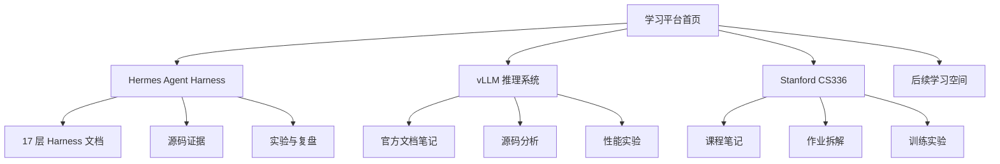

# 多学习空间平台：产品与工程规格

> 基线：2026-09-13。实现位于 `apps/learning-platform/`，内容目录由本目录的 `catalog.yaml` 注册。

## 一句话定位

这是一个面向个人长期学习的知识平台：顶层像书架一样组织 Hermes、vLLM、Stanford CS336 等学习空间；每个空间拥有自己的学习地图、文章、源码笔记和实验，但共享阅读器、搜索、进度、私有批注与后台发布能力。

它不是公开的仓库索引服务，也不在首版自动抓取网页、分析 Git 仓库或生成 Wiki。内容的事实来源始终是站长维护的 Markdown、受限 MDX 或安全 HTML。

## 两层产品模型



顶层只理解 `LearningSpace`，不理解模块内部的“官方文档”“作业”或“源码分析”。因此增加学习空间是内容操作，不是产品功能开发。

## 已落地范围

| 能力 | 首版状态 | 说明 |
| --- | --- | --- |
| 多学习空间目录 | 已落地 | YAML 注册，首页和 `/spaces` 自动发现 |
| Hermes 内容接入 | 已落地 | 原目录继续使用，不强制迁移 |
| vLLM、CS336 模块 | 已落地骨架 | 后续直接增加 Markdown |
| Markdown/安全 HTML | 已落地 | HTML 在无脚本 iframe 中隔离 |
| Mermaid | 已落地 | 严格安全模式，支持缩放和全屏 |
| 跨空间搜索 | 已落地 | SQLite FTS5 索引，只检索已发布内容 |
| 阅读进度 | 已落地 | 仅站长可见，按空间和文章隔离 |
| 划词私有批注 | 已落地 | 引用、上下文、位置和 revision 组合锚定 |
| 后台编辑 | 已落地 | 富文本、源码、diff、预览 |
| Git 发布与历史 | 已落地 | 草稿入库，发布精确提交目标内容文件 |
| 模块元数据管理 | 已落地 | 后台修改标题、分类、标签、封面、精选、排序和状态 |
| WebMCP 搜索 | 已落地 | 支持时注册只读 `search_learning_content`，不支持时静默降级 |
| 自动抓取与 AI 问答 | 非首版 | 保留为模块内部的后续能力 |

## 文档导航

- [01 产品调研](./01-product-research.md)：参考产品的事实、取舍与设计原则。
- [02 信息架构与 UI](./02-information-architecture-and-ui.md)：页面、线框、交互和异常状态。
- [03 技术架构](./03-technical-architecture.md)：内容、数据库、批注、API、安全和 Git 发布协议。
- [04 实施与验收](./04-implementation-and-acceptance.md)：阶段、测试、部署、运维与完成定义。

## 快速启动

```bash
npm install --workspace @hermes/learning-platform
npm run dev --workspace @hermes/learning-platform
```

访问 `http://127.0.0.1:4317`。本地开发默认管理密码是 `learn-local`；正式环境必须设置 `LEARNING_ADMIN_PASSWORD`。

当前交付是本地优先应用，没有写入任何托管或发布配置。Docker Compose 是可执行部署规格；本次环境未安装 Docker，因此容器构建与重启验收仍需在装有 Docker 的主机执行。

## 新增学习空间

推荐从 `/admin/spaces/new` 创建。后台会校验 slug，在 `docs/learning-spaces/<slug>/` 创建入口文章，更新 `catalog.yaml`，并只提交这两个明确目标。

手工添加时也必须满足同一协议：

1. 在 `catalog.yaml` 增加唯一 `id` 和 `slug`。
2. `contentRoot` 只能位于允许的学习内容目录。
3. 创建入口 Markdown，并明确 `status`。
4. 不要为模块增加新的前端路由或 if/else 分支。

## 核心不变量

1. 文章身份是 `(spaceId, documentId)`，不能只用 slug。
2. 未发布内容永远不进入公开路由和搜索索引。
3. 批注、进度和草稿必须包含 `spaceId`。
4. 草稿不修改 Git；只有显式发布才写文件并提交。
5. 发布前必须确认编辑基础 revision 仍是当前版本。
6. HTML 支持不等于允许脚本执行。
7. 顶层不承担外部资料采集和模块领域语义。
