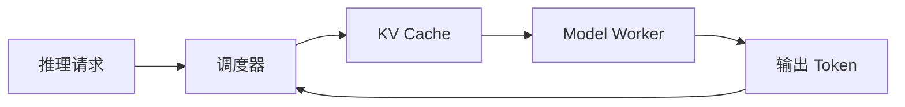

# vLLM 学习地图

这个模块用于沉淀个人的 vLLM 学习材料。顶层平台只负责找到它；模块内部会逐步补充官方文档笔记、源码分析、性能实验和复盘。

## 计划结构

1. 快速建立推理请求的端到端心智模型。
2. 理解调度器、PagedAttention 与 KV Cache。
3. 追踪单机和分布式执行路径。
4. 用可复现实验理解吞吐、延迟与显存之间的权衡。

> 当前是模块入口页。后续文章可以直接放入本目录，无需修改平台代码。
