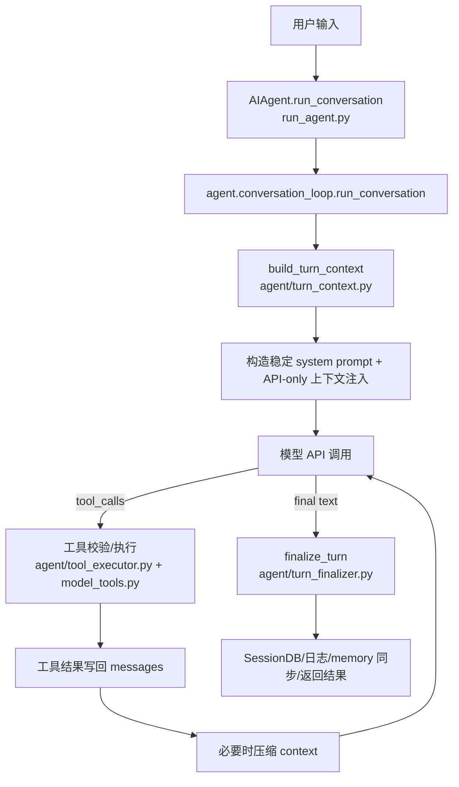

# 核心代码地图

## 一轮 turn 的主干

## 入口层

- `run_agent.py`
  - `AIAgent` 的主门面，保留大量 provider、工具、压缩、memory、fallback、streaming 相关方法。
  - `AIAgent.run_conversation()` 现在只是转发到 `agent.conversation_loop.run_conversation`，读主循环时不要在 `run_agent.py` 里迷路。
- `agent/conversation_loop.py`
  - 真实主循环。
  - 开头调用 `build_turn_context()` 完成 turn prologue。
  - 中间 while 处理 iteration budget、role alternation 修复、API message 构造、工具调用、压缩、fallback、空响应恢复。
  - 结尾调用 `finalize_turn()`。
- `agent/turn_context.py`
  - 每轮一次性准备：消息恢复、系统 prompt 恢复或构建、预压缩、plugin pre_llm_call、external memory prefetch。
- `agent/turn_finalizer.py`
  - turn 收尾：持久化、memory review/sync、清理、结果 dict。

## prompt 与缓存

- `agent/system_prompt.py`
  - `build_system_prompt_parts()`、`build_system_prompt()`、`invalidate_system_prompt()`。
  - 学习重点：system prompt 生命周期和 byte-stable 约束。
- `agent/prompt_builder.py`
  - context files、skills manifest、环境提示、任务完成指导、工具使用指导。
  - 学习重点：skills/system prompt 缓存、context 文件截断、平台提示。
- `agent/prompt_caching.py`
  - prompt caching 相关策略。
- `agent/conversation_loop.py`
  - API-only 注入：memory/plugin recall context 注入当前 user message，而不是改 system prompt。

## 工具 harness

- `tools/registry.py`
  - 工具注册中心，无依赖底座。
  - 每个工具文件 import 时调用 `registry.register()` 自注册 schema、handler、toolset、check_fn。
  - `check_fn` 有 TTL 缓存，避免短暂探测失败导致工具在长会话中消失。
- `model_tools.py`
  - 触发内置工具发现。
  - `get_tool_definitions()` 负责 schema 获取、toolset 过滤、缓存。
  - `handle_function_call()` 负责分发、参数纠正、特殊 agent-loop 工具处理。
- `toolsets.py`
  - `_HERMES_CORE_TOOLS` 和 `TOOLSETS` 是工具面分组与收束点。
  - 学习重点：为什么能力扩展优先放在 toolset/plugin/skill，而不是新增 core tool。
- `agent/tool_executor.py`
  - 并发/顺序执行工具调用、middleware、tool result 写回。
- `agent/tool_guardrails.py`
  - 幂等/变更型工具分类、重复失败控制、guardrail halt。

## session、搜索与压缩

- `hermes_state.py`
  - `SessionDB`：SQLite session store、FTS5 搜索、session lineage、compression lock、message append/replace。
- `agent/context_compressor.py`
  - `ContextCompressor`：何时压缩、如何保护 head/tail、如何处理 tool results、media、summary metadata。
- `trajectory_compressor.py`
  - 轨迹压缩相关工具。
- 重点测试：
  - `tests/agent/test_context_compressor.py`
  - `tests/agent/test_prompt_caching.py`
  - `tests/run_agent/test_compression_boundary.py`
  - `tests/run_agent/test_compression_persistence.py`

## skills 系统

- `agent/skill_commands.py`
  - 扫描 skill slash commands，构造 skill invocation message。
  - 关键不变量：skill 指令作为 user message 注入，而不是改变 system prompt。
- `agent/skill_utils.py`
  - frontmatter、平台/环境匹配、external skill dirs、skill config 解析。
- `agent/skill_preprocessing.py`
  - skill 内容模板变量、inline shell 展开。
- `agent/skill_bundles.py`
  - 多 skill bundle 的扫描、保存、调用。
- `tools/skills_tool.py`
  - `skills_list`、`skill_view`，负责 skill 浏览和读取。
- `tools/skill_manager_tool.py`
  - `skill_manage`，agent 创建、编辑、patch、删除 skill 的核心工具。
- `tools/skill_usage.py`
  - skill 使用、查看、patch、agent-created、pinned、archive 等状态记录。
- 重点测试：
  - `tests/agent/test_skill_commands.py`
  - `tests/agent/test_skill_bundles.py`
  - `tests/agent/test_learn_prompt.py`
  - `tests/tools/test_skills_*` 相关文件
  - `tests/hermes_cli/test_skills_*` 相关文件

## memory 系统

- `agent/memory_provider.py`
  - `MemoryProvider` 抽象接口：system prompt block、prefetch、sync_turn、tool schemas、turn hooks。
- `agent/memory_manager.py`
  - 多 provider 编排，memory context block，provider tools 注入，turn start/end/switch/pre-compress/delegation hooks。
- `tools/memory_tool.py`
  - agent-facing memory 工具。
- `tools/session_search_tool.py`
  - 跨 session 搜索入口。
- `plugins/memory/`
  - `honcho`、`mem0`、`supermemory`、`holographic`、`hindsight`、`byterover` 等 provider/plugin。
- 重点测试：
  - `tests/agent/test_memory_provider.py`
  - `tests/agent/test_memory_async_sync.py`
  - `tests/agent/test_memory_write_bridge.py`
  - `tests/plugins/memory/test_*`

## 自进化闭环

- `agent/learn_prompt.py`
  - `/learn` 把用户描述或刚完成的流程转成“创建一个可复用 skill”的 agent prompt。
- `tools/skill_manager_tool.py`
  - 真正落盘 skill。
- `tools/skill_usage.py`
  - 追踪 skill 的 view/use/patch/state。
- `agent/curator.py`
  - 周期性 review、stale/archive/consolidate、LLM pass。
- `agent/curator_backup.py`
  - skill 快照和 rollback。
- 重点测试：
  - `tests/agent/test_curator.py`
  - `tests/agent/test_curator_activity.py`
  - `tests/agent/test_curator_backup.py`
  - `tests/hermes_cli/test_curator_*`

## 多 agent 与委派

- `tools/delegate_tool.py`
- `tools/async_delegation.py`
- `batch_runner.py`
- `agent/moa_loop.py`
- `plugins/kanban/`

学习重点：Hermes 如何让子 agent 复用核心但限制 toolsets、iteration budget、session/cwd 上下文。

## surface 交互边界

- `cli.py` 和 `hermes_cli/commands.py`
  - slash command registry 和 CLI 分发。
- `gateway/run.py`
  - messaging 平台共享 slash command 和 agent session。
- `tui_gateway/server.py`
  - TUI/desktop 类 JSON-RPC gateway。
- `apps/desktop/`
  - 不是当前主线；只需要知道它通过 gateway/backend RPC 调 agent core。

