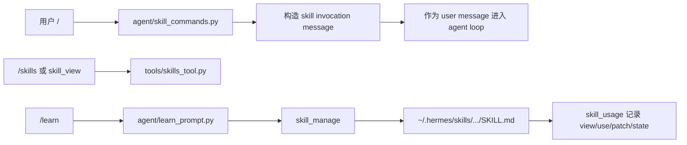
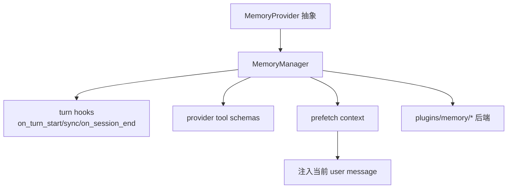

# 重点专题深挖

## 专题 A：Prompt Caching 是核心约束

Hermes 的很多设计都围绕一个原则：长会话的 cached prefix 不要被破坏。

重点观察：

- system prompt 生命周期由 `agent/system_prompt.py` 和 `agent/prompt_builder.py` 管。
- `agent/conversation_loop.py` 构造 API messages 时，会把 memory/plugin recall context 注入当前 user message，而不是改 system prompt。
- skill slash command 也是作为普通 user message 注入，不是动态改系统提示。
- context compression 是少数允许改变历史上下文的机制，但它被集中管理，有 metadata 和边界保护。

要回答的问题：

- 哪些内容属于 stable prefix？
- 哪些内容是 API-call-time only？
- 为什么“更智能地动态改 system prompt”在这里反而是坏设计？

## 专题 B：Harness 行动空间设计

从 harness 工程视角看，Hermes 的工具系统值得重点学：

- `tools/registry.py`：schema-first，工具自注册。
- `model_tools.py`：统一 discovery、schema cache、参数纠错、dispatch。
- `toolsets.py`：把工具按能力面收束，避免每个 surface 自己拼工具。
- `check_fn`：服务可用时才暴露工具，避免无效 action 污染模型选择。
- `agent/tool_guardrails.py`：对高风险/重复失败/非幂等工具做防护。
- `agent/conversation_loop.py`：invalid tool、invalid JSON、空工具名、空响应、thinking-only response 都尽量走“模型可恢复 observation”，而不是直接崩。

可以提炼的设计准则：

- action space 要小而明确。
- observation 要能指导下一步。
- recovery path 要保持 role alternation。
- tool schemas 也算 context budget，不能无限膨胀。

## 专题 C：Skills 是过程记忆

Hermes 的 skill 不是“知识库文章”，而是 agent 可执行的操作习惯。

关键链路：

要重点理解：

- skill discovery 不应该破坏 prompt cache。
- skill 内容需要短描述、frontmatter、平台/环境约束。
- supporting files 可以存在，但 `SKILL.md` 要像路由说明一样引导使用。
- agent-created skill 通过 `skill_manage` 写入，不能任意文件系统写入。

## 专题 D：Memory 是声明式/用户建模能力

memory 与 skill 的边界：

- memory：我是谁、用户是谁、长期偏好、事实、关系、跨会话上下文。
- skill：遇到某类任务时该怎么做。

关键链路：

要重点理解：

- `MemoryProvider` 是窄接口，让 Honcho、mem0、supermemory 等以插件方式接入。
- `MemoryManager` 编排 provider，而不是让主 loop 直接知道每个后端。
- recall context 注入 user message，是 prompt caching 约束下的关键取舍。
- session search 和 external memory 是互补关系：一个搜历史会话，一个接外部长期记忆。

## 专题 E：自进化闭环

自进化不是单个功能，而是一组机制组合：

- `/learn`：把经验转成创建 skill 的任务。
- `skill_manage`：安全地创建/编辑/patch/delete skill。
- `skill_usage`：记录 skill 是否被看过、用过、patch 过、是否 agent-created。
- `curator`：周期性审查、归档、合并、维护 skills。
- `curator_backup`：快照和 rollback。
- memory/session search：让 agent 能回看过往经验。

关键问题：

- 为什么 `/learn` 不直接写 skill，而是让 agent 通过 `skill_manage` 完成？
- curator 为什么要严格限制 autonomous delete？
- self-improving 与 uncontrolled self-modifying 的边界在哪里？

## 专题 F：上下文压缩与长任务韧性

重点文件：

- `agent/context_compressor.py`
- `agent/conversation_loop.py`
- `hermes_state.py`

要观察：

- compression 不只是 summarize，而是保护 tool-call/message 边界。
- prompt token 估算要包含 tool schemas，否则工具多时会低估上下文压力。
- 真实 provider usage 优先于粗略估算，但断连/缺失 usage 时要 fallback。
- compression lock 保护并发会话/分叉。

## 专题 G：错误恢复的工程品味

Hermes 的主循环里有很多“失败后继续走”的细节：

- tool name auto-repair。
- invalid tool name 给模型错误 observation。
- invalid JSON args 三次内重试，超过后注入 tool error result。
- 空响应后根据是否有 tool result、thinking-only、prior housekeeping content 决定恢复策略。
- fallback provider chain。
- verification stop-loop 防止“没验证就说完成”。

复盘时要问：

- 这个恢复路径有没有污染历史消息？
- 有没有破坏 role alternation？
- 用户是否能看见足够的异常信息？
- 该错误是让模型修正，还是 agent runtime 自己修正？

