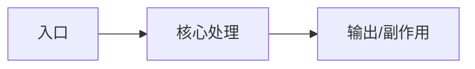

# 学习记录模板

以后每学一个阶段，在 `learn_plan/notes-XX-主题.md` 新建笔记，按下面格式写。

## 基本信息

- 日期：
- 阶段：
- 阅读范围：
- 相关测试：

## 一句话总结

用一句话说明这个模块解决什么问题。

## 费曼讲解

如果我要给一个没读过 Hermes 的工程师解释这个模块：

1. 它解决的问题是：
2. 输入是什么：
3. 输出是什么：
4. 中间最关键的 3 个步骤：
5. 最容易误解的一点：
6. Hermes 这样设计的收益：
7. 代价或风险：
8. 如果我自己实现，会保留/修改什么：

## 主流程

用 5-10 行写出数据/控制流。

## 关键文件与职责

| 文件 | 主要职责 | 我理解的边界 |
|---|---|---|
| `path/to/file.py` |  |  |

## 关键函数/类

| 符号 | 作用 | 注意点 |
|---|---|---|
| `Class.method()` |  |  |

## 不变量

- 不变量 1：
- 不变量 2：
- 不变量 3：

## 出彩设计

- 设计点：
- 为什么好：
- 代价是什么：
- 可以借鉴到哪里：

## 设计取舍表

| 设计点 | Hermes 选择 | 替代方案 | 为什么 Hermes 这么做 | 代价 |
|---|---|---|---|---|
|  |  |  |  |  |

## 证据链

没有代码或测试证据的结论，只能写成“我的假设”，不能写成事实。

| 我写下的结论 | 代码证据 | 测试证据 | 可信度 |
|---|---|---|---|
|  | `path.py:function` | `tests/...` | 高/中/低 |

## 风险与坑

- 坑 1：
- 坑 2：

## 测试如何保护它

| 测试文件 | 保护的行为 |
|---|---|
| `tests/...` |  |

## 我还没完全理解的问题

- 问题 1：
- 问题 2：

## 下一步

- 下一步阅读：
- 下一步实验：
