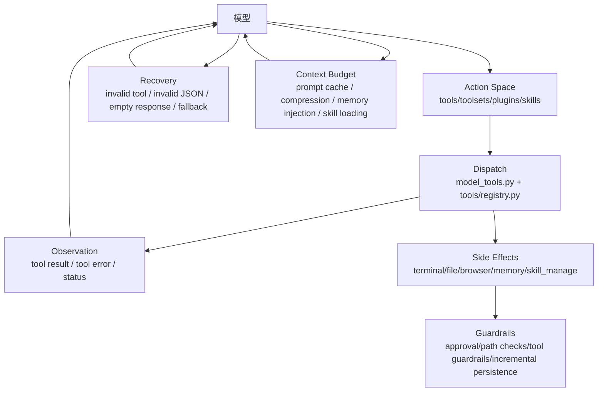

# Agent Harness 工程专题

## 先定义：什么是 agent harness

这里的 harness 不是单个框架，而是包住模型的一整套工程外壳：

- action space：模型能调用什么工具，工具名、参数、可用性如何定义。
- observation：工具结果如何反馈给模型，失败时是否给出可恢复信息。
- recovery：模型出错、工具出错、provider 出错、上下文过长时如何恢复。
- context budget：系统提示、工具 schema、历史消息、skills、memory 如何争夺上下文。
- side-effect control：写文件、执行命令、删除 skill、调用外部服务时如何控风险。
- evaluation：如何用测试和指标确认 harness 提高了完成率，而不是只增加复杂度。

Hermes 的核心亮点是：它没有把智能都塞进 prompt，而是把模型行动空间、上下文、恢复路径和长期学习都工程化了。

## Hermes 的 harness 总图

## 1. Action Space：工具面不是越大越好

核心代码：

- `tools/registry.py`：工具注册中心。
- `model_tools.py`：工具发现、schema 缓存、工具调用分发。
- `toolsets.py`：工具分组与核心工具收束。
- `tools/*.py`：每个工具文件自注册 schema、handler、toolset、check_fn。

Hermes 的做法：

- 工具通过 `registry.register()` 自注册，避免散落的全局工具表。
- `toolsets.py` 用 `_HERMES_CORE_TOOLS` 和 `TOOLSETS` 控制模型默认能看到什么。
- `check_fn` 让工具按服务可用性出现，例如外部服务没配置时不暴露相关工具。
- `model_tools.get_tool_definitions()` 有缓存，避免每次 API call 都重新走一遍昂贵发现。
- 插件和 MCP 可以扩展能力，但不必把所有能力做成 core tool。

为什么这符合 harness 工程：

- 稳定工具名降低模型选择成本。
- schema-first 参数让工具调用可校验。
- toolset 裁剪降低上下文占用和误调用概率。
- service-gated tool 避免无效行动污染 action space。

学习任务：

- 找 3 个 `registry.register()` 调用，比较它们的 `schema`、`handler`、`toolset`、`check_fn`。
- 追踪 `model_tools.get_tool_definitions()` 如何根据 enabled/disabled toolsets 产出 OpenAI function schema。
- 思考一个问题：如果把每个插件能力都默认暴露为 core tool，prompt cache 和 tool schema token 会发生什么？

## 2. Schema 与参数纠错：让模型错误变成可恢复事件

核心代码：

- `model_tools.py`
  - `coerce_tool_args()`
  - `_coerce_value()`
  - `handle_function_call()`
- `agent/conversation_loop.py`
  - tool call name repair
  - invalid JSON args recovery
  - empty tool name dampening

Hermes 的做法：

- 参数不是直接信任模型输出，而是先按 schema 做类型纠正。
- 空参数字符串会被视为 `{}`，这是常见模型小错误。
- tool name 不合法时先尝试 repair，失败再返回模型可读错误。
- invalid JSON 不直接崩溃，先重试，超过阈值后注入 tool-role error result，让模型在下一轮修正。

harness 价值：

- 模型输出不是可靠 RPC，harness 必须吸收常见格式错误。
- 错误 observation 必须保持 role alternation，不能随手插入 synthetic user message。
- 失败信息要告诉模型“怎么改”，而不是只说 failed。

学习任务：

- 读 `tests/run_agent/test_tool_arg_coercion.py` 和 `tests/run_agent/test_repair_tool_call_name.py`。
- 用表格记录：错误类型、检测位置、恢复方式、终止条件。

## 3. Observation：工具结果要可消费

核心代码：

- `tools/registry.py`
  - `tool_result()`
  - `tool_error()`
- `model_tools.py`
  - `_sanitize_tool_error()`
  - `_tool_result_observer_fields()`
  - `_emit_post_tool_call_hook()`
- `agent/tool_result_classification.py`
- `agent/tool_dispatch_helpers.py`

Hermes 的做法：

- 工具 handler 统一返回 JSON 字符串，减少 handler 风格分裂。
- 错误会被清洗，避免 XML/tool-call 片段继续诱导模型伪造工具调用。
- post-tool hook 可以观察 tool result，但不把所有观察逻辑塞进主循环。

harness 价值：

- observation 是模型下一步推理的输入，格式越稳定，模型越容易收敛。
- 错误结果需要同时服务人类调试和模型自修复。
- 结果过长要裁剪，避免一次工具输出淹没上下文。

学习任务：

- 对比 `tool_result()` 与某个手写 JSON result 的工具实现。
- 找一个工具错误测试，判断它是保护用户安全、模型恢复，还是上下文预算。

## 4. Recovery：失败路径是 agent 能不能长期跑的关键

核心代码：

- `agent/conversation_loop.py`
- `agent/tool_guardrails.py`
- `agent/error_classifier.py`
- `agent/retry_utils.py`
- `agent/verification_stop.py`

Hermes 的恢复类型：

| 失败类型 | 处理位置 | 恢复策略 |
|---|---|---|
| invalid tool name | `conversation_loop.py` | fuzzy repair，失败后 tool error observation |
| invalid JSON args | `conversation_loop.py` | 短期重试，超限后注入 tool-role recovery result |
| empty response | `conversation_loop.py` | 根据 prior tool、thinking-only、housekeeping content、fallback provider 分流 |
| context too long | `context_compressor.py` + loop | 压缩历史，保护 tool pairs 和 tail anchor |
| 重复/危险工具失败 | `tool_guardrails.py` | guardrail decision，必要时 halt |
| 未验证就结束 | `verification_stop.py` | synthetic verification nudge，要求先跑检查 |

harness 价值：

- agent 的真实难点不是 happy path，而是 provider 抽风、模型空响应、工具半执行、上下文过长。
- 恢复路径要有终止条件，否则 agent 会无限自救。
- 恢复不能污染 durable history，否则下一轮会把恢复脚手架当成真实上下文。

学习任务：

- 读 `tests/agent/test_empty_tool_name_loop_dampening.py`。
- 读 `tests/run_agent/test_tool_call_incremental_persistence.py`。
- 画出“工具调用已经持久化，但工具执行中断”时 Hermes 为什么能恢复。

## 5. Context Budget：上下文也是 harness 的资源

核心代码：

- `agent/system_prompt.py`
- `agent/prompt_builder.py`
- `agent/prompt_caching.py`
- `agent/context_compressor.py`
- `agent/skill_commands.py`
- `agent/memory_manager.py`

Hermes 的做法：

- system prompt 在会话中尽量 byte-stable，保护 prompt cache。
- 动态 memory/plugin recall 注入当前 user message，不改 system prompt。
- skills 是按需加载的过程记忆，不把全部技能内容塞进系统提示。
- compression 根据 provider usage 或 rough estimate 判断，rough estimate 会考虑 tool schemas。
- 压缩时保护消息边界、tool call/result 对、summary metadata、tail anchor。

harness 价值：

- action space 越大，tool schema token 越贵。
- skill 越多，如果全部塞入 prompt，prompt cache 和上下文都会崩。
- memory recall 如果进 system prompt，会让缓存前缀失效。

学习任务：

- 追踪一次 skill slash command 如何作为 user message 进入 loop。
- 解释为什么 `build_memory_context_block()` 的结果注入 current user message。
- 对比“动态改 system prompt”和“API-call-time user injection”的缓存影响。

## 6. Side-effect Control：能行动，也要能刹车

核心代码：

- `agent/tool_guardrails.py`
- `tools/approval.py`
- `tools/write_approval.py`
- `tools/path_security.py`
- `tools/skill_manager_tool.py`
- `agent/file_safety.py`

Hermes 的做法：

- 写文件、删 skill、执行终端命令、操作浏览器等都走专门工具，而不是一个无限权力的万能工具。
- `skill_manager_tool.py` 对路径、frontmatter、大小、pinned、external skill、background curator delete 做多层防护。
- 工具执行前增量持久化 assistant tool-call turn，防止副作用已发生但历史没记录。

harness 价值：

- 高风险操作要 micro-tool 化，schema 窄，审计清楚。
- side effect 发生前后都要有可恢复状态。
- 自进化能力必须带治理，否则就是不受控自修改。

学习任务：

- 重点读 `tools/skill_manager_tool.py` 的 delete/write guard。
- 说明 pinned skill 为什么允许 patch/edit，但不允许 autonomous delete。

## 7. Hermes harness 可以借鉴的工程模式

| 模式 | Hermes 代码 | 可借鉴点 |
|---|---|---|
| Narrow waist | `model_tools.py`、`toolsets.py` | 核心只保留通用工具面，能力放到 skill/plugin/provider |
| Service-gated tools | `tools/registry.py` | 未配置能力不出现在 action space |
| API-call-time injection | `conversation_loop.py` | 动态上下文不污染持久历史和 system prompt |
| Recovery as observation | `conversation_loop.py` | 让模型从结构化错误中恢复 |
| Procedural memory | `agent/skill_commands.py`、`skill_manage` | 把成功流程沉淀成可复用 skill |
| Provider abstraction | `agent/memory_provider.py` | memory 后端可替换，主 loop 不关心具体服务 |
| Guarded self-improvement | `curator`、`skill_usage`、`curator_backup` | 自进化必须有状态、审计、回滚 |

## 推荐阅读顺序

1. 先读 `tools/registry.py`，理解 action space 的底座。
2. 再读 `model_tools.py`，理解 schema 生成、缓存和 dispatch。
3. 再读 `agent/conversation_loop.py` 的 tool-call 分支，理解模型错误恢复。
4. 再读 `agent/prompt_builder.py` 和 `agent/context_compressor.py`，理解上下文预算。
5. 最后读 `tools/skill_manager_tool.py`、`agent/memory_manager.py`、`agent/curator.py`，理解长期学习能力如何受控接入 harness。

